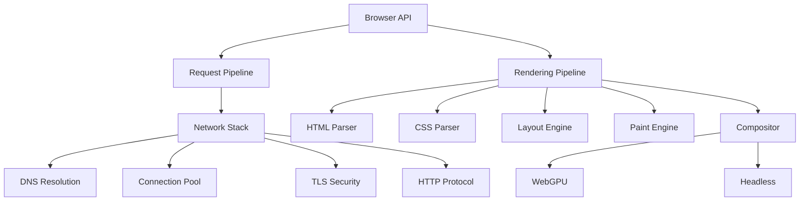
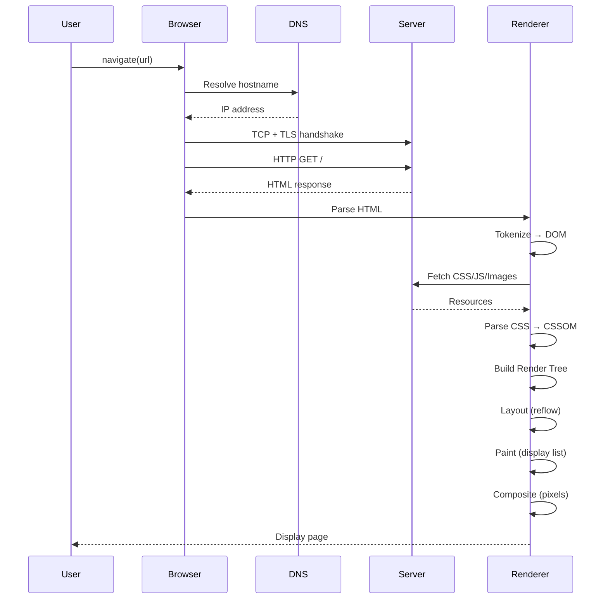

import { Card, CardGrid } from '@astrojs/starlight/components';

The Browser Engine is the core rendering and networking component of BrowserX, implementing a complete web browser from first principles in TypeScript/Deno. It provides full page load pipeline from DNS resolution to pixel rendering.

## Architecture Overview

The Browser Engine follows Chrome's multi-process model with a layered architecture:



### Key Components

<CardGrid>
  <Card title="Request Pipeline" icon="rocket">
    DNS → TCP → TLS → HTTP request/response lifecycle with connection pooling and caching.
  </Card>
  <Card title="Rendering Pipeline" icon="paintbrush">
    HTML/CSS parsing → DOM/CSSOM → Layout → Paint → Composite to pixels.
  </Card>
  <Card title="Network Stack" icon="seti:config">
    Complete network primitives: TCP, TLS 1.3, HTTP/1.1-3, WebSocket, DNS-over-HTTPS.
  </Card>
  <Card title="JavaScript Engine" icon="seti:javascript">
    V8 integration with isolates, contexts, event loop, and Web APIs.
  </Card>
  <Card title="Storage Layer" icon="seti:db">
    Cookies, localStorage, sessionStorage, IndexedDB, Cache API with quota management.
  </Card>
  <Card title="WebGPU Rendering" icon="seti:gpu">
    GPU-accelerated rendering with offscreen compositor and WGSL shaders.
  </Card>
</CardGrid>

## Page Load Pipeline

The complete page load sequence from URL to pixels:



### Timing Breakdown

Each stage is timed and exposed via metrics:

| Stage | Description | Typical Time |
|-------|-------------|--------------|
| DNS Lookup | Resolve hostname to IP | 10-50ms |
| TCP Connection | Three-way handshake | 20-100ms |
| TLS Handshake | SSL/TLS negotiation | 50-200ms |
| HTTP Request | Send request, wait for response | 50-500ms |
| HTML Parse | Tokenize + tree building | 10-100ms |
| CSS Parse | Tokenize + CSSOM | 5-50ms |
| Style Resolution | Compute final styles | 10-100ms |
| Layout | Box model computation | 20-200ms |
| Paint | Generate display list | 10-100ms |
| Composite | GPU composite to pixels | 5-20ms |

## Multi-Process Architecture

The browser uses separate processes for isolation and stability:

### Process Types

- **Browser Process**: Main privileged process, manages UI and network
- **Renderer Process**: Sandboxed process per tab/site for HTML/CSS/JS
- **GPU Process**: Handles all GPU operations and compositing
- **Network Process**: Isolated network stack with connection pooling

### Site Isolation

Each unique site (scheme + eTLD+1) gets its own renderer process:

```typescript
// Different processes:
https://example.com     // Process 1
https://sub.example.com // Process 1 (same site)
https://other.com       // Process 2 (different site)
http://example.com      // Process 3 (different scheme)
```

This provides complete protection against Spectre and side-channel attacks.

## Data Flow

Request and rendering pipelines process data in distinct stages:

### Request Pipeline Flow

```typescript
import { RequestPipeline } from "@browserx/browser";

const pipeline = new RequestPipeline();

// Complete request lifecycle:
const result = await pipeline.request("https://example.com");

console.log(result.timing);
// {
//   dnsLookup: 15,
//   tcpConnection: 45,
//   tlsHandshake: 78,
//   requestSent: 5,
//   firstByte: 120,
//   download: 80,
//   total: 343
// }
```

### Rendering Pipeline Flow

```typescript
import { RenderingPipeline } from "@browserx/browser";

const pipeline = new RenderingPipeline({
  width: 1920,
  height: 1080,
  enableJavaScript: true,
  enableGpu: true,
});

await pipeline.initialize();

const result = await pipeline.render("https://example.com");

// Access rendered output
const dom = result.dom;           // DOM tree
const cssom = result.cssom;       // CSSOM tree
const layout = result.layoutTree; // Layout boxes
const pixels = await pipeline.getPixels(); // RGBA pixel buffer
```

## Browser API

High-level browser instance API:

```typescript
import { Browser } from "@browserx/browser";

const browser = new Browser({
  width: 1024,
  height: 768,
  enableJavaScript: true,
  enableStorage: true,
});

// Navigate to URL
await browser.navigate("https://example.com");

// Access page state
const title = browser.getTitle();
const url = browser.getURL();
const dom = browser.getDOM();

// Interact with page
await browser.click("#button");
await browser.type("#input", "Hello");
const screenshot = await browser.screenshot();

// History navigation
await browser.back();
await browser.forward();

// Close browser
await browser.close();
```

## Rendering Modes

The rendering pipeline supports two modes:

### WebGPU Mode (GPU Accelerated)

When running in Deno with GPU support:

- Real GPU rendering via WebGPU API
- Offscreen rendering without display canvas
- WGSL shaders for compositing
- Layer-based architecture with transforms/opacity
- Actual pixel output from GPU texture readback

### Headless Mode (Fallback)

When GPU is unavailable (CI, tests):

- Canvas 2D fallback compositor
- Returns white pixels (255, 255, 255, 255)
- All browser features work (navigation, DOM, layout)
- Suitable for non-visual testing and scraping

Check mode at runtime:

```typescript
const pipeline = new RenderingPipeline({ enableGpu: true });
await pipeline.initialize();

if (pipeline.isWebGPUActive()) {
  console.log("GPU rendering enabled");
} else {
  console.log("Headless mode (no GPU)");
}
```

## Security Architecture

Multiple layers of security protection:

- **Process Isolation**: Site isolation prevents cross-origin data leaks
- **Sandboxing**: Renderer processes run with minimal privileges
- **TLS 1.3**: Modern encryption for HTTPS connections
- **Same-Origin Policy**: Enforced at network and DOM level
- **Content Security Policy**: CSP header parsing and enforcement
- **Certificate Validation**: X.509 certificate chain validation

## Performance Features

Optimizations throughout the pipeline:

- **Connection Pooling**: Reuse TCP/TLS connections across requests
- **DNS Caching**: In-memory cache with TTL management
- **HTTP Caching**: RFC 7234 compliant cache with LRU eviction
- **Preload Scanner**: Parallel resource discovery during parsing
- **GPU Compositing**: Hardware-accelerated final composite
- **Layer Tiling**: 256x256 tiles for large compositor layers

## Documentation Sections

Explore detailed documentation for each subsystem:

<CardGrid>
  <Card title="Page Load Pipeline" icon="forward">
    [Complete page load sequence →](/browser/page-load-pipeline)
  </Card>
  <Card title="Network Stack" icon="seti:config">
    [TCP, TLS, HTTP, DNS →](/browser/network-stack)
  </Card>
  <Card title="Rendering Pipeline" icon="paintbrush">
    [HTML/CSS parsing, layout, paint →](/browser/rendering-pipeline)
  </Card>
  <Card title="JavaScript Engine" icon="seti:javascript">
    [V8 integration and Web APIs →](/browser/javascript-engine)
  </Card>
  <Card title="Storage Layer" icon="seti:db">
    [Cookies, storage, IndexedDB →](/browser/storage)
  </Card>
  <Card title="WebGPU Rendering" icon="seti:gpu">
    [GPU compositing and shaders →](/browser/webgpu)
  </Card>
  <Card title="Security" icon="shield">
    [Site isolation and sandboxing →](/browser/security)
  </Card>
  <Card title="Metrics" icon="seti:clock">
    [Performance and observability →](/browser/metrics)
  </Card>
</CardGrid>

## Implementation Status

The browser engine is feature-complete with the following subsystems:

| Subsystem | Status | Test Coverage |
|-----------|--------|---------------|
| Network Stack | ✅ Complete | 95%+ |
| HTML Parser | ✅ Complete | 90%+ |
| CSS Parser | ✅ Complete | 85%+ |
| Layout Engine | ✅ Complete | 80%+ |
| Paint Engine | ✅ Complete | 75%+ |
| Compositor | ✅ Complete | 90%+ |
| JavaScript (V8) | ✅ Complete | 70%+ |
| Storage Layer | ✅ Complete | 85%+ |
| WebGPU | ✅ Complete | 80%+ |
| Security | ✅ Complete | 90%+ |

## Source Code

The browser engine source is located in `/browser/src/`:

```
browser/src/
├── main.ts                 # Browser class entry point
├── api/                    # High-level API (BrowserEngine, BrowserPage)
├── engine/
│   ├── RequestPipeline.ts  # Network request orchestration
│   ├── RenderingPipeline.ts # Rendering orchestration
│   ├── network/            # Network stack
│   │   ├── primitives/     # TCP, sockets, network primitives
│   │   ├── security/       # TLS, certificates, encryption
│   │   ├── protocols/      # HTTP, WebSocket
│   │   ├── connection/     # Connection pooling, manager
│   │   └── resolution/     # DNS, DoH, caching
│   ├── rendering/          # Rendering engine
│   │   ├── html-parser/    # HTML tokenizer, tree builder
│   │   ├── css-parser/     # CSS tokenizer, parser, CSSOM
│   │   ├── layout/         # Layout engine (box model)
│   │   ├── paint/          # Paint engine (display list)
│   │   └── compositor/     # Compositor thread
│   ├── javascript/         # JavaScript engine
│   │   ├── V8Isolate.ts    # V8 isolate wrapper
│   │   ├── V8Context.ts    # Execution context
│   │   ├── EventLoop.ts    # Event loop implementation
│   │   └── WindowObject.ts # Web APIs (window, document)
│   ├── storage/            # Storage layer
│   │   ├── CookieManager.ts
│   │   ├── StorageManager.ts (localStorage/sessionStorage)
│   │   ├── IDBDatabase.ts  # IndexedDB
│   │   └── CacheAPI.ts     # Cache Storage API
│   └── webgpu/             # WebGPU rendering
│       ├── offscreen/      # OffscreenWebGPU
│       ├── compositor/     # WebGPU compositor layers
│       └── shaders/        # WGSL shaders
└── types/                  # TypeScript type definitions
    ├── dom.ts              # DOM types
    ├── css.ts              # CSS types
    ├── http.ts             # HTTP types
    ├── network.ts          # Network types
    ├── rendering.ts        # Rendering types
    └── webgpu.ts           # WebGPU types
```

## Development

Run browser tests:

```bash
# All browser tests
deno task browser:test

# Type checking
deno task browser:check

# Specific test file
deno test --allow-all /path/to/test.ts
```

## Next Steps

- [Page Load Pipeline](/browser/page-load-pipeline) - Complete request and rendering flow
- [Network Stack](/browser/network-stack) - Deep dive into network implementation
- [Rendering Pipeline](/browser/rendering-pipeline) - HTML/CSS parsing to pixels
