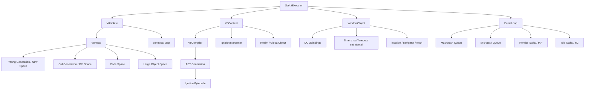
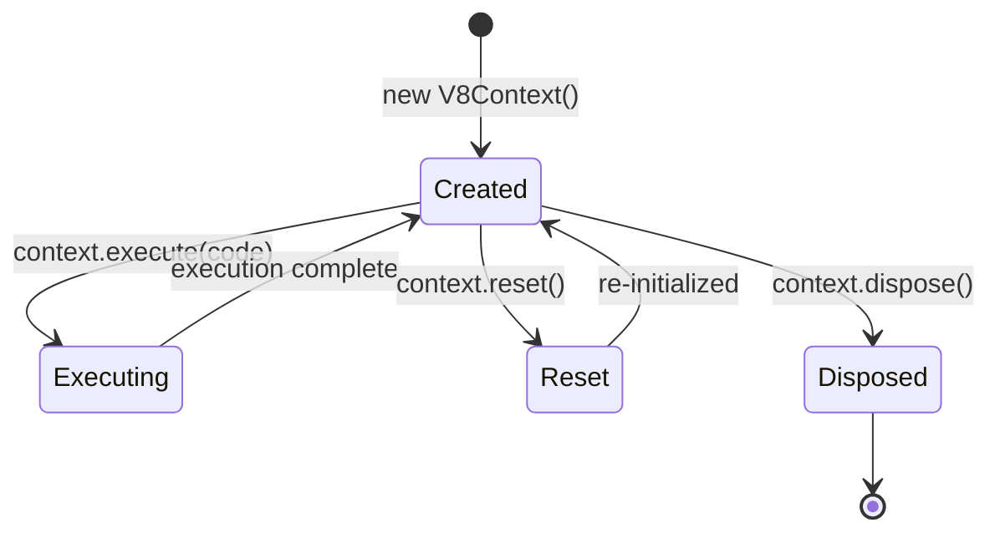
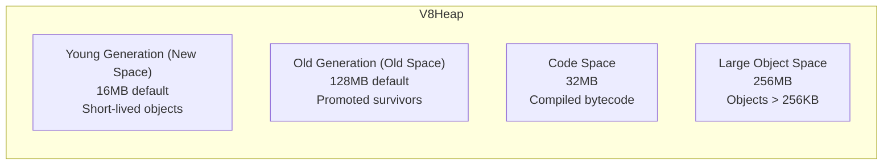
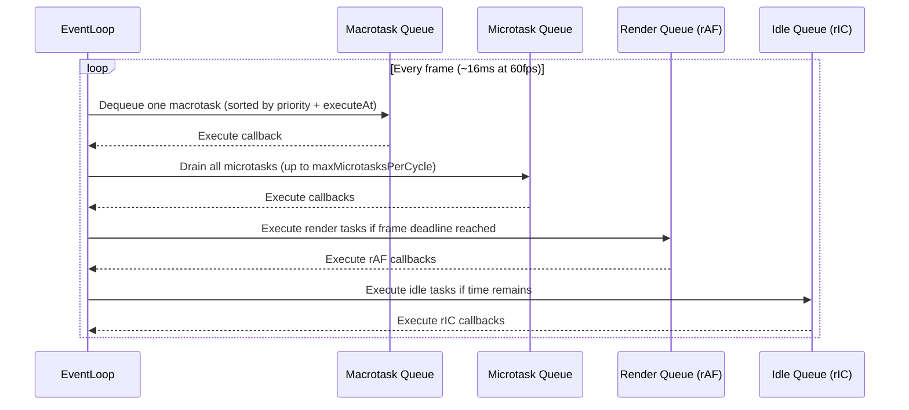

The JavaScript engine integrates a V8-compatible execution environment into BrowserX's browser pipeline. It handles script evaluation, context lifecycle, garbage collection, asynchronous task scheduling, and DOM bindings — all coordinated through the `ScriptExecutor` entry point.

## Architecture Overview



## V8 Isolate

`V8Isolate` is an independent JavaScript engine instance with its own isolated heap. Each isolate can host multiple execution contexts and manages its own garbage collection cycle.

### Configuration

```typescript
import { V8Isolate, IsolateFactory } from "@browserx/browser";

// Factory presets
const dev  = IsolateFactory.createDevelopment();   // 8MB/64MB heap, max 5 contexts
const prod = IsolateFactory.createProduction();    // 32MB/256MB heap, max 20 contexts
const test = IsolateFactory.createForTesting();    // 1MB/8MB heap, no background GC

// Custom configuration
const isolate = new V8Isolate({
  heapSize: {
    youngGeneration: 16 * 1024 * 1024,  // 16MB
    oldGeneration:  128 * 1024 * 1024,  // 128MB
  },
  maxContexts:       10,
  enableBackgroundGC: true,
  gcInterval:         5000, // ms between automatic GC cycles
});
```

### TypeScript API

```typescript
export class V8Isolate {
  readonly id: IsolateID;                                      // Branded string ID

  createContext(config?: V8ContextConfig): V8Context;          // Create execution context
  getContext(contextId: string): V8Context | null;
  getAllContexts(): V8Context[];
  disposeContext(contextId: string): boolean;

  executeInNewContext(code: string): ExecutionResult;          // Ephemeral execution

  collectGarbage(type?: GCType): void;                        // Trigger GC
  getStats(): IsolateStats;                                    // Heap + GC stats
  getHeapStatistics(): HeapStats;

  isDisposed(): boolean;
  getUptime(): number;                                         // ms since creation
  dispose(): void;                                             // Stop GC, drop all contexts
}
```

### Singleton `IsolateManager`

`IsolateManager` is a singleton that tracks all isolates in the process:

```typescript
import { IsolateManager } from "@browserx/browser";

const manager = IsolateManager.getInstance();
const isolate = manager.createIsolate({ maxContexts: 5 });
console.log(manager.getTotalStats());
// { isolateCount, totalContexts, totalHeapSize, totalObjects }
manager.disposeIsolate(isolate.getId());
```

## Execution Context Lifecycle

Each `V8Context` represents a JavaScript realm — a global object, built-in intrinsics, and a scope chain. Contexts share the isolate heap but maintain independent execution state.



### Global Object Setup

When created, `V8Context` populates the global object with standard built-ins:

| Global | Provided |
|---|---|
| `console.log/warn/error` | Forwarded to host console |
| `parseInt`, `parseFloat`, `isNaN`, `isFinite` | Native wrappers |
| `Math.*` | `PI`, `E`, `abs`, `sqrt`, `floor`, `ceil`, `round`, `random` |
| `globalThis`, `window`, `self` | All reference global object |
| `undefined` | Canonical undefined value |

### Execution API

```typescript
export interface V8ContextConfig {
  enableJIT?:     boolean;  // JIT compilation (default: false)
  enableDebugger?: boolean; // Debugger support (default: false)
  strictMode?:    boolean;  // Strict mode enforcement (default: false)
  heapSize?: {
    youngGeneration: number;
    oldGeneration:   number;
  };
}

export interface ExecutionResult {
  value:         JSValue;   // Tagged union result
  executionTime: number;    // ms
  success:       boolean;
  error?:        Error;
}

export class V8Context {
  execute(code: string): ExecutionResult;
  runExpression(expression: string): JSValue;  // Throws on error (context.eval)
  executeAsync(code: string): Promise<ExecutionResult>;

  compile(code: string): CompiledFunction;   // Compile without executing
  parse(code: string): AST;
  tokenize(code: string): Token[];

  setGlobal(name: string, value: JSValue): void;
  getGlobalVariable(name: string): JSValue;
  getGlobal(): JSValue;

  gc(): void;                                // Trigger heap GC
  reset(): void;                             // Wipe state, re-init globals
  dispose(): void;
  isValid(): boolean;
  getStats(): ContextStats;
}
```

## ECMAScript Environment Records

The `ExecutionContext` module implements the ECMAScript specification's scope chain and environment records:

```typescript
export enum EnvironmentRecordType {
  DECLARATIVE = "declarative",  // let / const / function / class
  OBJECT      = "object",       // with statement
  FUNCTION    = "function",     // function calls
  GLOBAL      = "global",       // global scope
  MODULE      = "module",       // ES modules
}

// Each ExecutionContext carries:
export interface ExecutionContext {
  variableEnvironment: EnvironmentRecord;   // var hoisting target
  lexicalEnvironment:  EnvironmentRecord;   // let/const scope
  thisBinding:         JSValue;
  realm:               Realm | null;
  function:            JSValue | null;      // null at global scope
  scriptOrModule:      unknown | null;
}
```

### Scope Chain Resolution

```typescript
import {
  createDeclarativeEnvironmentRecord,
  createMutableBinding,
  initializeBinding,
  getIdentifierReference,
} from "@browserx/browser";

const env = createDeclarativeEnvironmentRecord(null);
createMutableBinding(env, "x");
initializeBinding(env, "x", createNumber(42));

const value = getIdentifierReference(env, "x");
// { type: "number", value: 42 }
```

### Call Stack

```typescript
export class CallStack {
  push(context: ExecutionContext): void;  // Throws at depth 10,000
  pop(): ExecutionContext | undefined;
  current(): ExecutionContext | null;
  depth(): number;
  clear(): void;
  getStackTrace(): string[];
}
```

## JavaScript Value System

All JavaScript values are represented as a typed union (`JSValue`) for type-safe manipulation at the engine boundary:

```typescript
export type JSValue =
  | { type: JSValueType.UNDEFINED }
  | { type: JSValueType.NULL }
  | { type: JSValueType.BOOLEAN;  value: boolean }
  | { type: JSValueType.NUMBER;   value: number }
  | { type: JSValueType.STRING;   value: string }
  | { type: JSValueType.BIGINT;   value: bigint }
  | { type: JSValueType.SYMBOL;   value: JSSymbol }
  | { type: JSValueType.OBJECT;   value: JSObject }
  | { type: JSValueType.FUNCTION; value: JSFunction };

// Construction helpers
createUndefined(): JSValue
createNull(): JSValue
createBoolean(value: boolean): JSValue
createNumber(value: number): JSValue
createString(value: string): JSValue
createObject(prototype?: JSObject | null): JSValue
createFunction(name, code, length?, scope?): JSValue
createNativeFunction(name, impl, length?): JSValue

// Type guards
isUndefined(v): boolean
isNumber(v): boolean
isString(v): boolean
isObject(v): boolean
isFunction(v): boolean

// Abstract operations (ECMAScript spec)
toBoolean(v: JSValue): boolean
toNumber(v: JSValue): number
toString(v: JSValue): string
toPrimitive(v: JSValue, hint: "number" | "string"): JSValue
strictEquals(a, b): boolean
abstractEquals(a, b): boolean

// Property access
getProperty(obj, key: string | symbol): JSValue
setProperty(obj, key, value): boolean
deleteProperty(obj, key): boolean
hasProperty(obj, key): boolean
```

### Native Function Binding

Expose host functions to JavaScript by wrapping them as `JSValue` natives:

```typescript
import { createNativeFunction, setProperty, createNumber } from "@browserx/browser";

const addFn = createNativeFunction("add", (a, b) => {
  const aVal = (a as { type: "number"; value: number }).value;
  const bVal = (b as { type: "number"; value: number }).value;
  return createNumber(aVal + bVal);
}, 2);

setProperty(context.getGlobal(), "add", addFn);
// JavaScript: add(2, 3) → 5
```

## V8 Heap and Garbage Collection

`V8Heap` implements a generational garbage collector modeled on V8's memory model.

### Memory Spaces



| Space | Default Size | Purpose |
|---|---|---|
| New Space (young gen) | 16 MB | Newly allocated objects |
| Old Space (old gen) | 128 MB | Objects surviving scavenge |
| Code Space | 32 MB | Compiled Ignition bytecode |
| Large Object Space | 256 MB | Objects exceeding 256 KB |

### GC Algorithms

```typescript
export enum GCType {
  SCAVENGE            = "scavenge",            // Cheney's copying algorithm (young gen)
  MARK_SWEEP          = "mark_sweep",           // Tri-color mark-sweep (old gen)
  MARK_COMPACT        = "mark_compact",         // Mark-sweep + compaction
  INCREMENTAL_MARKING = "incremental_marking",  // Background incremental marks
}
```

**Scavenge** (young generation): Copies live objects to old generation using Cheney's algorithm. Triggered when young gen exceeds 80% capacity.

**Mark-Sweep** (old generation): Tri-color marking (white/gray/black) traverses object graph from GC roots. Unmarked objects are swept. Triggered when old gen exceeds 80% capacity.

```typescript
export class V8Heap {
  allocate(value: JSValue): HeapObjectID;
  getObject(id: HeapObjectID): HeapObject | null;

  addRoot(id: HeapObjectID): void;     // Register as GC root
  removeRoot(id: HeapObjectID): void;

  gc(): void;                           // Auto-select GC type
  forceGC(type: GCType): void;

  getStats(): HeapStats;
  getGCStats(): GCStats;
  clear(): void;
  dispose(): void;
}

export interface HeapStats {
  totalSize:           number;   // bytes across all spaces
  totalAllocated:      number;   // object count
  youngGenerationSize: number;
  oldGenerationSize:   number;
  objectCount:         number;
  youngObjectCount:    number;
  oldObjectCount:      number;
  gcStats:             GCStats;
}

export interface GCStats {
  totalCollections:  number;
  scavengeCount:     number;
  markSweepCount:    number;
  totalGCTime:       number;  // ms
  lastGCTime:        number;
  lastGCType:        GCType | null;
  objectsCollected:  number;
  bytesReclaimed:    number;
}
```

### Background GC

`V8Isolate` runs periodic GC on a configurable interval (default 5 seconds) using `setInterval`. To trigger collection manually:

```typescript
const isolate = new V8Isolate({ gcInterval: 5000, enableBackgroundGC: true });

// Force specific GC type
isolate.collectGarbage(GCType.SCAVENGE);    // Young gen only
isolate.collectGarbage(GCType.MARK_SWEEP);  // Old gen
isolate.collectGarbage();                   // Auto-select based on heap state
```

## Event Loop

`EventLoop` implements the browser event loop with four task queues. Each loop iteration follows the HTML specification's task processing order:



### Task Priority

```typescript
export enum TaskPriority {
  IMMEDIATE = 0,  // Microtasks, Promise callbacks
  HIGH      = 1,  // User interaction, rAF
  NORMAL    = 2,  // setTimeout(0), network responses
  LOW       = 3,  // setTimeout with positive delay
  IDLE      = 4,  // requestIdleCallback
}
```

### Scheduling API

```typescript
export class EventLoop {
  // Macrotasks
  setTimeout(callback, delay?: number, priority?: TaskPriority): TaskID;
  setInterval(callback, interval: number, priority?: TaskPriority): TaskID;
  clearTimeout(id: TaskID): boolean;
  clearInterval(id: TaskID): boolean;
  queueTask(task: () => void): void;  // Shorthand for setTimeout(fn, 0)

  // Microtasks
  queueMicrotask(callback, priority?: TaskPriority): TaskID;
  drainMicrotaskQueue(): void;

  // Rendering
  requestAnimationFrame(callback): TaskID;
  cancelAnimationFrame(id: TaskID): boolean;

  // Idle
  requestIdleCallback(callback): TaskID;
  cancelIdleCallback(id: TaskID): boolean;

  // Async execution helpers
  executeAsync(code: string): Promise<ExecutionResult>;
  executeFunctionAsync(fn: JSFunction, ...args: JSValue[]): Promise<JSValue>;

  // Lifecycle
  start(): void;
  stop(): void;
  run(): void;

  // Diagnostics
  getStats(): EventLoopStats;
  getQueueSizes(): { macrotasks, microtasks, renderTasks, idleTasks };
  hasPendingTasks(): boolean;
  getNextTaskTime(): number | null;
  processPendingTasks(): void;  // Synchronous drain (for testing)
  clearAllQueues(): void;
}
```

### Global Wrappers

Module-level exports delegate to the global `EventLoop` singleton:

```typescript
import {
  setTimeout, clearTimeout,
  setInterval, clearInterval,
  queueMicrotask,
  requestAnimationFrame, cancelAnimationFrame,
  requestIdleCallback, cancelIdleCallback,
  getGlobalEventLoop, setGlobalEventLoop,
} from "@browserx/browser";

// Replace the global loop instance
setGlobalEventLoop(EventLoopFactory.createProduction());
```

### EventLoop Configuration

```typescript
export interface EventLoopConfig {
  maxMicrotasksPerCycle?: number;   // Default: 1000 (dev: 500, prod: 2000)
  maxTaskExecutionTime?:  number;   // ms warning threshold (default: 50ms)
  enableIdleTasks?:       boolean;  // Default: true
  targetFrameRate?:       number;   // Default: 60fps
}
```

### Monitoring

```typescript
export interface EventLoopStats {
  macrotasksExecuted:  number;
  microtasksExecuted:  number;
  totalExecutionTime:  number;  // ms
  averageTaskTime:     number;  // ms
  currentQueueSize:    number;
  idleTime:            number;  // ms accumulated
  loopIterations:      number;
}
```

Long tasks (exceeding `maxTaskExecutionTime`) emit a `console.warn`. Microtask queue overflow beyond `maxMicrotasksPerCycle` also warns.

## Script Execution

`ScriptExecutor` is the top-level coordinator for executing JavaScript in a page context. It wires together the isolate, context, window object, and event loop:

```typescript
import { ScriptExecutor } from "@browserx/browser";

const executor = new ScriptExecutor(domDocument, "https://example.com");

// Execute inline code
const result = await executor.execute("document.title", { async: false });
// { success: true, value: ..., executionTime: 1.2 }

// Execute with options
await executor.execute(code, {
  type:      "classic",   // "classic" | "module"
  async:     true,        // queue in microtask
  defer:     true,        // wait for DOM ready
  timeout:   5000,        // ms
  sourceURL: "app.js",
});

// Execute an external script URL
await executor.executeExternal("https://cdn.example.com/lib.js");

// Execute a <script> DOM element
await executor.executeInline(scriptElement);

// Execute all <script> tags in the loaded document
const results = await executor.executeScriptsInDOM();

// Synchronous expression evaluation
const value = executor.evaluate("2 + 2");  // returns unknown

// Access subsystems
const isolate  = executor.getIsolate();
const context  = executor.getContext();
const window   = executor.getWindow();
const loop     = executor.getEventLoop();
const document = executor.getDocument();

// Statistics
const stats = executor.getStats();
// { scriptsExecuted, heapStats, eventLoop: { pending } }

// Cleanup
await executor.dispose();
```

### Script Loading with Caching

`ScriptLoader` handles deduplication — concurrent fetches for the same URL are coalesced:

```typescript
import { ScriptLoader } from "@browserx/browser";

const loader = new ScriptLoader();
const code = await loader.load("https://cdn.example.com/react.js");

console.log(loader.getCacheStats()); // { cached: 1, loading: 0 }
loader.clearCache();
```

## Window Object and Web APIs

`WindowObject` installs Web APIs into the V8 context global:

```typescript
export class WindowObject {
  install(): void;       // Register all APIs in context.global
  clearTimers(): void;   // Cancel all active setTimeout/setInterval handles
  getDOMBindings(): DOMBindings;
}
```

APIs installed by `WindowObject.install()`:

| API | Implementation |
|---|---|
| `window`, `self`, `globalThis` | Object alias pointing to global |
| `document` | DOM node wrapped as `JSValue` |
| `console.log/info/warn/error` | Native functions forwarding to host |
| `setTimeout` / `clearTimeout` | Timer tracking via `Map<handle, timeout>` |
| `setInterval` / `clearInterval` | Recurring timer tracking |
| `location` | URL components parsed from page URL |
| `navigator.userAgent` | `"GeoProx-Browser/1.0"` |
| `fetch` | Stub (logs call; integration with `RequestPipeline` pending) |
| `localStorage` / `sessionStorage` | In-memory stubs |
| `alert`, `confirm`, `prompt` | Headless no-ops (logs to console) |
| `window.innerWidth/Height` | 1024x768 defaults |
| `scrollTo`, `scrollBy` | No-op stubs |

## DOM Bindings

`DOMBindings` bridges native `DOMNode` objects into `JSValue`-based JavaScript representations using bidirectional `WeakMap`s:

```typescript
export class DOMBindings {
  install(): void;                              // Register Node, Element, Document constructors
  wrapNode(nativeNode: DOMNode): JSNode;        // Native to JS wrapper (cached)
  unwrapNode(jsNode: JSNode): DOMNode | null;   // JS wrapper to native
}
```

Constructors registered in the V8 global:

- `Node` — `appendChild`, `removeChild`, `insertBefore`
- `Element` — `getAttribute`, `setAttribute`, `removeAttribute`, `querySelector`
- `Document` — `getElementById`, `createElement`, `createTextNode`

Node type constants (`ELEMENT_NODE = 1`, `TEXT_NODE = 3`, `DOCUMENT_NODE = 9`, etc.) are installed on the global object.

### Web IDL Interfaces

```typescript
export interface JSDocument extends JSNode {
  documentElement: JSElement | null;
  head:            JSElement | null;
  body:            JSElement | null;
  title:           string;
  URL:             string;
  readyState:      "loading" | "interactive" | "complete";

  getElementById(id: string): JSElement | null;
  querySelector(selector: string): JSElement | null;
  createElement(tagName: string): JSElement;
  createTextNode(data: string): JSNode;
  addEventListener(type: string, listener: EventListener, options?): void;
}

export interface JSElement extends JSNode {
  tagName:   string;
  id:        string;
  className: string;
  innerHTML: string;

  getAttribute(name: string): string | null;
  setAttribute(name: string, value: string): void;
  querySelectorAll(selector: string): JSElement[];
  addEventListener(type: string, listener: EventListener, options?): void;
}
```

## Security Sandboxing

Each page's JavaScript executes inside a dedicated `V8Isolate` and `V8Context`, providing the following isolation properties:

- **Heap isolation**: Isolates have independent heaps; no object references cross isolate boundaries.
- **Origin isolation**: `WindowObject` installs `location` and `document` scoped to the page URL. Cross-origin access requires a separate isolate.
- **Strict mode support**: `V8ContextConfig.strictMode` enables strict-mode enforcement for all code evaluated in the context.
- **Timer containment**: All `setTimeout`/`setInterval` handles are tracked in `WindowObject.timers`; `clearTimers()` cancels all of them on page teardown.
- **Disposal**: Calling `ScriptExecutor.dispose()` stops the event loop, clears timers, disposes the context, and disposes the isolate — releasing all heap memory.

## Usage Example

```typescript
import { ScriptExecutor, IsolateFactory, EventLoopFactory } from "@browserx/browser";
import type { DOMNode } from "@browserx/browser";

// Build a minimal document node (normally produced by the HTML parser)
const document: DOMNode = {
  nodeType: 9,       // DOCUMENT_NODE
  nodeName: "#document",
  nodeValue: null,
  childNodes: [],
};

// Create executor for the page
const executor = new ScriptExecutor(document, "https://example.com");

// Run page scripts
await executor.execute(`
  const greeting = "Hello from BrowserX";
  console.log(greeting);
`);

// Inspect heap
const isolate = executor.getIsolate();
const heap    = isolate.getHeapStatistics();
console.log("Heap bytes:", heap.totalSize, "Objects:", heap.objectCount);

// Inspect event loop
const loop = executor.getEventLoop();
console.log("Pending tasks:", loop.hasPendingTasks());
console.log(loop.getStats());

// Teardown
await executor.dispose();
```
