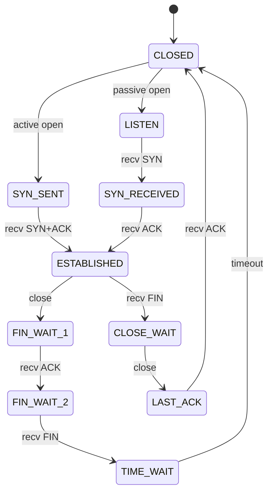
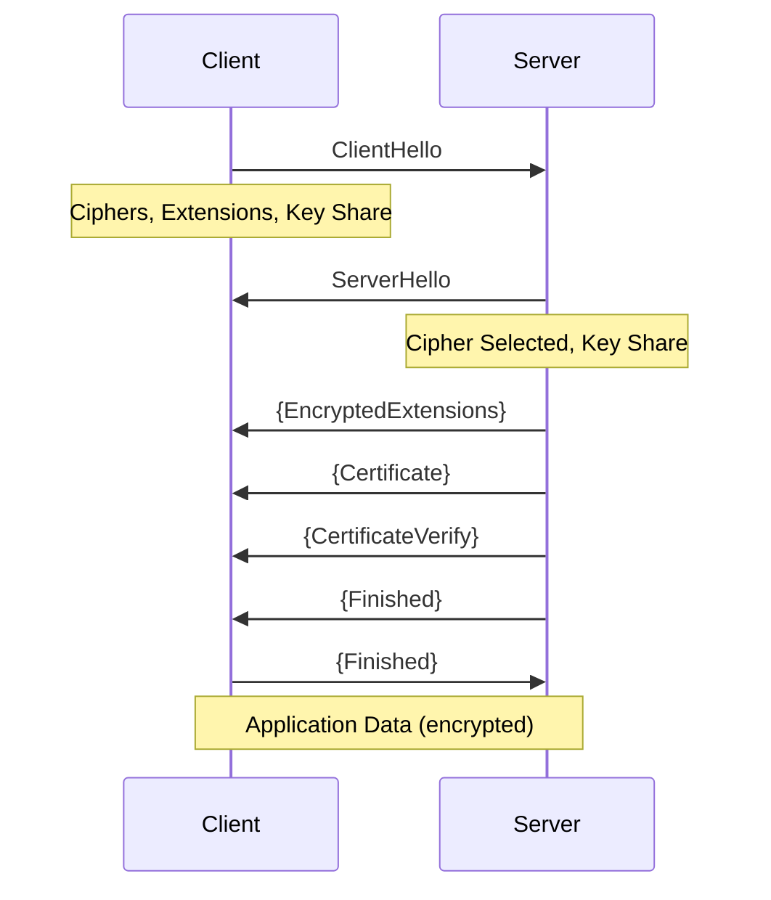
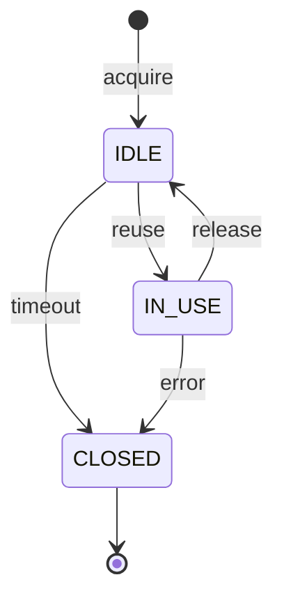

The Network Stack implements the complete networking layer from low-level sockets to high-level HTTP protocols. It provides TCP connections, TLS 1.3 encryption, HTTP/1.1-3 support, DNS resolution, and connection pooling.

## Architecture

The network stack is organized in layers:

```
┌─────────────────────────────────────────┐
│         Request Pipeline                │  High-level API
└─────────────────────────────────────────┘
                 ↓
┌─────────────────────────────────────────┐
│      Connection Management              │
│  ConnectionPool | ConnectionManager     │
└─────────────────────────────────────────┘
                 ↓
┌─────────────────────────────────────────┐
│         Protocol Layer                  │
│  HTTP/1.1 | HTTP/2 | HTTP/3 | WebSocket│
└─────────────────────────────────────────┘
                 ↓
┌─────────────────────────────────────────┐
│         Security Layer                  │
│  TLS 1.3 | Certificate Validation      │
└─────────────────────────────────────────┘
                 ↓
┌─────────────────────────────────────────┐
│         Network Primitives              │
│  TCP | Socket | Network Stack           │
└─────────────────────────────────────────┘
                 ↓
┌─────────────────────────────────────────┐
│         DNS Resolution                  │
│  DNS-over-HTTPS | DNS Cache             │
└─────────────────────────────────────────┘
```

## Source Code Structure

```
/browser/src/engine/network/
├── primitives/             # Low-level network primitives
│   ├── Socket.ts          # Socket abstraction
│   ├── TCPConnection.ts   # TCP state machine
│   └── SocketStats.ts     # Socket statistics
├── security/              # TLS and encryption
│   ├── TLSConnection.ts   # TLS 1.3 handshake
│   ├── TLSSocket.ts       # TLS socket wrapper
│   ├── Certificate.ts     # X.509 certificate validation
│   └── SessionKeys.ts     # TLS session key derivation
├── protocols/             # Application protocols
│   ├── HTTPRequestParser.ts   # HTTP request serialization
│   ├── HTTPResponseParser.ts  # HTTP response parsing
│   ├── HTTP2Connection.ts     # HTTP/2 with HPACK
│   ├── HTTP3Connection.ts     # HTTP/3 over QUIC
│   ├── WebSocketConnection.ts # WebSocket (RFC 6455)
│   └── HPACKEncoder.ts        # HPACK compression
├── connection/            # Connection management
│   ├── ConnectionPool.ts      # Connection pooling
│   ├── ConnectionManager.ts   # Connection lifecycle
│   └── ConnectionPoolStats.ts # Pool statistics
└── resolution/            # DNS resolution
    ├── DNSResolver.ts     # DNS-over-HTTPS resolver
    └── DNSCache.ts        # DNS result caching
```

## Network Primitives

### Socket

Low-level socket abstraction with OS integration.

```typescript
import { Socket, AddressFamily, SocketType } from "@browserx/browser";

// Create TCP socket
const socket = new Socket(AddressFamily.IPv4, SocketType.STREAM);

// Connect to remote host
await socket.connect("93.184.216.34", 80);

// Socket state
console.log(socket.state);          // "ESTABLISHED"
console.log(socket.localAddress);   // "192.168.1.100"
console.log(socket.localPort);      // 54321
console.log(socket.remoteAddress);  // "93.184.216.34"
console.log(socket.remotePort);     // 80

// Write data
const data = new TextEncoder().encode("GET / HTTP/1.1\r\n\r\n");
await socket.write(data);

// Read response
const response = await socket.read();

// Close socket
await socket.close();
```

**Socket State Machine:**

```typescript
enum SocketState {
  CLOSED,    // Not connected
  OPENING,   // Connection in progress
  OPEN,      // Connected and ready
  CLOSING,   // Closing connection
  ERROR,     // Error state
}

// State transitions:
// CLOSED → OPENING → OPEN → CLOSING → CLOSED
//              ↓
//           ERROR
```

**Socket Options:**

```typescript
interface SocketOptions {
  // TCP options
  TCP_NODELAY?: boolean;        // Disable Nagle's algorithm
  TCP_KEEPALIVE?: boolean;      // Enable keep-alive
  TCP_KEEPIDLE?: number;        // Seconds before keep-alive
  TCP_KEEPINTVL?: number;       // Interval between probes
  TCP_KEEPCNT?: number;         // Number of probes

  // General options
  SO_REUSEADDR?: boolean;       // Reuse local addresses
  SO_REUSEPORT?: boolean;       // Reuse local ports
  SO_RCVBUF?: number;           // Receive buffer size
  SO_SNDBUF?: number;           // Send buffer size
  SO_RCVTIMEO?: number;         // Receive timeout (ms)
  SO_SNDTIMEO?: number;         // Send timeout (ms)
  SO_LINGER?: {                 // Linger on close
    enabled: boolean;
    timeout: number;
  };
}

// Apply socket options
await socket.setOptions({
  TCP_NODELAY: true,              // Immediate send
  TCP_KEEPALIVE: true,            // Keep connection alive
  SO_RCVBUF: 65536,               // 64KB receive buffer
  SO_SNDBUF: 65536,               // 64KB send buffer
});
```

### TCP Connection

TCP state machine implementation with three-way handshake.

```typescript
import { TCPConnection, TCPState } from "@browserx/browser";

const tcp = new TCPConnection(socket, {
  connectTimeout: 30000,      // 30s connection timeout
  idleTimeout: 60000,         // 60s idle timeout
  keepAliveInterval: 75000,   // 75s keep-alive
  keepAliveProbes: 9,         // 9 probes before close
  sendBufferSize: 65536,      // 64KB send buffer
  receiveBufferSize: 65536,   // 64KB receive buffer
  noDelay: true,              // Disable Nagle's algorithm
  maxSegmentSize: 1460,       // Standard MSS
  windowSize: 65535,          // 64KB window
});

// TCP three-way handshake
await tcp.connect();

// State machine progression:
// CLOSED → SYN_SENT → ESTABLISHED
```

**TCP State Machine:**



**Three-Way Handshake:**

```
Client                Server
  │                     │
  │─────SYN────────────>│  Client initiates connection
  │                     │  SEQ = 1000
  │                     │
  │<───SYN+ACK──────────│  Server responds
  │                     │  SEQ = 5000, ACK = 1001
  │                     │
  │─────ACK────────────>│  Client acknowledges
  │                     │  SEQ = 1001, ACK = 5001
  │                     │
  │    ESTABLISHED      │  Connection ready
```

## DNS Resolution

DNS-over-HTTPS (DoH) resolver with caching.

### DNSResolver

Resolve hostnames to IP addresses using encrypted DoH.

```typescript
import { DNSResolver } from "@browserx/browser";

const resolver = new DNSResolver({
  // Primary: Cloudflare DoH (encrypted, privacy-focused)
  dohEndpoint: "https://cloudflare-dns.com/dns-query",

  // Fallback: UDP DNS (requires --unstable-net)
  nameservers: ["8.8.8.8", "8.8.4.4"],
});

// Resolve IPv4 address
const result = await resolver.resolve("example.com");
console.log(result);
// {
//   domain: "example.com",
//   addresses: ["93.184.216.34"],
//   ttl: 86400,
//   type: "A"
// }

// Resolve IPv6 address
const ipv6 = await resolver.resolve("example.com", "AAAA");
console.log(ipv6.addresses);
// ["2606:2800:220:1:248:1893:25c8:1946"]
```

**Why DNS-over-HTTPS?**

1. **Privacy**: Encrypted queries prevent ISP snooping
2. **Security**: HTTPS prevents DNS spoofing
3. **No special permissions**: Works without `--unstable-net` flag
4. **Reliability**: Uses same HTTPS infrastructure as web traffic

**DoH Request Format:**

```typescript
// DoH query to Cloudflare
const query = new URLSearchParams({
  name: "example.com",
  type: "A",
});

const response = await fetch(
  `https://cloudflare-dns.com/dns-query?${query}`,
  {
    headers: {
      "Accept": "application/dns-json",
    },
  }
);

const json = await response.json();
// {
//   "Status": 0,
//   "Answer": [
//     {
//       "name": "example.com",
//       "type": 1,
//       "TTL": 86400,
//       "data": "93.184.216.34"
//     }
//   ]
// }
```

### DNSCache

In-memory cache with TTL management.

```typescript
import { DNSCache } from "@browserx/browser";

const cache = new DNSCache();

// Store DNS result
cache.set("example.com", {
  addresses: ["93.184.216.34"],
  ttl: 3600,           // 1 hour TTL
  timestamp: Date.now()
});

// Retrieve from cache
const cached = cache.get("example.com");

if (cached && !cache.isExpired("example.com")) {
  console.log("Using cached DNS:", cached.addresses);
} else {
  console.log("Cache expired, query DNS");
}

// Clear cache
cache.clear();

// Get cache statistics
const stats = cache.getStats();
console.log(stats);
// {
//   entries: 10,
//   hits: 150,
//   misses: 20,
//   hitRate: 0.88
// }
```

## TLS Security

TLS 1.3 implementation with certificate validation.

### TLSConnection

Encrypted connection with full TLS 1.3 handshake.

```typescript
import { TLSConnection, CipherSuite } from "@browserx/browser";

// Create TLS connection over TCP socket
const tls = new TLSConnection(socket, {
  minVersion: "TLSv1.2",      // Fallback to TLS 1.2
  maxVersion: "TLSv1.3",      // Prefer TLS 1.3
  cipherSuites: [
    CipherSuite.TLS_AES_128_GCM_SHA256,
    CipherSuite.TLS_AES_256_GCM_SHA384,
    CipherSuite.TLS_CHACHA20_POLY1305_SHA256,
  ],
  verifyPeerCertificate: true,
  allowSelfSigned: false,
  serverName: "example.com",  // SNI hostname
  alpnProtocols: ["h2", "http/1.1"], // ALPN negotiation
});

// Perform TLS handshake
await tls.handshake();

// Handshake complete
console.log(tls.state);           // "ESTABLISHED"
console.log(tls.version);         // "TLSv1.3"
console.log(tls.cipher);          // "TLS_AES_128_GCM_SHA256"
console.log(tls.negotiatedProtocol); // "h2"

// Access peer certificate
const cert = tls.peerCertificate;
console.log(cert.subject);        // "CN=example.com"
console.log(cert.issuer);         // "CN=DigiCert..."
console.log(cert.validFrom);      // 2024-01-01T00:00:00Z
console.log(cert.validTo);        // 2025-01-01T00:00:00Z

// Write encrypted data
await tls.write(new TextEncoder().encode("Hello"));

// Read encrypted data
const data = await tls.read();
```

**TLS 1.3 Handshake Flow:**



**TLS State Machine:**

```typescript
enum TLSHandshakeState {
  NONE,
  CLIENT_HELLO,
  SERVER_HELLO,
  CERTIFICATE,
  SERVER_KEY_EXCHANGE,
  SERVER_HELLO_DONE,
  CLIENT_KEY_EXCHANGE,
  CHANGE_CIPHER_SPEC,
  FINISHED,
  ESTABLISHED,
  CLOSED,
}
```

**Cipher Suites (TLS 1.3):**

```typescript
enum CipherSuite {
  TLS_AES_128_GCM_SHA256 = 0x1301,        // AES-128-GCM
  TLS_AES_256_GCM_SHA384 = 0x1302,        // AES-256-GCM
  TLS_CHACHA20_POLY1305_SHA256 = 0x1303,  // ChaCha20-Poly1305
  TLS_AES_128_CCM_SHA256 = 0x1304,        // AES-128-CCM
}
```

### Certificate Validation

X.509 certificate chain validation.

```typescript
import { validateCertificate, loadSystemCAs } from "@browserx/browser";

// Load system CA certificates
const trustedCAs = await loadSystemCAs();

// Validate certificate chain
const isValid = await validateCertificate(
  peerCertificate,
  trustedCAs,
  "example.com"
);

if (!isValid) {
  throw new Error("Certificate validation failed");
}

// Certificate structure
interface Certificate {
  version: number;
  serialNumber: string;
  issuer: string;
  subject: string;
  validFrom: Date;
  validTo: Date;
  publicKey: ByteBuffer;
  signature: ByteBuffer;
  signatureAlgorithm: string;
  extensions: Map<string, unknown>;
}
```

## Connection Pooling

Reuse TCP/TLS connections for multiple requests.

### ConnectionPool

Manage connection lifecycle with pooling and reuse.

```typescript
import { ConnectionPool } from "@browserx/browser";

const pool = new ConnectionPool();

// Acquire connection (reuse if available)
const conn = await pool.acquire(
  "93.184.216.34",  // IP address
  443,              // Port
  true,             // Use TLS
  "example.com"     // SNI hostname for TLS
);

// Use connection
await conn.socket.write(data);
const response = await conn.socket.read();

// Release connection back to pool
await pool.release(conn.id);

// Connection is now IDLE and can be reused

// Get pool statistics
const stats = pool.getStats();
console.log(stats);
// {
//   totalConnections: 10,
//   activeConnections: 3,
//   idleConnections: 7,
//   reuseCount: 45,
//   hitRate: 0.82
// }
```

**Connection Pool Configuration:**

```typescript
const pool = new ConnectionPool({
  maxConnectionsPerHost: 6,      // Max connections per origin
  maxIdleConnections: 10,        // Max idle connections total
  idleTimeout: 60000,            // 60s idle timeout
  connectionTimeout: 30000,      // 30s connection timeout
});
```

**Connection Pool Benefits:**

1. **Reduced Latency**: Skip TCP + TLS handshakes (200-400ms savings)
2. **Lower Server Load**: Fewer connections to manage
3. **HTTP/2 Multiplexing**: Multiple requests over single connection
4. **Automatic Cleanup**: Idle connections closed after timeout

**Connection Lifecycle:**



### ConnectionManager

High-level connection management with automatic pooling.

```typescript
import { ConnectionManager } from "@browserx/browser";

const manager = new ConnectionManager(pool);

// Get connection (handles DNS, TCP, TLS automatically)
const conn = await manager.getConnection({
  url: "https://example.com/path",
  protocol: "https",
  port: 443,
});

// Connection is ready to use
await conn.socket.write(requestData);
const response = await conn.socket.read();

// Release when done
await manager.releaseConnection(conn.id);
```

## HTTP Protocols

Support for HTTP/1.1, HTTP/2, and HTTP/3.

### HTTP/1.1

Request and response parsing.

```typescript
import { HTTPRequestParser, HTTPResponseParser } from "@browserx/browser";

// Build HTTP request
const request = {
  method: "GET",
  url: "/path",
  version: "HTTP/1.1",
  headers: {
    "Host": "example.com",
    "User-Agent": "BrowserX/1.0",
    "Accept": "text/html",
    "Connection": "keep-alive",
  },
  body: null,
};

// Serialize to wire format
const requestBytes = HTTPRequestParser.serialize(request);
// "GET /path HTTP/1.1\r\nHost: example.com\r\n..."

// Send over connection
await conn.socket.write(requestBytes);

// Read response
const responseBytes = await conn.socket.read();

// Parse HTTP response
const response = HTTPResponseParser.parse(responseBytes);
console.log(response);
// {
//   version: "HTTP/1.1",
//   statusCode: 200,
//   statusText: "OK",
//   headers: {
//     "content-type": "text/html",
//     "content-length": "1256",
//   },
//   body: Uint8Array[...]
// }
```

### HTTP/2

Binary framing with HPACK header compression.

```typescript
import { HTTP2Connection } from "@browserx/browser";

// Create HTTP/2 connection over TLS
const http2 = new HTTP2Connection(tlsSocket);

// Send connection preface
await http2.sendPreface();

// Send request
const streamId = await http2.request({
  method: "GET",
  path: "/",
  headers: {
    ":scheme": "https",
    ":authority": "example.com",
    "user-agent": "BrowserX/1.0",
  },
});

// Receive response
const response = await http2.waitForResponse(streamId);
console.log(response.headers);
console.log(response.data);
```

**HTTP/2 Features:**

- **Binary Framing**: Efficient binary protocol
- **Stream Multiplexing**: Multiple requests per connection
- **HPACK Compression**: Header compression
- **Server Push**: Server-initiated streams
- **Flow Control**: Per-stream and connection-level

**HTTP/2 Frame Types:**

```typescript
enum HTTP2FrameType {
  DATA = 0x0,          // Application data
  HEADERS = 0x1,       // Headers
  PRIORITY = 0x2,      // Stream priority
  RST_STREAM = 0x3,    // Stream termination
  SETTINGS = 0x4,      // Connection settings
  PUSH_PROMISE = 0x5,  // Server push
  PING = 0x6,          // Ping/pong
  GOAWAY = 0x7,        // Connection termination
  WINDOW_UPDATE = 0x8, // Flow control
  CONTINUATION = 0x9,  // Header continuation
}
```

### HTTP/3

HTTP over QUIC with UDP transport.

```typescript
import { HTTP3Connection, QUICConnection } from "@browserx/browser";

// Create QUIC connection
const quic = new QUICConnection(socket);
await quic.connect("example.com", 443);

// Create HTTP/3 connection
const http3 = new HTTP3Connection(quic);

// Send request
const streamId = await http3.request({
  method: "GET",
  path: "/",
  headers: {
    ":scheme": "https",
    ":authority": "example.com",
  },
});

// Receive response
const response = await http3.waitForResponse(streamId);
```

**HTTP/3 Features:**

- **QUIC Transport**: Built on UDP instead of TCP
- **0-RTT Resumption**: Faster connection resumption
- **Improved Loss Recovery**: Better than TCP
- **Connection Migration**: Survive IP address changes
- **QPACK Compression**: Header compression

## WebSocket

Full-duplex communication over TCP.

```typescript
import { WebSocketConnection } from "@browserx/browser";

// Upgrade HTTP connection to WebSocket
const ws = await WebSocketConnection.connect("wss://example.com/ws");

// Send text message
ws.send("Hello, server!");

// Send binary message
ws.sendBinary(new Uint8Array([1, 2, 3, 4]));

// Receive messages
ws.onMessage = (message) => {
  console.log("Received:", message);
};

// Handle close
ws.onClose = (code, reason) => {
  console.log(`Closed: ${code} - ${reason}`);
};

// Close connection
ws.close(1000, "Normal closure");
```

## Performance Metrics

Track network performance with built-in metrics.

### Request Timing

```typescript
const timing = {
  dnsLookup: 15,        // DNS resolution
  tcpConnection: 45,    // TCP handshake
  tlsHandshake: 78,     // TLS handshake
  requestSent: 5,       // Send request
  firstByte: 120,       // Time to first byte (TTFB)
  download: 80,         // Download body
  total: 343,           // Total request time
};
```

### Socket Statistics

```typescript
const socketStats = socket.getStats();
// {
//   bytesSent: 1024,
//   bytesReceived: 4096,
//   segmentsSent: 10,
//   segmentsReceived: 15,
//   retransmissions: 2,
//   duplicateAcks: 1,
//   timeouts: 0
// }
```

### Connection Pool Statistics

```typescript
const poolStats = pool.getStats();
// {
//   totalConnections: 10,
//   activeConnections: 3,
//   idleConnections: 7,
//   reuseCount: 45,
//   hitRate: 0.82,
//   averageWaitTime: 5,
//   maxWaitTime: 20
// }
```

## Next Steps

- [Page Load Pipeline](/browser/page-load-pipeline) - Complete request flow
- [Security](/browser/security) - TLS and certificate validation details
- [Metrics](/browser/metrics) - Network performance monitoring
