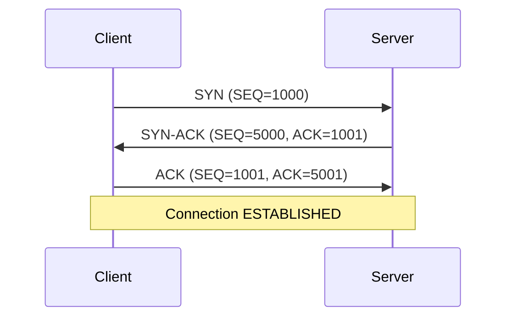
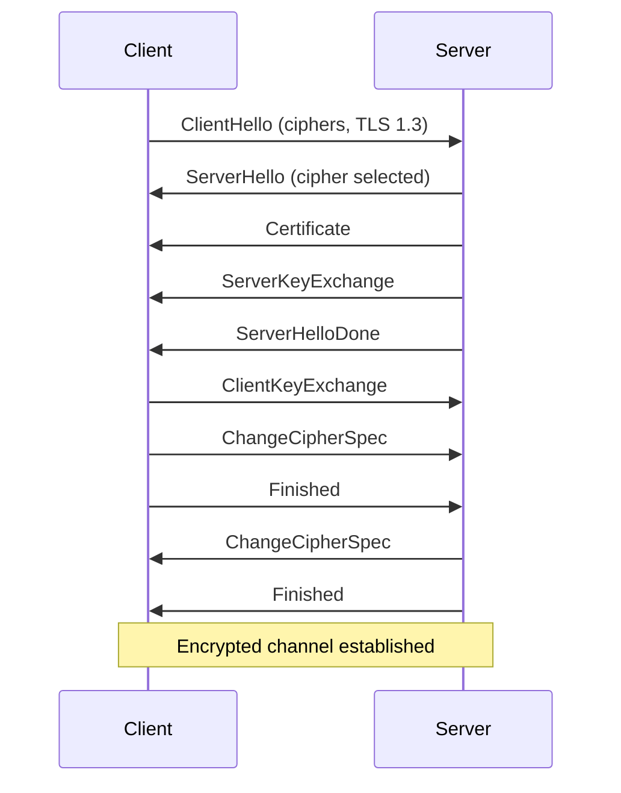

The page load pipeline orchestrates the complete journey from URL input to rendered pixels on screen. This process involves two major pipelines: the **Request Pipeline** (network) and the **Rendering Pipeline** (parsing and layout).

## Complete Page Load Sequence


## Request Pipeline

The Request Pipeline handles all network operations from URL to response.

### Architecture

```typescript
// Location: /browser/src/engine/RequestPipeline.ts

export class RequestPipeline {
  private dnsResolver: DNSResolver;
  private dnsCache: DNSCache;
  private connectionPool: ConnectionPool;
  private connectionManager: ConnectionManager;
  private cacheStorage: CacheStorage;

  async request(url: string, options: RequestOptions): Promise<RequestResult> {
    // Pipeline stages:
    // 1. DNS lookup (with caching)
    // 2. Connection pool (reuse or create)
    // 3. TLS handshake (if HTTPS)
    // 4. HTTP request/response
    // 5. Cache storage
  }
}
```

### Stage 1: DNS Resolution

Convert hostname to IP address using DNS-over-HTTPS (DoH) as primary method.

```typescript
// DNS Resolution with DoH
import { DNSResolver } from "@browserx/browser";

const resolver = new DNSResolver({
  dohEndpoint: "https://cloudflare-dns.com/dns-query",
  nameservers: ["8.8.8.8", "8.8.4.4"], // Fallback
});

const result = await resolver.resolve("example.com");
// {
//   domain: "example.com",
//   addresses: ["93.184.216.34"],
//   ttl: 86400,
//   type: "A"
// }
```

**Why DoH?**
- Encrypted DNS queries prevent eavesdropping
- Works without `--unstable-net` flag in Deno
- Privacy-focused (Cloudflare doesn't log queries)
- Bypasses ISP DNS manipulation

**DNS Caching:**

```typescript
import { DNSCache } from "@browserx/browser";

const cache = new DNSCache();

// Cache result with TTL
cache.set("example.com", {
  addresses: ["93.184.216.34"],
  ttl: 3600,
  timestamp: Date.now()
});

// Retrieve from cache
const cached = cache.get("example.com");
if (cached && !cache.isExpired("example.com")) {
  console.log("Using cached DNS:", cached.addresses);
}
```

### Stage 2: Connection Pool

Reuse existing TCP/TLS connections to avoid handshake overhead.

```typescript
import { ConnectionPool } from "@browserx/browser";

const pool = new ConnectionPool({
  maxConnectionsPerHost: 6,
  maxIdleConnections: 10,
  idleTimeout: 60000, // 60 seconds
  connectionTimeout: 30000, // 30 seconds
});

// Get or create connection
const connection = await pool.acquire({
  hostname: "example.com",
  port: 443,
  protocol: "https",
});

// Connection is reused if:
// - Same hostname + port
// - Still active (not idle timeout)
// - Not at max connections
```

**Connection Pool Benefits:**
- **Reduced Latency**: Skip TCP + TLS handshakes (200-400ms savings)
- **Lower Server Load**: Fewer connections to manage
- **HTTP/2 Multiplexing**: Multiple requests over single connection
- **Automatic Cleanup**: Idle connections closed after timeout

### Stage 3: TCP Handshake

Establish reliable connection using three-way handshake.



**TCP State Machine:**

```typescript
enum TCPState {
  CLOSED,
  LISTEN,
  SYN_SENT,
  SYN_RECEIVED,
  ESTABLISHED,
  FIN_WAIT_1,
  FIN_WAIT_2,
  CLOSE_WAIT,
  CLOSING,
  LAST_ACK,
  TIME_WAIT,
}

// Socket transitions through states:
// Client: CLOSED → SYN_SENT → ESTABLISHED
// Server: CLOSED → LISTEN → SYN_RECEIVED → ESTABLISHED
```

**Implementation:**

```typescript
import { Socket, TCPConnection } from "@browserx/browser";

const socket = new Socket(AddressFamily.IPv4, SocketType.STREAM);

// Connect initiates three-way handshake
await socket.connect("93.184.216.34", 443);

console.log(socket.state); // "ESTABLISHED"
console.log(`Local: ${socket.localAddress}:${socket.localPort}`);
console.log(`Remote: ${socket.remoteAddress}:${socket.remotePort}`);
```

### Stage 4: TLS Handshake

Encrypt connection using TLS 1.3 for HTTPS.



**TLS State Machine:**

```typescript
enum TLSState {
  NONE,
  CLIENT_HELLO,
  SERVER_HELLO,
  CERTIFICATE,
  SERVER_KEY_EXCHANGE,
  SERVER_HELLO_DONE,
  CLIENT_KEY_EXCHANGE,
  CHANGE_CIPHER_SPEC,
  FINISHED,
  ESTABLISHED,
  CLOSED,
}
```

**Implementation:**

```typescript
import { TLSConnection } from "@browserx/browser";

const tlsConn = new TLSConnection(socket, {
  serverName: "example.com",
  minVersion: "TLSv1.3",
  cipherSuites: [
    "TLS_AES_128_GCM_SHA256",
    "TLS_AES_256_GCM_SHA384",
  ],
});

await tlsConn.handshake();

console.log(tlsConn.state); // "ESTABLISHED"
console.log(tlsConn.version); // "TLSv1.3"
console.log(tlsConn.cipher); // "TLS_AES_128_GCM_SHA256"

// Certificate validation
const cert = tlsConn.peerCertificate;
console.log(cert.subject); // "CN=example.com"
console.log(cert.issuer);  // "CN=DigiCert..."
console.log(cert.validFrom, "-", cert.validTo);
```

### Stage 5: HTTP Request/Response

Send HTTP request and receive response.

```typescript
import { HTTPRequestParser, HTTPResponseParser } from "@browserx/browser";

// Build HTTP request
const request = {
  method: "GET",
  url: "https://example.com/",
  headers: {
    "Host": "example.com",
    "User-Agent": "BrowserX/1.0",
    "Accept": "text/html,application/xhtml+xml",
    "Accept-Encoding": "gzip, deflate, br",
    "Connection": "keep-alive",
  },
  body: null,
};

// Serialize to wire format
const requestBytes = HTTPRequestParser.serialize(request);

// Send over TLS connection
await tlsConn.write(requestBytes);

// Read response
const responseBytes = await tlsConn.read();

// Parse HTTP response
const response = HTTPResponseParser.parse(responseBytes);

console.log(response.statusCode); // 200
console.log(response.headers);
console.log(response.body.toString()); // HTML content
```

**HTTP Caching:**

```typescript
import { CacheStorage } from "@browserx/browser";

const cache = new CacheStorage("https://example.com");

// Check cache before request
const cachedResponse = await cache.match(request.url);

if (cachedResponse && isFresh(cachedResponse)) {
  console.log("Using cached response");
  return cachedResponse;
}

// Store response in cache
await cache.put(request.url, response);
```

### Request Timing

The Request Pipeline tracks timing for each stage:

```typescript
const result = await requestPipeline.request("https://example.com");

console.log(result.timing);
// {
//   dnsLookup: 15,        // DNS resolution
//   tcpConnection: 45,    // TCP handshake
//   tlsHandshake: 78,     // TLS handshake
//   requestSent: 5,       // Send HTTP request
//   firstByte: 120,       // Time to first byte (TTFB)
//   download: 80,         // Download response body
//   total: 343            // Total request time
// }
```

## Rendering Pipeline

The Rendering Pipeline transforms HTML into pixels on screen.

### Architecture

```typescript
// Location: /browser/src/engine/RenderingPipeline.ts

export class RenderingPipeline {
  private requestPipeline: RequestPipeline;
  private compositor: CompositorThread;
  private webgpu: OffscreenWebGPU | null;

  async render(url: string): Promise<RenderingResult> {
    // Pipeline stages:
    // 1. Fetch HTML (via RequestPipeline)
    // 2. Parse HTML → DOM tree
    // 3. Fetch CSS → Parse CSS → CSSOM
    // 4. Build Render Tree
    // 5. Layout → Geometry
    // 6. Paint → Display List
    // 7. Composite → Pixels
  }
}
```

### Stage 1: HTML Fetch

Use Request Pipeline to fetch HTML document.

```typescript
const result = await this.requestPipeline.request(url, {
  method: "GET",
  headers: {
    "Accept": "text/html,application/xhtml+xml",
  },
});

const html = result.response.body.toString();
```

### Stage 2: HTML Parse

Convert HTML string to DOM tree using tokenizer and tree builder.

**HTML Tokenizer:**

The tokenizer implements HTML5's 60+ state machine to convert characters into tokens.

```typescript
import { HTMLTokenizer, HTMLTokenizerState } from "@browserx/browser";

const tokenizer = new HTMLTokenizer();
const tokens = tokenizer.tokenize("<div class='test'>Hello</div>");

// Tokens:
// [
//   { type: START_TAG, tagName: "div", attributes: {class: "test"} },
//   { type: CHARACTER, data: "Hello" },
//   { type: END_TAG, tagName: "div" },
//   { type: EOF }
// ]
```

**Tokenizer States:**

```typescript
enum HTMLTokenizerState {
  DATA,                           // Default state
  TAG_OPEN,                       // After <
  END_TAG_OPEN,                   // After </
  TAG_NAME,                       // Reading tag name
  BEFORE_ATTRIBUTE_NAME,          // Before attribute
  ATTRIBUTE_NAME,                 // Reading attribute name
  AFTER_ATTRIBUTE_NAME,           // After attribute name
  BEFORE_ATTRIBUTE_VALUE,         // Before attribute value
  ATTRIBUTE_VALUE_DOUBLE_QUOTED,  // Inside "..."
  ATTRIBUTE_VALUE_SINGLE_QUOTED,  // Inside '...'
  ATTRIBUTE_VALUE_UNQUOTED,       // Unquoted value
  SELF_CLOSING_START_TAG,         // <tag />
  COMMENT,                        // Inside <!-- -->
  DOCTYPE,                        // Inside <!DOCTYPE>
  SCRIPT_DATA,                    // Inside <script>
  RCDATA,                         // Inside <title>, <textarea>
  RAWTEXT,                        // Inside <style>
  // ... 40+ more states
}
```

**HTML Tree Builder:**

Constructs DOM tree from tokens using insertion modes.

```typescript
import { HTMLTreeBuilder } from "@browserx/browser";

const builder = new HTMLTreeBuilder();
const dom = builder.build(tokens);

// DOM tree:
// Document
//   └─ Element (div, class="test")
//       └─ Text ("Hello")
```

**Preload Scanner:**

While parsing HTML, discover resources early for parallel fetching.

```typescript
import { PreloadScanner } from "@browserx/browser";

const scanner = new PreloadScanner();
const resources = scanner.scan(html);

// Discovered resources:
// [
//   { url: "/style.css", type: "stylesheet" },
//   { url: "/script.js", type: "script" },
//   { url: "/image.png", type: "image" }
// ]

// Fetch resources in parallel while parsing continues
const resourceFetches = resources.map(r =>
  requestPipeline.request(r.url)
);
```

### Stage 3: CSS Fetch and Parse

Fetch and parse stylesheets into CSSOM.

```typescript
import { CSSTokenizer, CSSParser, CSSOM } from "@browserx/browser";

// Fetch CSS files discovered in <link> tags
const cssPromises = cssUrls.map(url => requestPipeline.request(url));
const cssResponses = await Promise.all(cssPromises);

// Parse CSS into CSSOM
const cssom = new CSSOM();

for (const response of cssResponses) {
  const css = response.response.body.toString();
  const tokenizer = new CSSTokenizer();
  const tokens = tokenizer.tokenize(css);

  const parser = new CSSParser();
  const stylesheet = parser.parse(tokens);

  cssom.addStylesheet(stylesheet);
}

// CSSOM structure:
// StyleSheet
//   └─ Rules
//       ├─ ".test { color: red; }"
//       └─ "div { margin: 10px; }"
```

### Stage 4: Style Resolution

Compute final styles for each DOM element.

```typescript
import { StyleResolver } from "@browserx/browser";

const resolver = new StyleResolver(cssom);

// Resolve styles for each element
function resolveStyles(node: DOMNode) {
  if (node.type === "ELEMENT") {
    // Compute final styles from:
    // 1. User agent stylesheet (browser defaults)
    // 2. User stylesheet (user preferences)
    // 3. Author stylesheet (page CSS)
    // 4. Inline styles (style attribute)

    const computedStyle = resolver.resolve(node);
    node.computedStyle = computedStyle;
  }

  for (const child of node.children) {
    resolveStyles(child);
  }
}

resolveStyles(dom);
```

### Stage 5: Build Render Tree

Create render tree with only visible elements.

```typescript
import { RenderTree } from "@browserx/browser";

const renderTree = new RenderTree();

function buildRenderTree(domNode: DOMNode, parentRenderNode: RenderNode | null) {
  // Skip elements with display: none
  if (domNode.computedStyle?.display === "none") {
    return;
  }

  // Create render node
  const renderNode = renderTree.createNode({
    element: domNode,
    style: domNode.computedStyle,
    parent: parentRenderNode,
  });

  // Process children
  for (const child of domNode.children) {
    buildRenderTree(child, renderNode);
  }
}

buildRenderTree(dom, null);
```

### Stage 6: Layout

Compute geometry for each render node.

```typescript
import { LayoutEngine } from "@browserx/browser";

const layoutEngine = new LayoutEngine({
  viewportWidth: 1920,
  viewportHeight: 1080,
  devicePixelRatio: 1.0,
});

const layoutTree = layoutEngine.layout(renderTree);

// Layout boxes with computed geometry:
// LayoutBox
//   ├─ dimensions: { x: 0, y: 0, width: 1920, height: 100 }
//   ├─ padding: { top: 10, right: 10, bottom: 10, left: 10 }
//   ├─ border: { top: 1, right: 1, bottom: 1, left: 1 }
//   ├─ margin: { top: 0, right: 0, bottom: 20, left: 0 }
//   └─ children: [...]
```

**Layout Process:**
1. **Normal Flow**: Block and inline layout
2. **Flexbox**: Flexible box layout
3. **Grid**: CSS Grid layout
4. **Positioning**: Absolute, relative, fixed, sticky
5. **Floats**: Float layout

### Stage 7: Paint

Generate display list with drawing commands.

```typescript
import { DisplayList, PaintContext } from "@browserx/browser";

const displayList = new DisplayList();
const paintContext = new PaintContext(displayList);

function paint(layoutBox: LayoutBox) {
  // Paint background
  if (layoutBox.style.backgroundColor) {
    paintContext.fillRect(
      layoutBox.dimensions.x,
      layoutBox.dimensions.y,
      layoutBox.dimensions.width,
      layoutBox.dimensions.height,
      layoutBox.style.backgroundColor
    );
  }

  // Paint border
  if (layoutBox.border) {
    paintContext.strokeRect(
      layoutBox.dimensions.x,
      layoutBox.dimensions.y,
      layoutBox.dimensions.width,
      layoutBox.dimensions.height,
      layoutBox.style.borderColor,
      layoutBox.border.top
    );
  }

  // Paint text
  if (layoutBox.text) {
    paintContext.fillText(
      layoutBox.text,
      layoutBox.dimensions.x,
      layoutBox.dimensions.y,
      layoutBox.style.color,
      layoutBox.style.font
    );
  }

  // Paint children
  for (const child of layoutBox.children) {
    paint(child);
  }
}

paint(layoutTree);

// Display list commands:
// [
//   { op: "fillRect", x: 0, y: 0, width: 1920, height: 100, color: "#fff" },
//   { op: "strokeRect", x: 0, y: 0, width: 1920, height: 100, color: "#000", width: 1 },
//   { op: "fillText", text: "Hello", x: 10, y: 50, color: "#000", font: "16px Arial" }
// ]
```

### Stage 8: Composite

Composite layers into final pixels using WebGPU or headless fallback.

**WebGPU Compositor:**

```typescript
import { OffscreenWebGPU, WebGPUCompositorLayer } from "@browserx/browser";

// Initialize WebGPU
const webgpu = new OffscreenWebGPU();
await webgpu.initialize(1920, 1080);

// Create compositor layer
const layer = new WebGPUCompositorLayer(webgpu.gpuDevice, {
  width: 1920,
  height: 1080,
  displayList,
  transform: { x: 0, y: 0, scaleX: 1, scaleY: 1, rotation: 0 },
  opacity: 1.0,
});

await layer.upload();

// Composite to texture
await layer.composite();

// Read pixels back to CPU
const pixels = await webgpu.getPixels();
// Uint8Array of RGBA pixels (1920 * 1080 * 4 bytes)
```

**Headless Fallback:**

```typescript
import { CompositorThread } from "@browserx/browser";

const compositor = new CompositorThread(canvas, {
  width: 1920,
  height: 1080,
});

// Returns white pixels when no GPU
const pixels = await compositor.getPixels();
// All pixels are (255, 255, 255, 255)
```

### Rendering Timing

The Rendering Pipeline tracks timing for each stage:

```typescript
const result = await renderingPipeline.render("https://example.com");

console.log(result.timing);
// {
//   htmlFetch: 150,           // Fetch HTML document
//   htmlParse: 35,            // Parse HTML → DOM
//   cssFetch: 80,             // Fetch CSS files
//   cssParse: 20,             // Parse CSS → CSSOM
//   scriptExecution: 0,       // Execute <script> tags
//   styleResolution: 45,      // Compute final styles
//   layoutComputation: 120,   // Layout geometry
//   paintRecording: 60,       // Generate display list
//   compositing: 25,          // Composite to pixels
//   total: 535                // Total rendering time
// }
```

## Complete Example

Full page load from URL to pixels:

```typescript
import { Browser } from "@browserx/browser";

const browser = new Browser({
  width: 1920,
  height: 1080,
  enableJavaScript: false,
  enableStorage: true,
});

const startTime = Date.now();

// Navigate triggers both pipelines:
await browser.navigate("https://example.com");

const totalTime = Date.now() - startTime;

console.log(`Page loaded in ${totalTime}ms`);

// Access rendered output
const dom = browser.getDOM();
const pixels = await browser.screenshot();

// Timing breakdown
const requestTiming = browser.getRequestTiming();
const renderingTiming = browser.getRenderingTiming();

console.log("Request Pipeline:", requestTiming);
console.log("Rendering Pipeline:", renderingTiming);
```

## Performance Optimizations

### Connection Reuse

Connection pooling saves 200-400ms per request:

```typescript
// First request: DNS + TCP + TLS = ~300ms
await requestPipeline.request("https://example.com/page1");

// Second request: Reuses connection = ~50ms (no handshakes)
await requestPipeline.request("https://example.com/page2");
```

### DNS Caching

DNS caching saves 10-50ms per lookup:

```typescript
// First lookup: Query DNS = ~20ms
await dnsResolver.resolve("example.com");

// Second lookup: From cache = ~0ms
await dnsResolver.resolve("example.com");
```

### Resource Preloading

Parallel resource fetching reduces total load time:

```typescript
// Sequential: 150 + 80 + 60 = 290ms
await fetchHTML();
await fetchCSS();
await fetchJS();

// Parallel: max(150, 80, 60) = 150ms
await Promise.all([fetchHTML(), fetchCSS(), fetchJS()]);
```

### WebGPU Compositing

GPU compositing is faster than CPU:

- CPU Canvas 2D: ~50-100ms composite
- GPU WebGPU: ~5-20ms composite

## Next Steps

- [Network Stack](/browser/network-stack) - Deep dive into network implementation
- [Rendering Pipeline](/browser/rendering-pipeline) - HTML/CSS parsing details
- [Metrics](/browser/metrics) - Performance monitoring and observability
