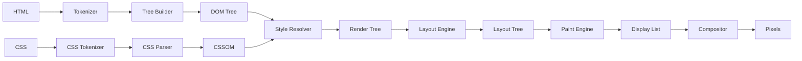

The Rendering Pipeline transforms HTML and CSS into pixels on screen through parsing, layout, paint, and compositing stages.

## Pipeline Stages



## HTML Parsing

### HTMLTokenizer

Implements HTML5 state machine with 60+ states.

```typescript
import { HTMLTokenizer, HTMLTokenType } from "@browserx/browser";

const tokenizer = new HTMLTokenizer();
const tokens = tokenizer.tokenize('<div class="box">Hello</div>');

// Tokens produced:
// [
//   { type: START_TAG, tagName: "div", attributes: {class: "box"} },
//   { type: CHARACTER, data: "Hello" },
//   { type: END_TAG, tagName: "div" },
//   { type: EOF }
// ]
```

**Tokenizer States:**

```typescript
enum HTMLTokenizerState {
  DATA,                           // Default state
  TAG_OPEN,                       // After <
  END_TAG_OPEN,                   // After </
  TAG_NAME,                       // Reading tag name
  BEFORE_ATTRIBUTE_NAME,
  ATTRIBUTE_NAME,
  AFTER_ATTRIBUTE_NAME,
  BEFORE_ATTRIBUTE_VALUE,
  ATTRIBUTE_VALUE_DOUBLE_QUOTED,  // Inside "..."
  ATTRIBUTE_VALUE_SINGLE_QUOTED,  // Inside '...'
  ATTRIBUTE_VALUE_UNQUOTED,
  SELF_CLOSING_START_TAG,         // <tag />
  COMMENT,                        // Inside <!-- -->
  DOCTYPE,                        // Inside <!DOCTYPE>
  SCRIPT_DATA,                    // Inside <script>
  RCDATA,                         // Inside <title>, <textarea>
  RAWTEXT,                        // Inside <style>
  // ... 40+ more states
}
```

### HTMLTreeBuilder

Constructs DOM tree from tokens.

```typescript
import { HTMLTreeBuilder } from "@browserx/browser";

const builder = new HTMLTreeBuilder();
const dom = builder.build(tokens);

// DOM structure:
// Document
//   └─ Element (div)
//       ├─ Attribute: class="box"
//       └─ Text ("Hello")
```

**Insertion Modes:**
- Initial
- Before HTML
- Before Head
- In Head
- After Head
- In Body
- In Table
- After Body
- After After Body

### PreloadScanner

Discovers resources early for parallel fetching.

```typescript
import { PreloadScanner } from "@browserx/browser";

const scanner = new PreloadScanner();
const resources = scanner.scan(html);

// Discovered:
// [
//   { url: "/style.css", type: "stylesheet", as: "style" },
//   { url: "/script.js", type: "script", as: "script" },
//   { url: "/hero.jpg", type: "image", as: "image" }
// ]

// Fetch in parallel while parsing continues
Promise.all(resources.map(r => fetch(r.url)));
```

## CSS Parsing

### CSSTokenizer

Tokenize CSS into discrete tokens.

```typescript
import { CSSTokenizer } from "@browserx/browser";

const tokenizer = new CSSTokenizer();
const tokens = tokenizer.tokenize('.box { color: red; margin: 10px; }');

// Tokens:
// [
//   { type: "DELIM", value: "." },
//   { type: "IDENT", value: "box" },
//   { type: "LBRACE" },
//   { type: "IDENT", value: "color" },
//   { type: "COLON" },
//   { type: "IDENT", value: "red" },
//   { type: "SEMICOLON" },
//   ...
// ]
```

### CSSParser

Parse tokens into CSSOM.

```typescript
import { CSSParser, CSSOM } from "@browserx/browser";

const parser = new CSSParser();
const stylesheet = parser.parse(tokens);

const cssom = new CSSOM();
cssom.addStylesheet(stylesheet);

// CSSOM structure:
// StyleSheet
//   └─ Rules
//       └─ StyleRule
//           ├─ Selector: ".box"
//           └─ Declarations
//               ├─ color: red
//               └─ margin: 10px
```

### StyleResolver

Compute final styles for each element.

```typescript
import { StyleResolver } from "@browserx/browser";

const resolver = new StyleResolver(cssom);

function resolveStyles(element: DOMElement) {
  // Cascade order:
  // 1. User agent styles (browser defaults)
  // 2. User styles (user preferences)
  // 3. Author styles (page CSS)
  // 4. Inline styles (style attribute)

  const computed = resolver.resolve(element);
  element.computedStyle = computed;

  for (const child of element.children) {
    if (child.type === "ELEMENT") {
      resolveStyles(child);
    }
  }
}
```

**Specificity Calculation:**

```typescript
// Inline style: 1,0,0,0
// ID selector: 0,1,0,0
// Class/attribute/pseudo-class: 0,0,1,0
// Element/pseudo-element: 0,0,0,1

// Examples:
// div                  = 0,0,0,1
// .box                 = 0,0,1,0
// #main                = 0,1,0,0
// style="..."          = 1,0,0,0
// div.box#main         = 0,1,1,1
// .box.active:hover    = 0,0,3,0
```

## Layout Engine

### Layout Algorithms

Different display types use different layout algorithms:

```typescript
import { LayoutEngine } from "@browserx/browser";

const layoutEngine = new LayoutEngine();

// Dispatch based on display type:
switch (element.computedStyle.display) {
  case "flex":
  case "inline-flex":
    layoutEngine.layoutFlex(element);
    break;

  case "grid":
  case "inline-grid":
    layoutEngine.layoutGrid(element);
    break;

  case "block":
  case "flow-root":
    layoutEngine.layoutBlock(element);
    break;

  case "inline":
  case "inline-block":
    layoutEngine.layoutInline(element);
    break;
}
```

### Normal Flow Layout

Block and inline layout.

```typescript
import { NormalFlowLayout } from "@browserx/browser";

const normalFlow = new NormalFlowLayout();

// Block layout (vertical stacking)
const blockBox = normalFlow.layoutBlock(element, constraints);
// Each child stacks vertically
// Width: fills parent
// Height: sum of children

// Inline layout (horizontal flow)
const inlineBox = normalFlow.layoutInline(element, constraints);
// Children flow left-to-right
// Wrap to new line when reaching edge
```

### Flexbox Layout

CSS Flexible Box Layout.

```typescript
import { FlexboxLayout } from "@browserx/browser";

const flexbox = new FlexboxLayout();

const layout = flexbox.layout(element, {
  flexDirection: "row",        // or "column"
  flexWrap: "wrap",           // or "nowrap"
  justifyContent: "space-between",
  alignItems: "center",
  gap: 10,
});

// Algorithm:
// 1. Determine flex container size
// 2. Calculate flex base sizes
// 3. Resolve flexible lengths (flex-grow/flex-shrink)
// 4. Determine hypothetical main size
// 5. Resolve cross size
// 6. Align items
```

### Grid Layout

CSS Grid Layout.

```typescript
import { GridLayout } from "@browserx/browser";

const grid = new GridLayout();

const layout = grid.layout(element, {
  gridTemplateColumns: "1fr 2fr 1fr",
  gridTemplateRows: "auto 1fr auto",
  gap: "10px",
  justifyItems: "stretch",
  alignItems: "start",
});

// Algorithm:
// 1. Resolve track sizes
// 2. Place items in grid
// 3. Resolve item positions
// 4. Align items within cells
```

### Box Model

Every element has a box model:

```typescript
interface LayoutBox {
  // Content box
  content: {
    x: Pixels;
    y: Pixels;
    width: Pixels;
    height: Pixels;
  };

  // Padding box
  padding: {
    top: Pixels;
    right: Pixels;
    bottom: Pixels;
    left: Pixels;
  };

  // Border box
  border: {
    top: Pixels;
    right: Pixels;
    bottom: Pixels;
    left: Pixels;
  };

  // Margin box
  margin: {
    top: Pixels;
    right: Pixels;
    bottom: Pixels;
    left: Pixels;
  };
}

// Total width = content.width + padding.left + padding.right + border.left + border.right
// Total height = content.height + padding.top + padding.bottom + border.top + border.bottom
```

## Paint Engine

### Display List

Record drawing commands for replay.

```typescript
import { DisplayList, PaintContext } from "@browserx/browser";

const displayList = new DisplayList();
const ctx = new PaintContext(displayList);

// Record paint commands
ctx.save();
ctx.fillRect(0, 0, 100, 100, "#ffffff");      // Background
ctx.strokeRect(0, 0, 100, 100, "#000000", 1);  // Border
ctx.fillText("Hello", 10, 50, "#000000", "16px Arial");
ctx.restore();

// Display list contains:
// [
//   { type: "SAVE" },
//   { type: "FILL_RECT", x: 0, y: 0, width: 100, height: 100, color: "#fff" },
//   { type: "STROKE_RECT", x: 0, y: 0, width: 100, height: 100, color: "#000", lineWidth: 1 },
//   { type: "FILL_TEXT", text: "Hello", x: 10, y: 50, color: "#000", font: "16px Arial" },
//   { type: "RESTORE" }
// ]
```

**Paint Command Types:**

```typescript
enum PaintCommandType {
  SAVE,
  RESTORE,
  TRANSLATE,
  SCALE,
  ROTATE,
  CLIP_RECT,
  FILL_RECT,
  STROKE_RECT,
  FILL_TEXT,
  STROKE_TEXT,
  DRAW_IMAGE,
  BEGIN_PATH,
  MOVE_TO,
  LINE_TO,
  QUADRATIC_CURVE_TO,
  BEZIER_CURVE_TO,
  ARC,
  FILL,
  STROKE,
}
```

### Paint Order

Elements paint in specific order:

```typescript
function paint(element: LayoutBox) {
  // 1. Background color/image
  paintBackground(element);

  // 2. Border
  paintBorder(element);

  // 3. Content (text, replaced elements)
  paintContent(element);

  // 4. Outline
  paintOutline(element);

  // 5. Children (recursively)
  for (const child of element.children) {
    paint(child);
  }
}
```

## Compositor

### CompositorThread

Composite layers into final pixels.

```typescript
import { CompositorThread } from "@browserx/browser";

const compositor = new CompositorThread(canvas, {
  width: 1920,
  height: 1080,
  devicePixelRatio: 2.0,
});

// Add layers
compositor.addLayer({
  id: "background",
  displayList: backgroundDisplayList,
  transform: { x: 0, y: 0, scaleX: 1, scaleY: 1 },
  opacity: 1.0,
});

compositor.addLayer({
  id: "content",
  displayList: contentDisplayList,
  transform: { x: 0, y: 100, scaleX: 1, scaleY: 1 },
  opacity: 0.9,
});

// Composite all layers
await compositor.composite();

// Get final pixels
const pixels = await compositor.getPixels();
// Uint8Array of RGBA pixels (1920 * 1080 * 4 bytes)
```

### Layer Compositing

Layers are composited from back to front:

```typescript
// Compositing algorithm:
for (const layer of layers.sortByZIndex()) {
  // 1. Apply transform
  ctx.save();
  ctx.translate(layer.transform.x, layer.transform.y);
  ctx.scale(layer.transform.scaleX, layer.transform.scaleY);
  ctx.rotate(layer.transform.rotation);

  // 2. Apply opacity
  ctx.globalAlpha = layer.opacity;

  // 3. Replay display list
  layer.displayList.replay(ctx);

  ctx.restore();
}
```

## Performance Optimizations

### Damage Tracking

Only repaint changed regions:

```typescript
interface DamageRect {
  x: Pixels;
  y: Pixels;
  width: Pixels;
  height: Pixels;
}

// Track damaged regions
const damageRects: DamageRect[] = [];

// When element changes, mark damage
function markDamage(element: LayoutBox) {
  damageRects.push({
    x: element.x,
    y: element.y,
    width: element.width,
    height: element.height,
  });
}

// Repaint only damaged regions
for (const rect of damageRects) {
  ctx.save();
  ctx.clip(rect.x, rect.y, rect.width, rect.height);
  paint(root);
  ctx.restore();
}
```

### Layer Tiling

Split large layers into tiles for efficient rendering:

```typescript
const TILE_SIZE = 256; // 256x256 pixels

function tileLayer(layer: CompositorLayer): Tile[] {
  const tiles: Tile[] = [];

  for (let y = 0; y < layer.height; y += TILE_SIZE) {
    for (let x = 0; x < layer.width; x += TILE_SIZE) {
      tiles.push({
        x,
        y,
        width: Math.min(TILE_SIZE, layer.width - x),
        height: Math.min(TILE_SIZE, layer.height - y),
        displayList: layer.displayList.clip(x, y, TILE_SIZE, TILE_SIZE),
      });
    }
  }

  return tiles;
}
```

### Incremental Layout

Avoid full-tree relayout when possible:

```typescript
// Mark subtree for layout
function markNeedsLayout(element: LayoutBox) {
  element.needsLayout = true;

  // Mark all ancestors
  let parent = element.parent;
  while (parent) {
    parent.needsLayout = true;
    parent = parent.parent;
  }
}

// Only layout marked subtrees
function layoutIfNeeded(element: LayoutBox) {
  if (!element.needsLayout) {
    return; // Skip clean subtrees
  }

  // Perform layout
  layout(element);
  element.needsLayout = false;

  // Layout children
  for (const child of element.children) {
    layoutIfNeeded(child);
  }
}
```

## Complete Example

Full rendering from HTML to pixels:

```typescript
import { RenderingPipeline } from "@browserx/browser";

const pipeline = new RenderingPipeline({
  width: 1920,
  height: 1080,
  enableJavaScript: false,
  enableGpu: true,
});

await pipeline.initialize();

const html = `
  <!DOCTYPE html>
  <html>
    <head>
      <style>
        .container {
          display: flex;
          justify-content: center;
          padding: 20px;
        }
        .box {
          width: 200px;
          height: 200px;
          background: #4CAF50;
          border: 2px solid #333;
          border-radius: 10px;
        }
      </style>
    </head>
    <body>
      <div class="container">
        <div class="box">Hello, World!</div>
      </div>
    </body>
  </html>
`;

const result = await pipeline.render(html);

// Access rendered output
console.log("DOM nodes:", countNodes(result.dom));
console.log("CSS rules:", result.cssom.getRuleCount());
console.log("Layout boxes:", countLayoutBoxes(result.layoutTree));
console.log("Paint commands:", result.displayList.getCommandCount());

// Get final pixels
const pixels = await pipeline.getPixels();
console.log("Pixel buffer size:", pixels.length); // 1920 * 1080 * 4

// Timing breakdown
console.log(result.timing);
// {
//   htmlParse: 35,
//   cssParse: 20,
//   styleResolution: 45,
//   layoutComputation: 120,
//   paintRecording: 60,
//   compositing: 25,
//   total: 305
// }
```

## Next Steps

- [WebGPU Rendering](/browser/webgpu) - GPU-accelerated compositing
- [JavaScript Engine](/browser/javascript-engine) - Script execution
- [Page Load Pipeline](/browser/page-load-pipeline) - Complete flow
