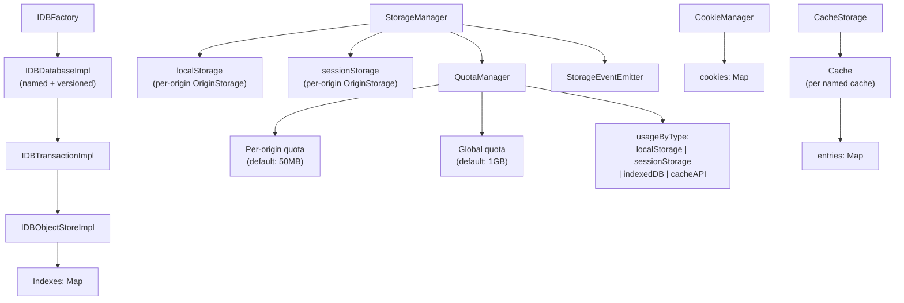
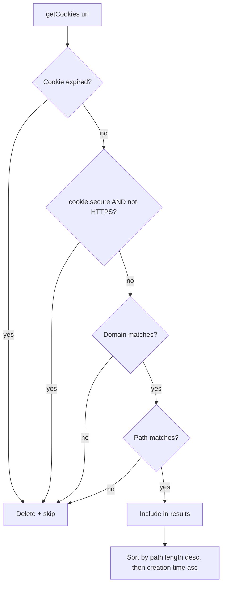
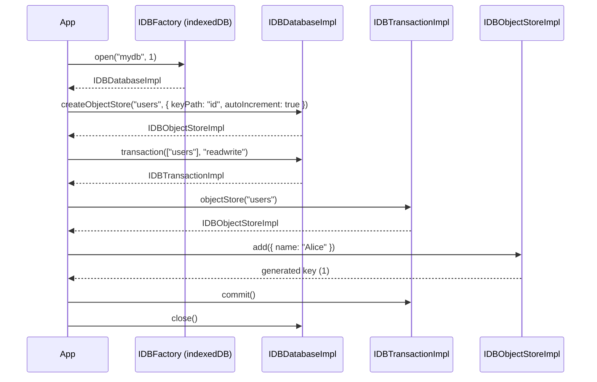
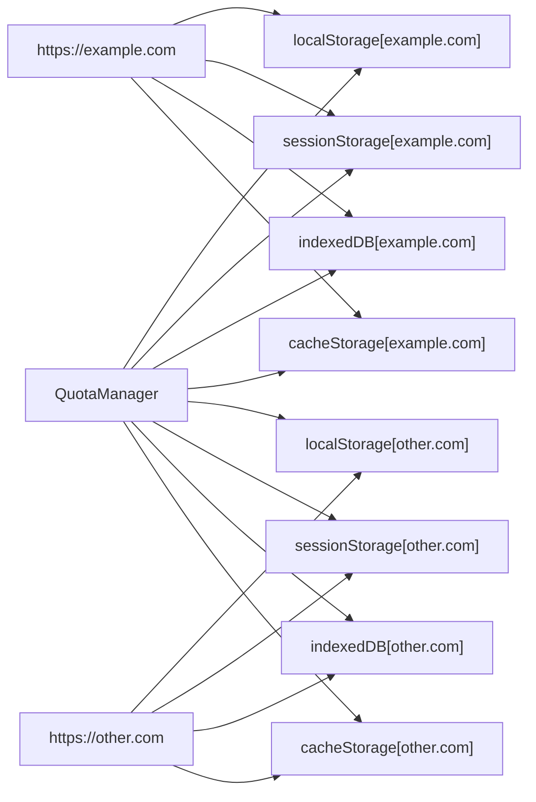

The storage layer implements the complete browser data persistence stack: Web Storage (localStorage and sessionStorage), cookies with SameSite policy enforcement, IndexedDB with transactions, the Service Worker Cache API, and unified per-origin quota management.

## Architecture Overview



## StorageManager — localStorage and sessionStorage

`StorageManager` provides origin-isolated Web Storage per the HTML specification. Each origin gets its own `OriginStorage` instance keyed by origin string.

### Basic Usage

```typescript
import { StorageManager } from "@browserx/browser";

const manager = new StorageManager();

// Get storage areas for an origin
const local   = manager.getLocalStorage("https://example.com");
const session = manager.getSessionStorage("https://example.com");

// Standard Storage API
local.setItem("theme", "dark", "https://example.com/page");
const theme = local.getItem("theme");   // "dark"
local.removeItem("theme", "https://example.com/page");
local.clear("https://example.com/page");

// Enumeration
const keys    = local.keys();           // string[]
const values  = local.values();         // string[]
const entries = local.entries();        // [string, string][]
const count   = local.length;           // number
const keyAt   = local.key(0);           // string | null

// Size tracking
const sizeBytes = local.getSize();      // UTF-16 bytes used

// Session lifecycle
manager.clearAllSessionStorage();       // Clear all session data (browser close)
manager.clearOrigin("https://example.com", "https://example.com/page");
manager.deleteOrigin("https://example.com");
```

### TypeScript API

```typescript
export class StorageManager {
  getLocalStorage(origin: string): OriginStorage;
  getSessionStorage(origin: string): OriginStorage;

  clearOrigin(origin: string, url: string): void;
  deleteOrigin(origin: string): void;
  getAllOrigins(): string[];

  getUsage(origin: string): { local: number; session: number; total: number };
  getTotalUsage(): number;

  getEventEmitter(): StorageEventEmitter;
  getQuotaManager(): QuotaManager;

  // Serialization
  export(): {
    localStorage:    Record<string, Record<string, string>>;
    sessionStorage:  Record<string, Record<string, string>>;
  };
  import(data: {
    localStorage?:   Record<string, Record<string, string>>;
    sessionStorage?: Record<string, Record<string, string>>;
  }): void;

  clearAllSessionStorage(): void;
}
```

### Quota Enforcement

Every `setItem` call calculates the UTF-16 byte delta and checks against the `QuotaManager` before writing:

```typescript
// Throws "QuotaExceededError: Storage quota exceeded" if over limit
local.setItem("largeKey", "x".repeat(1_000_000), "https://example.com");
```

Size calculation: `(key.length + value.length) * 2` bytes (UTF-16 encoding).

### Storage Events

`OriginStorage` emits a `StorageEvent` via `queueMicrotask` after every mutation:

```typescript
export interface StorageEvent {
  key:         string;                           // "" on clear()
  oldValue:    string | null;
  newValue:    string | null;
  url:         string;
  storageArea: "localStorage" | "sessionStorage";
}

const emitter = manager.getEventEmitter();
emitter.addEventListener((event) => {
  console.log(`Storage changed: ${event.key}`, event);
});
emitter.removeEventListener(listener);
emitter.setEnabled(false);  // Temporarily suppress events
```

The `StorageEventCoordinator` singleton broadcasts events across origins, excluding the source origin (per spec):

```typescript
import { storageEventCoordinator } from "@browserx/browser";

storageEventCoordinator.broadcast(event, "https://example.com");
// Emits to all registered origins except example.com
```

## CookieManager

`CookieManager` implements RFC 6265 cookie storage with domain/path matching, expiration, and SameSite policy enforcement.

### Setting and Retrieving Cookies

```typescript
import { CookieManager } from "@browserx/browser";

const manager = new CookieManager();

// Set a cookie
manager.setCookie({
  name:     "session",
  value:    "abc123",
  domain:   ".example.com",
  path:     "/",
  secure:   true,
  httpOnly: true,
  sameSite: "Lax",
  maxAge:   3600,             // seconds
  // expires: new Date(...), // alternative to maxAge
}, "https://example.com/login");

// Get cookies for a URL (domain + path + secure matching)
const cookies = manager.getCookies("https://example.com/app");

// Get cookies with SameSite filtering
const requestCookies = manager.getCookiesForRequest(
  "https://example.com",
  "https://other.com",   // cross-site request URL
  "GET",
);

// Delete
manager.deleteCookie("session", ".example.com", "/");
manager.deleteCookiesForDomain("example.com");
manager.clearAll();

// Inspection
const all   = manager.getAllCookies();
const count = manager.getCookieCount();

// Cleanup
manager.dispose();  // Stops the 60-second expiration cleanup interval
```

### TypeScript API

```typescript
export class CookieManager {
  setCookie(cookie: Cookie, requestUrl: string): void;

  getCookies(url: string): Cookie[];
  getCookiesForRequest(url: string, requestUrl: string, method?: string): Cookie[];

  deleteCookie(name: string, domain: string, path: string): void;
  deleteCookiesForDomain(domain: string): void;
  clearAll(): void;

  getAllCookies(): Cookie[];
  getCookieCount(): number;
  dispose(): void;
}
```

### Domain and Path Matching



**Domain matching rules:**
- Exact match: `cookie.domain === request.hostname`
- Dot-prefix: `.example.com` matches `example.com` and `sub.example.com`
- Subdomain: `example.com` matches `sub.example.com`

**SameSite policy:**
| Value | Allowed requests |
|---|---|
| `Strict` | Same-site only |
| `Lax` | Same-site or top-level navigation with safe HTTP method |
| `None` | Any request, but cookie must be `Secure` |

### Expiration

Cookies expire via either `expires` (absolute `Date`) or `maxAge` (seconds from creation). A background cleanup interval runs every 60 seconds to purge expired cookies.

## QuotaManager

`QuotaManager` enforces per-origin and global storage limits across all storage types.

### Configuration

```typescript
import { QuotaManager, StorageType } from "@browserx/browser";

const quota = new QuotaManager(
  50  * 1024 * 1024,   // 50MB per origin (default)
  1024 * 1024 * 1024,  // 1GB global (default)
);

// Check before writing
if (!quota.hasQuota("https://example.com", bytesNeeded)) {
  throw new Error("Storage quota exceeded");
}

// Record usage
quota.updateUsage("https://example.com", bytesWritten, StorageType.LOCAL_STORAGE);

// Inspect
const info = quota.getQuotaInfo("https://example.com");
// { quota, usage, available, usageByType: Map<StorageType, bytes> }

const global = quota.getGlobalQuotaInfo();
// { quota, usage, available, originCount }

// Per-origin usage percentage
const pct = quota.getUsagePercentage("https://example.com");  // 0–100

// Override per-origin quota
quota.setQuota("https://trusted.com", 200 * 1024 * 1024);

// Clear
quota.clearOrigin("https://example.com");
quota.clearAll();
```

### TypeScript API

```typescript
export enum StorageType {
  LOCAL_STORAGE   = "localStorage",
  SESSION_STORAGE = "sessionStorage",
  INDEXED_DB      = "indexedDB",
  CACHE_API       = "cacheAPI",
}

export interface QuotaInfo {
  quota:       number;
  usage:       number;
  available:   number;
  usageByType: Map<StorageType, number>;
}

export class QuotaManager {
  hasQuota(origin: string, requestedBytes: number): boolean;
  updateUsage(origin: string, bytes: number, type?: StorageType): void;

  getQuota(origin: string): number;
  setQuota(origin: string, quota: number): void;
  getUsage(origin: string): number;
  getUsageByType(origin: string, type: StorageType): number;
  getQuotaInfo(origin: string): QuotaInfo;

  setGlobalQuota(quota: number): void;
  setDefaultQuota(quota: number): void;
  getGlobalQuotaInfo(): { quota, usage, available, originCount };

  isGlobalQuotaExceeded(): boolean;
  isOriginQuotaExceeded(origin: string): boolean;
  getUsagePercentage(origin: string): number;
  getGlobalUsagePercentage(): number;

  getAllOrigins(): string[];
  clearOrigin(origin: string): void;
  clearAll(): void;

  export(): { quotas, usage, globalUsage };
  import(data: { quotas?, usage?, globalUsage? }): void;
}
```

## IndexedDB

The IndexedDB implementation provides a structured key-value database with versioned schemas, transactions, object stores, and secondary indexes.

### Database Lifecycle



### Basic Usage

```typescript
import { indexedDB } from "@browserx/browser";

// Open or create database
const db = await indexedDB.open("myapp", 1);

// Schema: create object stores and indexes
const users = db.createObjectStore("users", {
  keyPath:       "id",
  autoIncrement: true,
});
users.createIndex("byEmail", "email", { unique: true });

// Read-write transaction
const txn  = db.transaction(["users"], "readwrite");
const store = txn.objectStore("users");

// CRUD
const key = await store.add({ name: "Alice", email: "alice@example.com" });
await store.put({ id: key, name: "Alice Smith", email: "alice@example.com" });
const user = await store.get(key);
await store.delete(key);

// Bulk operations
const all   = await store.getAll();
const keys  = await store.getAllKeys();
const count = await store.count();

// Cursor iteration
const cursor = await store.openCursor(undefined, "next");
while (cursor && !cursor.done) {
  console.log(cursor.key, await cursor.value());
  cursor.continue();
}

// Commit / abort
txn.commit();
// txn.abort();

db.close();

// Delete database
await indexedDB.deleteDatabase("myapp");
```

### TypeScript API

```typescript
export class IDBFactory {
  open(name: string, version?: number): Promise<IDBDatabaseImpl>;
  deleteDatabase(name: string): Promise<void>;
  getDatabaseNames(): string[];
  cmp(a: unknown, b: unknown): number;
}

export class IDBDatabaseImpl {
  readonly name:            string;
  readonly version:         number;
  readonly objectStoreNames: string[];

  createObjectStore(name: string, options?: IDBObjectStoreOptions): IDBObjectStoreImpl;
  deleteObjectStore(name: string): void;
  transaction(storeNames: string | string[], mode?: IDBTransactionMode): IDBTransactionImpl;
  close(): void;
  isClosed(): boolean;
  export(): DatabaseExport;
}

export class IDBTransactionImpl {
  readonly db:               IDBDatabaseImpl;
  readonly mode:             IDBTransactionMode;  // "readonly" | "readwrite" | "versionchange"
  readonly objectStoreNames: string[];

  objectStore(name: string): IDBObjectStoreImpl;
  abort(): void;
  commit(): void;
  isActive(): boolean;
  setOnComplete(callback: () => void): void;
  setOnAbort(callback: (error: Error) => void): void;
}

export class IDBObjectStoreImpl {
  readonly name:          string;
  readonly keyPath:       string | string[] | null;
  readonly autoIncrement: boolean;
  readonly indexNames:    string[];

  add(value: unknown, key?: unknown): Promise<unknown>;
  put(value: unknown, key?: unknown): Promise<unknown>;
  get(key: unknown): Promise<unknown>;
  delete(key: unknown): Promise<void>;
  clear(): Promise<void>;

  getAll(query?: unknown, count?: number): Promise<unknown[]>;
  getAllKeys(query?: unknown, count?: number): Promise<unknown[]>;
  count(query?: unknown): Promise<number>;
  openCursor(query?: unknown, direction?: "next" | "prev"): Promise<IDBCursorImpl | null>;

  createIndex(name: string, keyPath: string | string[], options?: {
    unique?:     boolean;
    multiEntry?: boolean;
  }): IDBIndex;
  deleteIndex(name: string): void;
  index(name: string): IDBIndex | undefined;
}
```

### Transaction Auto-commit

Transactions auto-commit via `queueMicrotask` if `commit()` is not called explicitly:

```typescript
const txn = db.transaction(["store"], "readwrite");
// If no explicit commit/abort in same microtask task, auto-commits
queueMicrotask(() => {
  if (txn.isActive()) txn.commit();
});
```

### Secondary Indexes

```typescript
const store = txn.objectStore("products");

// Create unique index on SKU field
store.createIndex("bySku", "sku", { unique: true });

// Create multiEntry index for tag arrays
store.createIndex("byTag", "tags", { multiEntry: true });

// Access index
const skuIdx = store.index("bySku");
```

## Cache API

`CacheStorage` and `Cache` implement the Service Worker Cache API for storing request/response pairs keyed by URL and HTTP method.

### Usage

```typescript
import { cacheStorageManager } from "@browserx/browser";

const storage = cacheStorageManager.getStorage("https://example.com");

// Open a named cache
const cache = await storage.open("v1-assets");

// Store a response
await cache.put(request, response);

// Match a cached response
const cached = await cache.match(request);
const cachedIgnoreQuery = await cache.match(request, { ignoreSearch: true });

// Cross-cache match
const found = await storage.match(request);
const inSpecific = await storage.match(request, { cacheName: "v1-assets" });

// List cached request URLs
const keys = await cache.keys();

// Delete a cached entry
await cache.delete(request);
await cache.delete("https://example.com/style.css");

// Delete entire named cache
await storage.delete("v1-assets");

// Inspect
const names  = await storage.keys();         // ["v1-assets", ...]
const exists = await storage.has("v1-assets");
const size   = storage.getTotalSize();        // bytes

// Clear all caches for an origin
await storage.clearAll();
await cacheStorageManager.deleteOrigin("https://example.com");
```

### TypeScript API

```typescript
export interface CacheMatchOptions {
  ignoreSearch?: boolean;  // Ignore query string when matching URL
  ignoreMethod?: boolean;  // Ignore HTTP method when matching
  ignoreVary?:   boolean;  // Ignore Vary response header
  cacheName?:    string;   // Search only this named cache
}

export class Cache {
  readonly name: string;

  put(request: HTTPRequest, response: HTTPResponse): Promise<void>;
  match(request: HTTPRequest | string, options?: CacheMatchOptions): Promise<HTTPResponse | undefined>;
  delete(request: HTTPRequest | string, options?: CacheMatchOptions): Promise<boolean>;
  keys(request?: HTTPRequest | string, options?: CacheMatchOptions): Promise<HTTPRequest[]>;
  clear(): Promise<void>;

  getSize(): number;   // bytes consumed
  getCount(): number;  // number of entries
}

export class CacheStorage {
  open(cacheName: string): Promise<Cache>;
  match(request: HTTPRequest | string, options?: CacheMatchOptions): Promise<HTTPResponse | undefined>;
  has(cacheName: string): Promise<boolean>;
  delete(cacheName: string): Promise<boolean>;
  keys(): Promise<string[]>;

  getTotalSize(): number;
  getCacheCount(): number;
  clearAll(): Promise<void>;
}

// Singleton manager (per-origin CacheStorage instances)
export const cacheStorageManager: CacheStorageManager;
```

### Expiration

Cache entries expire automatically based on HTTP response headers:

| Header | Behavior |
|---|---|
| `Cache-Control: max-age=N` | Entry expires `N` seconds after caching |
| `Expires: <date>` | Entry expires at the specified date |
| (none) | Entry never expires unless explicitly deleted |

Expired entries are removed lazily on the next `match()` or `keys()` call, and also when `cleanupExpired()` runs internally.

### Quota Integration

`Cache.put()` checks the `QuotaManager` before storing. Entry size is calculated as:

```
size = (url.length + method.length) * 2
     + sum of (key.length + value.length) * 2 for request headers
     + request.body.byteLength
     + statusText.length * 2
     + sum of (key.length + value.length) * 2 for response headers
     + response.body.byteLength
```

## Origin Isolation

All storage subsystems enforce origin isolation at the API boundary:



Each origin's storage is gated through `QuotaManager.hasQuota(origin, bytes)` before any write. Quotas are tracked separately per `StorageType` per origin, and globally across all origins.

## Session Persistence

### localStorage persists across sessions

`StorageManager` exposes `export()` and `import()` for serialization to and from a JSON-compatible structure, enabling localStorage data to survive browser restarts:

```typescript
// Serialize to JSON
const snapshot = manager.export();
const json = JSON.stringify(snapshot);

// Restore on next session
const data = JSON.parse(json);
manager.import(data);
```

### sessionStorage is cleared on close

Call `StorageManager.clearAllSessionStorage()` when the browser session ends to enforce the spec requirement that session storage does not persist:

```typescript
// On browser window close / tab close
manager.clearAllSessionStorage();
```

### Cookie persistence

`CookieManager` stores cookies in memory. Session cookies (no `expires` or `maxAge`) are automatically excluded by the expiration logic on next startup if not serialized. Persistent cookies (with `expires`/`maxAge`) should be serialized to disk by the caller — `getAllCookies()` returns all stored cookies for this purpose.

### IndexedDB persistence

`IDBDatabaseImpl.export()` serializes the database schema and object store data for external persistence. Import/restore is the caller's responsibility.
