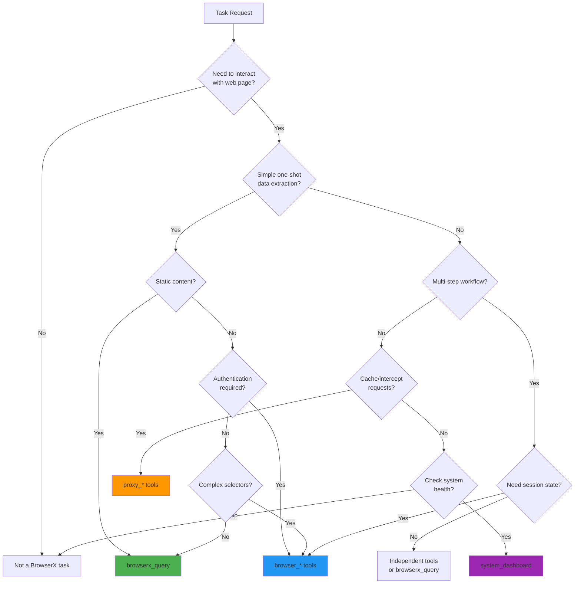

# AI Agent Guide

This guide helps AI agents (like Claude, GPT-4, or custom LLMs) effectively use BrowserX MCP tools for browser automation, web scraping, and proxy control.

## Tool Selection Decision Tree



## When to Use Each Tool Category

### Use `browserx_query` when:

- Extracting data from a single page
- Simple CSS selector-based extraction
- No authentication required
- Static content (no JavaScript interactions needed)
- One-shot operation (no session state required)

**Example:**

```typescript
// Extract product data from public listing
await browserx_query({
  query: "SELECT title, price FROM 'https://shop.com/products'"
});
```

### Use `browser_*` tools when:

- Multi-step interaction workflow required
- Need to click, type, or scroll
- Login/authentication flows
- Dynamic SPAs with async loading
- Need to maintain session state across operations

**Example:**

```typescript
// Login flow requires session
const { sessionId } = await browser_navigate({ url: "..." });
await browser_type({ sessionId, selector: "#email", text: "..." });
await browser_click({ sessionId, selector: "#submit" });
```

### Use `proxy_*` tools when:

- Need to cache HTTP responses
- Intercept or modify requests
- Add custom headers
- Block specific URLs

**Example:**

```typescript
// Cache API responses
await proxy_cache_set({
  key: "https://api.example.com/data",
  value: responseData,
  ttl: 3600
});
```

---

## Session Management for Agents

### Critical Rules

1. **`browser_navigate` WITHOUT `sessionId`** → Creates NEW session
2. **`browser_navigate` WITH `sessionId`** → Reuses existing session
3. **ALWAYS pass `sessionId` to subsequent browser tool calls**
4. **ALWAYS close sessions when done** → `browser_close_session`

### Session Lifecycle Pattern

```typescript
// 1. CREATE SESSION
const { sessionId } = await browser_navigate({ url: "..." });
// SessionManager acquires instance from BrowserPool

// 2. USE SESSION (maintain state)
await browser_click({ sessionId, selector: "..." });
await browser_type({ sessionId, selector: "...", text: "..." });
await browser_screenshot({ sessionId });

// 3. CLEANUP (release instance back to pool)
await browser_close_session({ sessionId });
```

### Common Session Mistakes

#### Mistake 1: Forgetting sessionId

```typescript
// ❌ WRONG
const { sessionId } = await browser_navigate({ url: "page1" });
await browser_click({ sessionId, selector: "#btn" });
await browser_navigate({ url: "page2" });  // Creates NEW session!
// Lost state from page1

// ✅ CORRECT
const { sessionId } = await browser_navigate({ url: "page1" });
await browser_click({ sessionId, selector: "#btn" });
await browser_navigate({ sessionId, url: "page2" });  // Reuse session
// State preserved
```

#### Mistake 2: Not Closing Sessions

```typescript
// ❌ WRONG
const { sessionId } = await browser_navigate({ url: "..." });
// ... do work ...
// Never closed! Resource leak

// ✅ CORRECT
let sessionId: string | null = null;
try {
  const result = await browser_navigate({ url: "..." });
  sessionId = result.sessionId;
  // ... do work ...
} finally {
  if (sessionId) {
    await browser_close_session({ sessionId });
  }
}
```

#### Mistake 3: Using Wrong SessionId

```typescript
// ❌ WRONG
const session1 = await browser_navigate({ url: "site1.com" });
const session2 = await browser_navigate({ url: "site2.com" });
await browser_click({ sessionId: session1.sessionId, selector: "#btn" });
// Trying to click button on site2 with session1

// ✅ CORRECT
const { sessionId } = await browser_navigate({ url: "site2.com" });
await browser_click({ sessionId, selector: "#btn" });
// Correct session for site2
```

---

## BrowserPool Architecture

Understanding the pool helps with debugging and resource management:

```
Agent Tool Call
    ↓
SessionManager
    ↓
BrowserPool.acquire() → Returns available instance OR creates new
    ↓
BrowserSession (wraps instance)
    ↓
Agent uses session
    ↓
browser_close_session()
    ↓
BrowserPool.release() → Instance returns to pool for reuse
```

### Key Points

- **Max Sessions**: Controlled by `MCP_MAX_SESSIONS` (default: 10)
- **Instance Reuse**: Released instances are recycled
- **Idle Timeout**: Sessions unused for 30 min auto-close
- **Pool Exhaustion**: Error thrown when all slots in use

### Checking Pool Status

```typescript
// Check available capacity
const sessions = await browser_list_sessions();
console.log(`${sessions.activeSessions} / ${sessions.maxSessions} in use`);

// Check pool health
const dashboard = await system_dashboard();
console.log(`Pool: ${dashboard.pool.idle} idle, ${dashboard.pool.inUse} in use`);
```

---

## Error Recovery Strategies

### Error: Timeout

**Symptoms:** Tool returns timeout error, operation did not complete.

**Recovery:**

```typescript
try {
  await browser_navigate({ url: "...", timeout: 30000 });
} catch (error) {
  if (error.message.includes("timeout")) {
    // Strategy 1: Increase timeout
    await browser_navigate({ url: "...", timeout: 60000 });

    // Strategy 2: Use faster waitUntil
    await browser_navigate({
      url: "...",
      waitUntil: "domcontentloaded"  // Faster than "load"
    });

    // Strategy 3: Wait for specific element instead
    await browser_navigate({ url: "...", waitUntil: "domcontentloaded" });
    await browser_wait({ sessionId, type: "selector", selector: ".loaded" });
  }
}
```

---

### Error: Pool Exhausted

**Symptoms:** `Cannot create session: all browser pool slots are in use`

**Recovery:**

```typescript
try {
  const { sessionId } = await browser_navigate({ url: "..." });
} catch (error) {
  if (error.message.includes("pool slots are in use")) {
    // Strategy 1: Close unused sessions
    const { sessions } = await browser_list_sessions();
    const oldSessions = sessions.filter(s => s.lastUsed > 60000);

    if (oldSessions.length > 0) {
      await browser_close_session({ sessionId: oldSessions[0].id });
      // Retry
      const { sessionId } = await browser_navigate({ url: "..." });
    } else {
      // Strategy 2: Wait for idle timeout
      throw new Error("All sessions in use. Close a session first.");
    }
  }
}
```

**Proactive check:**

```typescript
// Before creating session, check capacity
const { activeSessions, maxSessions } = await browser_list_sessions();

if (activeSessions >= maxSessions) {
  throw new Error("Cannot create session: pool at capacity");
}
```

---

### Error: Session Not Found

**Symptoms:** `Session not found: sess_abc123`

**Causes:**

- Session expired (idle timeout)
- Session closed by another operation
- Invalid session ID (typo)

**Recovery:**

```typescript
async function safeGetSession(sessionId: string, url: string) {
  // Check if session exists
  const { sessions } = await browser_list_sessions();
  const exists = sessions.some(s => s.id === sessionId);

  if (!exists) {
    // Create new session
    console.log("Session not found, creating new one");
    const result = await browser_navigate({ url });
    return result.sessionId;
  }

  return sessionId;
}

// Usage
sessionId = await safeGetSession(sessionId, url);
```

---

### Error: Element Not Found

**Symptoms:** `Element not found`, `No element matches selector`

**Recovery:**

```typescript
// Strategy 1: Verify selector exists
const elements = await browser_query_dom({
  sessionId,
  selector: "#submit-btn"
});

if (elements.count === 0) {
  // Try alternative selectors
  const alternatives = [
    "button[type=submit]",
    ".submit-button",
    "[data-submit]"
  ];

  for (const selector of alternatives) {
    const check = await browser_query_dom({ sessionId, selector });
    if (check.count > 0) {
      await browser_click({ sessionId, selector });
      break;
    }
  }
}

// Strategy 2: Wait for element to appear
await browser_wait({
  sessionId,
  type: "selector",
  selector: "#submit-btn",
  timeout: 10000
});
await browser_click({ sessionId, selector: "#submit-btn" });

// Strategy 3: Check if element is in iframe (not supported yet)
const iframes = await browser_query_dom({ sessionId, selector: "iframe" });
if (iframes.count > 0) {
  throw new Error("Element may be in iframe (not supported)");
}
```

---

### Error: Navigation Failed

**Symptoms:** `Navigation failed`, `Net error`

**Recovery:**

```typescript
try {
  await browser_navigate({ url: "https://example.com" });
} catch (error) {
  if (error.message.includes("navigation failed")) {
    // Check if URL is valid
    try {
      new URL(url);
    } catch {
      throw new Error("Invalid URL format");
    }

    // Try with different waitUntil
    await browser_navigate({
      url: "https://example.com",
      waitUntil: "domcontentloaded"
    });

    // Check for redirects
    const result = await browser_navigate({ url: "..." });
    if (result.url !== result.currentUrl) {
      console.log(`Redirected to ${result.currentUrl}`);
    }
  }
}
```

---

## Performance Optimization

### Navigation Speed

```typescript
// FASTEST: Wait for DOM only (HTML parsed)
await browser_navigate({
  url: "https://example.com",
  waitUntil: "domcontentloaded"
});

// MEDIUM: Wait for all resources (images, CSS, JS)
await browser_navigate({
  url: "https://example.com",
  waitUntil: "load"  // Default
});

// SLOWEST: Wait for network idle (best for SPAs)
await browser_navigate({
  url: "https://spa.example.com",
  waitUntil: "networkidle"
});
```

### Waiting Strategies (Ranked by Reliability)

1. **Selector wait** (BEST) - Wait for specific element:

```typescript
await browser_wait({
  sessionId,
  type: "selector",
  selector: ".content-loaded"
});
```

2. **Function wait** (GOOD) - Wait for JavaScript condition:

```typescript
await browser_wait({
  sessionId,
  type: "function",
  condition: "window.dataLoaded === true"
});
```

3. **Time wait** (AVOID) - Fixed delay:

```typescript
await browser_wait({
  sessionId,
  type: "time",
  duration: 3000
});
// ONLY use as last resort!
```

### Session Reuse

```typescript
// EFFICIENT: Reuse session for multiple pages on same site
const { sessionId } = await browser_navigate({ url: "https://site.com/page1" });
await browser_navigate({ sessionId, url: "https://site.com/page2" });
await browser_navigate({ sessionId, url: "https://site.com/page3" });
await browser_close_session({ sessionId });

// INEFFICIENT: Create new session per page
await browser_navigate({ url: "https://site.com/page1" });  // session1
await browser_navigate({ url: "https://site.com/page2" });  // session2
await browser_navigate({ url: "https://site.com/page3" });  // session3
// Resource waste + sessions not closed
```

---

## Common Automation Patterns

### Pattern 1: Login Flow

```typescript
const { sessionId } = await browser_navigate({ url: loginUrl });
await browser_wait({ sessionId, type: "selector", selector: "#email" });
await browser_type({ sessionId, selector: "#email", text: email, clear: true });
await browser_type({ sessionId, selector: "#password", text: password, clear: true });
await browser_click({ sessionId, selector: "button[type=submit]" });
await browser_wait({ sessionId, type: "selector", selector: ".dashboard" });
// Now authenticated, session maintains cookies
```

### Pattern 2: Data Extraction

```typescript
const { sessionId } = await browser_navigate({ url });
await browser_wait({ sessionId, type: "selector", selector: ".data-loaded" });
const data = await browser_query_dom({
  sessionId,
  selector: ".item",
  extract: [
    { name: "title", getText: true },
    { name: "link", attribute: "href" },
    { name: "price", getText: true }
  ]
});
await browser_close_session({ sessionId });
```

### Pattern 3: Form Submission

```typescript
const { sessionId } = await browser_navigate({ url: formUrl });
await browser_query_dom({ sessionId, selector: "input, select" }); // Discover fields
await browser_type({ sessionId, selector: "#field1", text: "value1", clear: true });
await browser_type({ sessionId, selector: "#field2", text: "value2", clear: true });
await browser_click({ sessionId, selector: "button[type=submit]" });
await browser_wait({
  sessionId,
  type: "function",
  condition: "!document.querySelector('.error')"
});
await browser_screenshot({ sessionId }); // Capture result
await browser_close_session({ sessionId });
```

---

## Monitoring and Health Checks

### System Dashboard

Use `system_dashboard` to check MCP server health:

```typescript
const dashboard = await system_dashboard();

// Check component health
if (dashboard.health["session-manager"] === "degraded") {
  console.warn("Session manager at capacity");
}

// Check pool status
console.log(
  `Pool: ${dashboard.pool.total} total, ` +
  `${dashboard.pool.idle} idle, ` +
  `${dashboard.pool.inUse} in use`
);

// Check for session leaks
const { created, closed } = dashboard.metrics;
const leaked = created - closed;
if (leaked > 5) {
  console.error(`Possible session leak: ${leaked} unclosed sessions`);
}
```

### Session Metrics

Track session usage:

```typescript
const dashboard = await system_dashboard();

// Active sessions (gauge)
console.log(`Active: ${dashboard.metrics.browserx_mcp_active_sessions}`);

// Total created (counter)
console.log(`Created: ${dashboard.metrics.browserx_mcp_sessions_created_total}`);

// Total closed (counter)
console.log(`Closed: ${dashboard.metrics.browserx_mcp_sessions_closed_total}`);

// Detect leaks
const leaked = dashboard.metrics.browserx_mcp_sessions_created_total -
               dashboard.metrics.browserx_mcp_sessions_closed_total -
               dashboard.metrics.browserx_mcp_active_sessions;

if (leaked > 0) {
  console.error(`${leaked} sessions were not properly closed`);
}
```

---

## Best Practices for AI Agents

### 1. Always Use try/finally for Sessions

```typescript
let sessionId: string | null = null;
try {
  const result = await browser_navigate({ url });
  sessionId = result.sessionId;
  // ... do work ...
} finally {
  if (sessionId) {
    await browser_close_session({ sessionId });
  }
}
```

### 2. Verify Elements Before Interaction

```typescript
// Check element exists before clicking
const button = await browser_query_dom({ sessionId, selector: "#submit" });
if (button.count === 0) {
  throw new Error("Submit button not found");
}
await browser_click({ sessionId, selector: "#submit" });
```

### 3. Use Appropriate Wait Strategies

```typescript
// Good: Wait for specific element
await browser_wait({ sessionId, type: "selector", selector: ".loaded" });

// Acceptable: Wait for condition
await browser_wait({
  sessionId,
  type: "function",
  condition: "document.readyState === 'complete'"
});

// Bad: Fixed time wait
await browser_wait({ sessionId, type: "time", duration: 5000 });
```

### 4. Track SessionIds Carefully

```typescript
// Store session ID for entire workflow
const { sessionId } = await browser_navigate({ url: "..." });

// Use throughout workflow
await browser_click({ sessionId, selector: "..." });
await browser_type({ sessionId, selector: "...", text: "..." });
await browser_screenshot({ sessionId });

// Close at end
await browser_close_session({ sessionId });
```

### 5. Monitor Pool Capacity

```typescript
// Check before creating multiple sessions
const { activeSessions, maxSessions } = await browser_list_sessions();
const needed = 5;

if (activeSessions + needed > maxSessions) {
  throw new Error(`Need ${needed} slots but only ${maxSessions - activeSessions} available`);
}
```

---

## Data Persistence

All browser activity is automatically saved:

```
.browserx/usage_data/
├── screenshots/YYYY-MM-DD/{timestamp}_{id}.png
├── logs/YYYY-MM-DD.jsonl
└── metadata/{sessionId}.json
```

**Screenshot tool returns file path:**

```typescript
const result = await browser_screenshot({ sessionId });
console.log("Screenshot saved:", result.filePath);
// → ".browserx/usage_data/screenshots/2024-02-16/1708096800_abc123.png"
```

**Activity logs:**

- Navigation events
- Click/type actions
- Query executions
- Errors

---

## Next Steps

- [Tools Reference](/mcp/tools) - Complete tool documentation
- [Workflows](/mcp/workflows) - Step-by-step examples
- [Session Management](/mcp/sessions) - Deep dive into sessions
- [Resources](/mcp/resources) - Page state and metrics access
