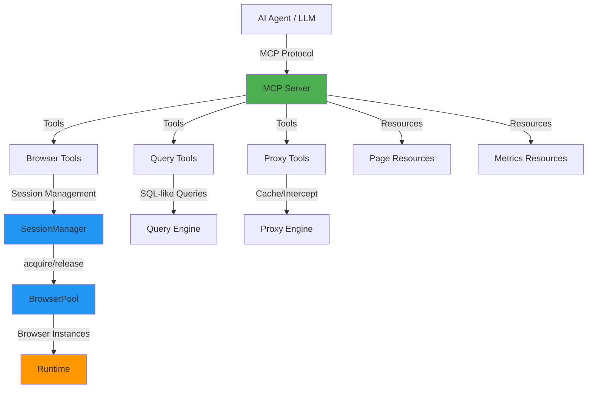

# BrowserX MCP Server

The BrowserX MCP Server exposes BrowserX's browser automation, web scraping, and proxy capabilities to Large Language Models (LLMs) through the **Model Context Protocol (MCP)**. This enables AI agents like Claude to perform complex browser interactions, extract web data, and automate workflows.

## What is MCP?

The Model Context Protocol is an open standard for connecting LLMs to external data sources and tools. BrowserX implements MCP to provide:

- **Tools**: Actionable commands for browser control (navigate, click, screenshot, query)
- **Resources**: Read-only access to page state and metrics
- **Prompts**: Pre-built workflow templates for common automation tasks

## Quick Start

### Starting the Server

```bash
# stdio transport (for Claude Desktop)
deno task mcp:start

# HTTP transport (for custom integrations)
deno task mcp:start:http

# Custom port
deno run --allow-all mod.ts --http --port=9847
```

### Connecting to Claude Desktop

Add to your Claude Desktop config (`~/Library/Application Support/Claude/claude_desktop_config.json`):

```json
{
  "mcpServers": {
    "browserx": {
      "command": "deno",
      "args": ["task", "mcp:start"],
      "cwd": "/path/to/BrowserX"
    }
  }
}
```

## Architecture Overview



## Core Components

### Session Management

Sessions are the foundation of multi-step browser workflows. When you create a session, the MCP server acquires a browser instance from the Runtime's **BrowserPool**:

- **Session creation**: `browser_navigate` without `sessionId` creates a new session
- **Session reuse**: Pass `sessionId` to subsequent calls to maintain state
- **Session cleanup**: `browser_close_session` releases the instance back to the pool

Sessions preserve:
- Cookies and localStorage
- Navigation history
- DOM state
- Viewport configuration

### Runtime Integration

The MCP server is fully integrated with BrowserX's Runtime lifecycle system:

```
Agent Request → MCP Tool → SessionManager ↔ BrowserPool
                               ↓              ↓
                          BrowserSession   Runtime
                          (cookies, DOM)   (health, metrics)
```

Benefits:
- **Instance reuse**: Browser instances are recycled across sessions
- **Health monitoring**: Runtime tracks component health and metrics
- **Resource limits**: Pool enforces max concurrent sessions
- **Idle cleanup**: Automatic cleanup of unused sessions

### Data Persistence

All browser activity is automatically saved to persistent storage:

```
.browserx/usage_data/
├── screenshots/YYYY-MM-DD/{timestamp}_{id}.png
├── logs/YYYY-MM-DD.jsonl
└── metadata/{sessionId}.json
```

The `browser_screenshot` tool returns both the base64 image data **and** the file path where it was saved.

## Configuration

### Environment Variables

| Variable | Default | Description |
|----------|---------|-------------|
| `MCP_TRANSPORT` | `stdio` | Transport mode: `stdio` or `http` |
| `MCP_PORT` | `3000` | HTTP port (when using http transport) |
| `MCP_PERMISSIONS` | `AUTOMATION` | Permission level (see below) |
| `MCP_MAX_SESSIONS` | `10` | Max concurrent browser sessions |

### Permission Levels

| Level | Capabilities |
|-------|-------------|
| `READONLY` | Query data only, no navigation or mutations |
| `AUTOMATION` | Navigate, click, type, screenshot (default) |
| `FULL` | All capabilities including cache manipulation |

## Key Features

### Lazy Initialization

The MCP server uses lazy initialization for optimal performance:

- **Server starts instantly** - no upfront cost
- **Runtime starts on first browser tool call** - only when needed
- **Components initialize on demand** - SessionManager, QueryEngine, ProxyEngine

### Tool Tiers

Tools are organized by execution time:

- **SHORT** (< 5s): click, type, query_dom
- **MEDIUM** (5-15s): wait, evaluate
- **LONG** (15-60s): navigate, screenshot, query execution
- **VERY_LONG** (> 60s): async queries, full page PDFs

Each tier has appropriate default timeouts that can be overridden per-call.

### Error Handling

The MCP server provides detailed error messages with context:

- **Validation errors**: Invalid URLs, selectors, or scripts
- **Timeout errors**: Operation exceeded time limit
- **Session errors**: Session not found or pool exhausted
- **Element errors**: Selector not found or element not interactable

### Progress Tracking

Long-running operations emit progress stages:

- **Navigation**: STARTING → SESSION → NAVIGATING → COMPLETE
- **Screenshot**: PREPARING → CAPTURING → SAVING → COMPLETE
- **Query**: PARSING → EXECUTING → FORMATTING → COMPLETE

## Next Steps

- [Tools Reference](/mcp/tools) - Complete tool catalog with examples
- [Resources](/mcp/resources) - Page state and metrics access
- [Prompts](/mcp/prompts) - Pre-built workflow templates
- [Session Management](/mcp/sessions) - Session lifecycle and patterns
- [Agent Guide](/mcp/agent-guide) - Tool selection and error recovery
- [Workflows](/mcp/workflows) - Step-by-step workflow examples
- [Integration](/mcp/integration) - Connecting with AI frameworks

## Example Usage

### Simple Data Extraction

```typescript
// Using browserx_query
const result = await tools.browserx_query({
  query: "SELECT title, price FROM 'https://shop.example.com/product'"
});
```

### Multi-Step Workflow

```typescript
// 1. Navigate and create session
const { sessionId } = await tools.browser_navigate({
  url: "https://example.com/login"
});

// 2. Fill form
await tools.browser_type({
  sessionId,
  selector: "#email",
  text: "user@example.com",
  clear: true
});

// 3. Submit and wait
await tools.browser_click({ sessionId, selector: "#submit" });
await tools.browser_wait({
  sessionId,
  type: "selector",
  selector: ".dashboard"
});

// 4. Extract data
const data = await tools.browser_query_dom({
  sessionId,
  selector: ".data-item",
  extract: [
    { name: "title", getText: true },
    { name: "link", attribute: "href" }
  ]
});

// 5. Cleanup
await tools.browser_close_session({ sessionId });
```

## Resources

- [MCP Specification](https://modelcontextprotocol.io)
- [Claude Desktop Integration](https://docs.anthropic.com/claude/docs/mcp)
- [BrowserX Documentation](/)
