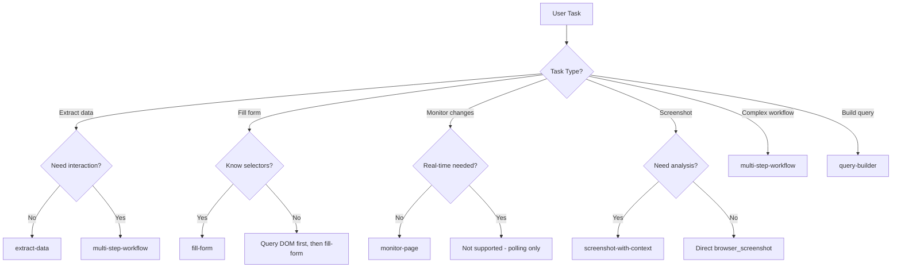

# Prompts

MCP Prompts are pre-built workflow templates that guide AI agents through common automation tasks. They provide structured instructions for data extraction, form filling, monitoring, and multi-step workflows.

## What are Prompts?

Prompts in BrowserX MCP are **reusable templates** that:

- Define **when** to use a specific approach
- Provide **step-by-step** instructions for the agent
- Specify **which tools** to use and in what order
- Include **example code** and best practices

Prompts are **not tools**. They are guidance systems that help AI agents select the right combination of tools for a task.

## Available Prompts

### extract-data

Extract structured data from a webpage using BrowserX queries.

**Use when:**

- Scraping specific data points from a known URL structure
- Simple extraction without interaction
- Static content that loads immediately

**Do NOT use when:**

- You need to interact with the page (click, type, scroll)
- Content loads dynamically via JavaScript
- Authentication is required

**Inputs:**

| Parameter | Type | Description |
|-----------|------|-------------|
| `url` | string | URL of the page to scrape |
| `dataDescription` | string | Description of what data to extract |

**Example invocation:**

```typescript
const prompt = await getPrompt("extract-data", {
  url: "https://shop.example.com/products",
  dataDescription: "product names, prices, and image URLs"
});

// Prompt generates:
// 1. Navigate to the URL and see page structure
// 2. Use browser_query_dom to understand DOM structure
// 3. Construct appropriate BrowserX query
// 4. Return structured data
```

**Generated workflow:**

```
Steps:
1. First use browser_navigate to visit the URL and see the page structure
2. Use browser_query_dom to understand the DOM structure
3. Construct an appropriate BrowserX query to extract the data
4. Return the extracted data in a structured format

Example query format:
```sql
SELECT field1, field2, field3 FROM 'https://shop.example.com/products' WHERE <conditions>
```
```

**Best for:**

- Public product listings
- News article metadata
- Static data tables
- API endpoint responses

---

### fill-form

Fill out a web form with provided data.

**Use when:**

- Automating form submission with known field selectors
- All form fields are visible and accessible
- No complex validation or multi-step flows

**Do NOT use when:**

- You need to discover form fields first (use `browser_query_dom`)
- Form has dynamic validation or CAPTCHA
- Multi-page wizard with conditional steps

**Inputs:**

| Parameter | Type | Description |
|-----------|------|-------------|
| `url` | string | URL of the page with the form |
| `formFields` | string | JSON object mapping field selectors to values |

**Example invocation:**

```typescript
const prompt = await getPrompt("fill-form", {
  url: "https://example.com/contact",
  formFields: JSON.stringify({
    "#name": "John Doe",
    "#email": "john@example.com",
    "#message": "Hello world"
  })
});
```

**Generated workflow:**

```
Steps:
1. Use browser_navigate to go to the URL
2. Use browser_query_dom to find the form fields and verify selectors
3. For each field:
   - Use browser_type to enter the value (set clear: true to clear existing text)
4. If there's a submit button, use browser_click to submit
5. Wait for navigation or confirmation using browser_wait
6. Report the result
```

**Best for:**

- Contact forms
- Survey submissions
- Registration forms
- Feedback forms

---

### monitor-page

Monitor a webpage for content changes.

**Use when:**

- Detecting when page content changes (price updates, availability, new posts)
- Comparing current state to baseline
- Polling-based monitoring is acceptable

**Do NOT use when:**

- Real-time monitoring required (this is polling-based, not event-driven)
- Changes are too frequent (will generate many requests)
- Authentication required (session will expire)

**Inputs:**

| Parameter | Type | Description |
|-----------|------|-------------|
| `url` | string | URL of the page to monitor |
| `selector` | string | CSS selector of element to watch |
| `description` | string | What changes to detect |

**Example invocation:**

```typescript
const prompt = await getPrompt("monitor-page", {
  url: "https://shop.example.com/product/123",
  selector: ".price",
  description: "price drops below $50"
});
```

**Generated workflow:**

```
Steps:
1. Use browser_navigate to load the page
2. Use browser_query_dom to capture the current state of ".price"
3. Store the initial content
4. Use BrowserX query with FOR loop to periodically check:
   ```sql
   FOR iteration IN RANGE(1, 10)
     NAVIGATE TO 'https://shop.example.com/product/123'
     SELECT text FROM '.price'
     WAIT(5000)
   END
   ```
5. Compare each result to the initial state
6. Report any changes detected
```

**Best for:**

- Product availability monitoring
- Price tracking
- Content publication alerts
- Status page monitoring

---

### screenshot-with-context

Take a screenshot and provide context about the page.

**Use when:**

- Capturing a page with semantic understanding
- Need both visual and structural information
- Documenting page state for debugging

**Do NOT use when:**

- You only need the screenshot itself (use `browser_screenshot` directly)
- No analysis required

**Inputs:**

| Parameter | Type | Description |
|-----------|------|-------------|
| `url` | string | URL of the page to capture |

**Example invocation:**

```typescript
const prompt = await getPrompt("screenshot-with-context", {
  url: "https://example.com/dashboard"
});
```

**Generated workflow:**

```
Steps:
1. Use browser_navigate to load the page
2. Use browser_wait to ensure content is loaded
3. Use browser_screenshot to capture the page
4. Use browser_query_dom to analyze page structure:
   - Count and describe navigation elements
   - Identify interactive elements (buttons, forms, links)
   - Extract key content (headings, text blocks)
5. Return screenshot with analysis:
   - Page title and URL
   - Element count breakdown
   - Interactive element locations
   - Notable page features
```

**Best for:**

- Page audits
- UI testing documentation
- Bug reports
- Accessibility reviews

---

### multi-step-workflow

Execute a sequence of browser actions in order.

**Use when:**

- Complex multi-step automation required
- Need to maintain state across steps
- Each step depends on previous step's success

**Do NOT use when:**

- Simple single-step operations (use direct tools)
- Steps are independent (execute in parallel instead)

**Inputs:**

| Parameter | Type | Description |
|-----------|------|-------------|
| `steps` | string | JSON array of step definitions |

**Example invocation:**

```typescript
const prompt = await getPrompt("multi-step-workflow", {
  steps: JSON.stringify([
    { action: "navigate", url: "https://example.com/login" },
    { action: "type", selector: "#email", text: "user@test.com" },
    { action: "type", selector: "#password", text: "secret" },
    { action: "click", selector: "#submit" },
    { action: "wait", selector: ".dashboard" },
    { action: "screenshot" }
  ])
});
```

**Generated workflow:**

```
Steps:
1. Create a browser session with browser_navigate
2. For each step in the workflow:
   a. If action is "navigate": browser_navigate with sessionId
   b. If action is "type": browser_type with sessionId, selector, text
   c. If action is "click": browser_click with sessionId, selector
   d. If action is "wait": browser_wait with sessionId, selector
   e. If action is "screenshot": browser_screenshot with sessionId
   f. If action is "extract": browser_query_dom with sessionId, selector
3. After all steps complete, browser_close_session
4. Return results from each step
```

**Best for:**

- Login → extract workflows
- Multi-page data collection
- Form submission → verification
- Sequential testing flows

---

### query-builder

Build BrowserX queries for specific tasks.

**Use when:**

- Need help constructing complex BrowserX SQL-like queries
- Want to understand query syntax for a task
- Exploring query capabilities

**Do NOT use when:**

- You already know the query syntax
- Task requires multiple tools beyond queries

**Inputs:**

| Parameter | Type | Description |
|-----------|------|-------------|
| `task` | string | Description of the task to accomplish |
| `url` | string | (Optional) Target URL if known |

**Example invocation:**

```typescript
const prompt = await getPrompt("query-builder", {
  task: "Extract all product names and prices from a shop page, then navigate to each product and get the description",
  url: "https://shop.example.com/products"
});
```

**Generated workflow:**

```
Steps:
1. Analyze the task requirements
2. Determine which BrowserX statements are needed:
   - SELECT for data extraction
   - NAVIGATE for page navigation
   - FOR for iteration
   - IF for conditionals
3. Construct the query with proper syntax
4. Use browserx_query_explain to validate before execution
5. Execute with browserx_query
6. Return results

Example generated query:
```sql
-- Extract products first
SET @products = (SELECT name, price, url FROM 'https://shop.example.com/products' WHERE '.product')

-- Iterate through each product
FOR product IN @products
  NAVIGATE TO product.url
  SELECT description FROM '.product-description'
END
```
```

**Best for:**

- Learning query syntax
- Complex query construction
- Query optimization
- Debugging query issues

---

## Using Prompts

### From an AI Agent

When Claude or another AI agent receives a task, it can request a prompt:

```
User: "Extract product data from https://shop.example.com"

Agent: [Checks available prompts]
       [Matches task to "extract-data" prompt]
       [Requests prompt with parameters]

MCP: [Returns extract-data prompt with instructions]

Agent: [Follows prompt instructions step-by-step]
       1. browser_navigate to see structure
       2. browser_query_dom to understand DOM
       3. Constructs BrowserX query
       4. Executes browserx_query
       5. Returns extracted data
```

### Programmatically

```typescript
import { MCPClient } from "@modelcontextprotocol/sdk";

const client = new MCPClient();
const prompt = await client.getPrompt("extract-data", {
  url: "https://example.com",
  dataDescription: "article titles and authors"
});

// prompt.messages contains step-by-step instructions
console.log(prompt.messages[0].content.text);
```

---

## Prompt Selection Logic



---

## Combining Prompts with Tools

Prompts are **guidelines**, not replacements for tools. A typical flow:

1. **Agent receives task** from user
2. **Agent selects prompt** based on task type
3. **Prompt provides instructions** for tool usage
4. **Agent executes tools** following prompt steps
5. **Agent returns results** to user

**Example flow:**

```
User: "Monitor https://example.com/status for downtime"

Agent: Uses "monitor-page" prompt
       ↓
Prompt: Instructs to use browser_navigate + browser_query_dom in loop
       ↓
Agent: Executes browser_navigate, browser_query_dom, browser_wait
       ↓
Agent: Compares results across iterations
       ↓
Agent: Reports changes to user
```

---

## Best Practices

### 1. Choose the Right Prompt

Match prompt to task complexity:

- **Simple extraction** → `extract-data`
- **Simple form** → `fill-form`
- **Complex workflow** → `multi-step-workflow`

### 2. Provide Specific Parameters

Prompts work best with detailed inputs:

```typescript
// ❌ Vague
await getPrompt("extract-data", {
  url: "https://example.com",
  dataDescription: "data"
});

// ✅ Specific
await getPrompt("extract-data", {
  url: "https://shop.example.com/products",
  dataDescription: "product name (h2.title), price (.price-tag), availability (.in-stock)"
});
```

### 3. Follow Prompt Instructions

Prompts provide step-by-step guidance. Follow the order:

```
❌ Skip steps:
1. Navigate to page
2. [SKIP] Query DOM to understand structure
3. Extract data  // May fail without DOM understanding

✅ Follow all steps:
1. Navigate to page
2. Query DOM to understand structure
3. Construct appropriate query based on DOM
4. Extract data  // Success
```

### 4. Adapt Prompts to Your Needs

Prompts are templates. Adjust based on actual page behavior:

```typescript
// Prompt says: "Wait for .content-loaded"
await browser_wait({ sessionId, type: "selector", selector: ".content-loaded" });

// But page uses different class:
await browser_wait({ sessionId, type: "selector", selector: ".page-ready" });
```

### 5. Combine Multiple Prompts

For complex tasks, use multiple prompts:

```
Task: "Log in, extract data, and monitor for changes"

1. Use "multi-step-workflow" for login
2. Use "extract-data" for data extraction
3. Use "monitor-page" for ongoing monitoring
```

---

## Creating Custom Prompts

You can extend BrowserX MCP with custom prompts for your specific use cases:

```typescript
server.prompt(
  "custom-workflow",
  "Description of when to use this prompt",
  {
    param1: z.string().describe("First parameter"),
    param2: z.number().optional().describe("Second parameter")
  },
  ({ param1, param2 }) => ({
    messages: [
      {
        role: "user",
        content: {
          type: "text",
          text: `Step-by-step instructions using ${param1}...`
        }
      }
    ]
  })
);
```

See `/mcp-server/prompts/automation-prompts.ts` for examples.

---

## Prompt vs Tool Decision Tree

```
Is the task well-defined with known steps?
├─ Yes: Use prompt to get structured approach
│   └─ Prompt guides tool selection and order
│
└─ No: Use tools directly
    └─ Experiment with tools to understand task
```

**Examples:**

| Task | Use Prompt? | Reason |
|------|-------------|--------|
| "Extract prices from shop" | Yes | `extract-data` provides structured approach |
| "Click the submit button" | No | Direct `browser_click` is simpler |
| "Fill out contact form" | Yes | `fill-form` handles validation and waits |
| "Take screenshot" | No | Direct `browser_screenshot` is sufficient |
| "Monitor page for changes" | Yes | `monitor-page` provides polling pattern |

---

## Next Steps

- [Tools Reference](/mcp/tools) - Available tools for prompt execution
- [Workflows](/mcp/workflows) - Complete workflow examples
- [Agent Guide](/mcp/agent-guide) - How agents use prompts
- [Integration](/mcp/integration) - Using prompts in your application
