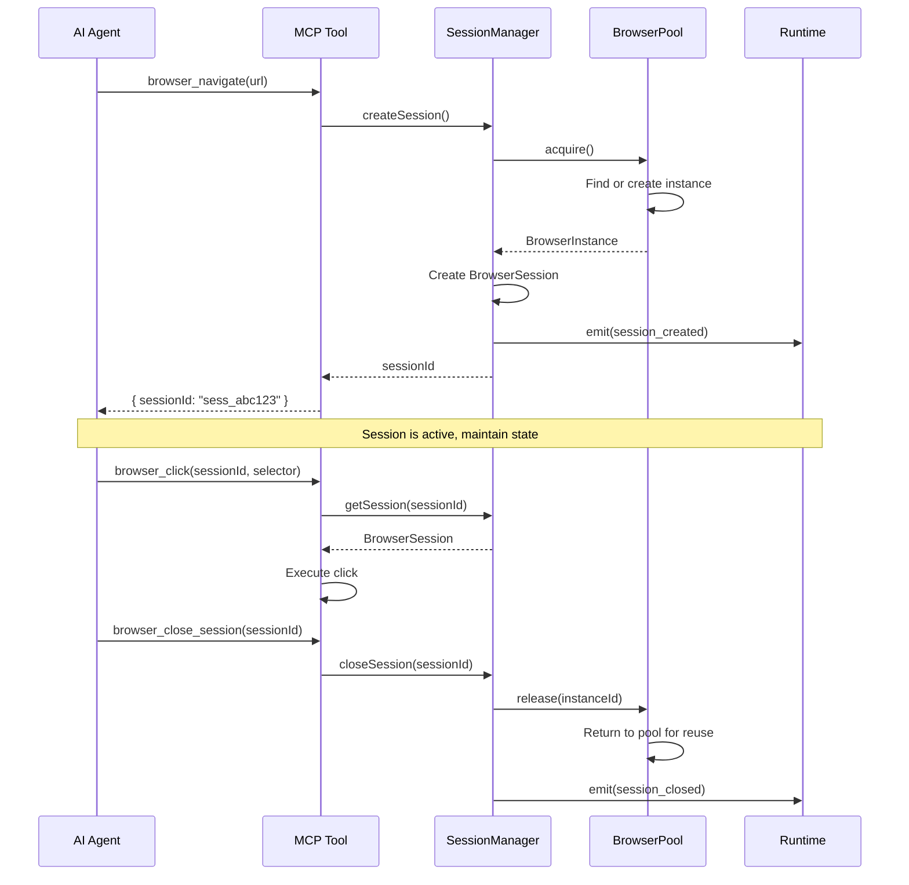

# Session Management

Sessions are the foundation of multi-step browser workflows in BrowserX MCP. Understanding session lifecycle and the BrowserPool integration is critical for reliable automation.

## Architecture

Sessions are backed by the Runtime's **BrowserPool**, which manages browser instance lifecycle:



## Session Lifecycle

### 1. Creation

**Create new session:**

```typescript
const result = await browser_navigate({
  url: "https://example.com"
});
// → { sessionId: "sess_abc123", newSession: true }
```

**What happens internally:**

1. SessionManager checks capacity (< `MCP_MAX_SESSIONS`)
2. SessionManager calls `BrowserPool.acquire()`
3. Pool returns an available browser instance (or creates one)
4. SessionManager wraps instance in BrowserSession
5. Runtime emits `session_created` event
6. Session ID returned to agent

**Reuse existing session:**

```typescript
await browser_navigate({
  url: "https://example.com/page2",
  sessionId: "sess_abc123"  // Reuse session
});
```

### 2. Usage

Pass `sessionId` to **all** subsequent browser tool calls:

```typescript
// All these calls use the same session
await browser_click({ sessionId: "sess_abc123", selector: "#button" });
await browser_type({ sessionId: "sess_abc123", selector: "#input", text: "hello" });
await browser_screenshot({ sessionId: "sess_abc123" });
await browser_query_dom({ sessionId: "sess_abc123", selector: ".data" });
```

**Session preserves:**

- Cookies and localStorage
- Navigation history
- DOM state
- JavaScript execution context
- Viewport size

### 3. Cleanup

**Manual cleanup (recommended):**

```typescript
await browser_close_session({ sessionId: "sess_abc123" });
```

**What happens internally:**

1. SessionManager closes the BrowserPage
2. SessionManager calls `BrowserPool.release(instanceId)`
3. Pool marks instance as idle (available for reuse)
4. Runtime emits `session_closed` event
5. Session removed from SessionManager

**Automatic cleanup:**

- **Idle timeout**: Sessions unused for 30 minutes are auto-closed
- **Shutdown**: All sessions closed when MCP server stops

---

## BrowserPool Integration

### Why Pool Browser Instances?

Creating a new browser instance is expensive (startup time, memory allocation). The BrowserPool enables:

1. **Instance reuse**: Released instances are recycled for new sessions
2. **Resource limits**: Enforce max concurrent instances
3. **Health monitoring**: Track instance health and metrics
4. **Unified lifecycle**: Runtime manages all instances consistently

### Pool Configuration

```typescript
// Default configuration (via MCP_MAX_SESSIONS env var)
maxInstances: 10,
idleTimeout: 30 * 60 * 1000,  // 30 minutes
maxLifetime: 60 * 60 * 1000,  // 1 hour
cleanupInterval: 5 * 60 * 1000  // 5 minutes
```

### Pool States

A browser instance in the pool can be in three states:

| State | Description | Session can use? |
|-------|-------------|------------------|
| **Idle** | Available for acquisition | Yes |
| **In Use** | Acquired by a session | No |
| **Destroyed** | Exceeded max lifetime, being replaced | No |

### Pool Exhaustion

When all instances are in use:

```typescript
const result = await browser_navigate({ url: "https://example.com" });
// ❌ Error: Cannot create session: all browser pool slots are in use.
//           Close an existing session first.
```

**Recovery:**

1. Check active sessions: `await browser_list_sessions()`
2. Close unused sessions: `await browser_close_session(sessionId)`
3. Wait for idle timeout (30 min)
4. Check pool metrics: `await readResource("metrics://browser-pool")`

---

## Session Patterns

### Pattern 1: Single Page Workflow

For simple, single-page interactions:

```typescript
// 1. Create session
const { sessionId } = await browser_navigate({
  url: "https://example.com"
});

// 2. Interact
await browser_click({ sessionId, selector: "#button" });
await browser_type({ sessionId, selector: "#input", text: "data" });

// 3. Extract results
const data = await browser_query_dom({
  sessionId,
  selector: ".result",
  extract: [{ name: "text", getText: true }]
});

// 4. Cleanup
await browser_close_session({ sessionId });
```

**Total sessions created:** 1

---

### Pattern 2: Multi-Page Navigation

For workflows that navigate multiple pages:

```typescript
const { sessionId } = await browser_navigate({
  url: "https://example.com/page1"
});

// Navigate to page 2 (reuse session)
await browser_navigate({
  sessionId,
  url: "https://example.com/page2"
});

// Navigate to page 3 (reuse session)
await browser_navigate({
  sessionId,
  url: "https://example.com/page3"
});

// Cookies and state preserved across all pages
await browser_close_session({ sessionId });
```

**Total sessions created:** 1 (session reused)

---

### Pattern 3: Login Flow

For authenticated workflows:

```typescript
// 1. Navigate to login page
const { sessionId } = await browser_navigate({
  url: "https://example.com/login"
});

// 2. Wait for form
await browser_wait({
  sessionId,
  type: "selector",
  selector: "#email"
});

// 3. Fill credentials
await browser_type({
  sessionId,
  selector: "#email",
  text: "user@example.com",
  clear: true
});

await browser_type({
  sessionId,
  selector: "#password",
  text: "password123",
  clear: true
});

// 4. Submit
await browser_click({ sessionId, selector: "button[type=submit]" });

// 5. Wait for redirect
await browser_wait({
  sessionId,
  type: "selector",
  selector: ".dashboard"
});

// 6. Now authenticated - navigate to protected pages
await browser_navigate({
  sessionId,  // Cookies preserved!
  url: "https://example.com/protected-data"
});

// 7. Extract data
const data = await browser_query_dom({
  sessionId,
  selector: ".data-row",
  extract: [
    { name: "id", attribute: "data-id" },
    { name: "value", getText: true }
  ]
});

// 8. Cleanup
await browser_close_session({ sessionId });
```

**Key insight:** Session maintains login cookies across all pages.

---

### Pattern 4: Parallel Sessions

For concurrent operations on different sites:

```typescript
// Start multiple sessions in parallel
const [session1, session2, session3] = await Promise.all([
  browser_navigate({ url: "https://site1.com" }),
  browser_navigate({ url: "https://site2.com" }),
  browser_navigate({ url: "https://site3.com" })
]);

// Process each independently
await Promise.all([
  processSite(session1.sessionId),
  processSite(session2.sessionId),
  processSite(session3.sessionId)
]);

// Cleanup all
await Promise.all([
  browser_close_session({ sessionId: session1.sessionId }),
  browser_close_session({ sessionId: session2.sessionId }),
  browser_close_session({ sessionId: session3.sessionId })
]);
```

**Important:** Respect `MCP_MAX_SESSIONS` limit. Check capacity first:

```typescript
const sessions = await browser_list_sessions();
if (sessions.activeSessions >= sessions.maxSessions - 2) {
  throw new Error("Not enough session slots for parallel operations");
}
```

---

### Pattern 5: Session Pooling (Agent-Level)

For long-running agents that need multiple workflows:

```typescript
class BrowserAgent {
  private sessionPool: string[] = [];
  private maxPoolSize = 3;

  async getSession(url: string): Promise<string> {
    // Reuse idle session if available
    if (this.sessionPool.length > 0) {
      const sessionId = this.sessionPool.pop()!;
      await browser_navigate({ sessionId, url });
      return sessionId;
    }

    // Create new session
    const { sessionId } = await browser_navigate({ url });
    return sessionId;
  }

  async releaseSession(sessionId: string): Promise<void> {
    // Return to pool if under limit
    if (this.sessionPool.length < this.maxPoolSize) {
      this.sessionPool.push(sessionId);
    } else {
      // Exceeded pool size, close session
      await browser_close_session({ sessionId });
    }
  }

  async shutdown(): Promise<void> {
    // Close all pooled sessions
    await Promise.all(
      this.sessionPool.map(id => browser_close_session({ sessionId: id }))
    );
    this.sessionPool = [];
  }
}
```

**Benefits:**

- Reduces session creation overhead
- Keeps warm sessions ready
- Manages capacity at agent level

---

## Session Limits

### Max Sessions

Controlled by `MCP_MAX_SESSIONS` environment variable (default: 10).

**Check current usage:**

```typescript
const result = await browser_list_sessions();
console.log(`${result.activeSessions} / ${result.maxSessions} sessions in use`);
```

**Close oldest session when at capacity:**

```typescript
const { sessions } = await browser_list_sessions();

if (sessions.length >= maxSessions) {
  // Find oldest session
  const oldest = sessions.sort((a, b) => b.age - a.age)[0];
  await browser_close_session({ sessionId: oldest.id });
}
```

### Idle Timeout

Sessions unused for 30 minutes are automatically closed.

**Track last used time:**

```typescript
const { sessions } = await browser_list_sessions();

for (const session of sessions) {
  const idleMinutes = session.lastUsed / 1000 / 60;
  if (idleMinutes > 25) {
    console.warn(`Session ${session.id} idle for ${idleMinutes} minutes`);
  }
}
```

### Max Lifetime

Browser instances have a max lifetime of 1 hour (pool-level). After 1 hour, the instance is destroyed and replaced, but existing sessions continue until closed.

---

## Monitoring Sessions

### List Active Sessions

```typescript
const result = await browser_list_sessions();
// → {
//   sessions: [
//     {
//       id: "sess_abc123",
//       age: 125000,        // 125 seconds old
//       lastUsed: 5000,     // Used 5 seconds ago
//       currentUrl: "https://example.com/page"
//     }
//   ],
//   activeSessions: 1,
//   maxSessions: 10
// }
```

### Session Metrics

Available via `system_dashboard` tool:

```typescript
const dashboard = await system_dashboard();
// → {
//   metrics: {
//     browserx_mcp_active_sessions: 3,
//     browserx_mcp_sessions_created_total: 125,
//     browserx_mcp_sessions_closed_total: 122
//   }
// }
```

**Growing gap** between created and closed indicates **session leaks**.

### Pool Metrics

```typescript
const pool = await readResource("metrics://browser-pool");
const data = JSON.parse(pool.text);
// → {
//   total: 10,
//   idle: 7,
//   inUse: 3,
//   acquired: 125,
//   released: 122
// }
```

---

## Common Issues

### Issue 1: Session Not Found

**Error:**

```
Session not found: sess_abc123
```

**Causes:**

- Session expired (idle timeout)
- Session closed by another operation
- Invalid session ID

**Resolution:**

```typescript
// Check if session exists
const { sessions } = await browser_list_sessions();
const exists = sessions.some(s => s.id === sessionId);

if (!exists) {
  // Create new session
  const result = await browser_navigate({ url });
  sessionId = result.sessionId;
}
```

---

### Issue 2: Pool Exhausted

**Error:**

```
Cannot create session: all browser pool slots are in use. Close an existing session first.
```

**Resolution:**

```typescript
// Check pool status
const pool = await readResource("metrics://browser-pool");
const data = JSON.parse(pool.text);

if (data.idle === 0) {
  // Option 1: Close idle sessions
  const { sessions } = await browser_list_sessions();
  const oldestIdle = sessions
    .filter(s => s.lastUsed > 60000)  // Idle > 1 min
    .sort((a, b) => b.lastUsed - a.lastUsed)[0];

  if (oldestIdle) {
    await browser_close_session({ sessionId: oldestIdle.id });
  }

  // Option 2: Wait for auto-cleanup
  await new Promise(resolve => setTimeout(resolve, 5000));

  // Retry
  const result = await browser_navigate({ url });
}
```

---

### Issue 3: Forgotten Sessions

**Symptom:** Gradually increasing active sessions that never close.

**Detection:**

```typescript
const dashboard = await system_dashboard();
const { created, closed } = dashboard.metrics;

if (created - closed > 10) {
  console.error("Session leak detected!");
}
```

**Prevention:**

```typescript
// Always use try/finally
let sessionId: string | null = null;

try {
  const result = await browser_navigate({ url });
  sessionId = result.sessionId;

  // ... do work ...

} finally {
  if (sessionId) {
    await browser_close_session({ sessionId });
  }
}
```

---

### Issue 4: Wrong SessionId

**Error:**

```
Session not found: sess_xyz789
```

**Cause:** Using sessionId from different navigation call.

**Example of bug:**

```typescript
// ❌ Wrong: Each navigate creates NEW session
const result1 = await browser_navigate({ url: "https://site1.com" });
const result2 = await browser_navigate({ url: "https://site2.com" });

await browser_click({
  sessionId: result1.sessionId,  // Wrong! Points to site1
  selector: "#button"             // Button is on site2
});
```

**Correct:**

```typescript
// ✅ Correct: Reuse same session
const result = await browser_navigate({ url: "https://site1.com" });
const sessionId = result.sessionId;

await browser_navigate({
  sessionId,  // Reuse session
  url: "https://site2.com"
});

await browser_click({
  sessionId,  // Now on site2
  selector: "#button"
});
```

---

## Best Practices

### 1. Always Close Sessions

```typescript
// Good: try/finally ensures cleanup
let sessionId: string | null = null;
try {
  const result = await browser_navigate({ url });
  sessionId = result.sessionId;
  // ... work ...
} finally {
  if (sessionId) {
    await browser_close_session({ sessionId });
  }
}
```

### 2. Reuse Sessions for Multi-Page Flows

```typescript
// Good: One session, multiple pages
const { sessionId } = await browser_navigate({ url: page1 });
await browser_navigate({ sessionId, url: page2 });
await browser_navigate({ sessionId, url: page3 });
await browser_close_session({ sessionId });

// Bad: New session per page (wastes resources)
await browser_navigate({ url: page1 });  // session1
await browser_navigate({ url: page2 });  // session2
await browser_navigate({ url: page3 });  // session3
// No cleanup!
```

### 3. Check Capacity Before Parallel Operations

```typescript
const { activeSessions, maxSessions } = await browser_list_sessions();
const needed = 5;

if (activeSessions + needed > maxSessions) {
  throw new Error(`Need ${needed} slots but only ${maxSessions - activeSessions} available`);
}
```

### 4. Track Session IDs Carefully

```typescript
// Good: Store sessionId in variable
const { sessionId } = await browser_navigate({ url });
await browser_click({ sessionId, selector: "#btn" });
await browser_close_session({ sessionId });

// Bad: Inline sessionId (loses reference)
await browser_click({
  sessionId: (await browser_navigate({ url })).sessionId,
  selector: "#btn"
});
// Can't close session - no reference!
```

### 5. Monitor Session Leaks

```typescript
// Periodically check for leaks
setInterval(async () => {
  const dashboard = await system_dashboard();
  const { created, closed } = dashboard.metrics;
  const leaked = created - closed;

  if (leaked > 5) {
    console.error(`Session leak: ${leaked} unclosed sessions`);
  }
}, 60000);
```

---

## Next Steps

- [Tools Reference](/mcp/tools) - Browser tool usage
- [Workflows](/mcp/workflows) - Complete workflow examples
- [Agent Guide](/mcp/agent-guide) - Error recovery patterns
- [Monitoring](/mcp/monitoring) - Health checks and metrics
