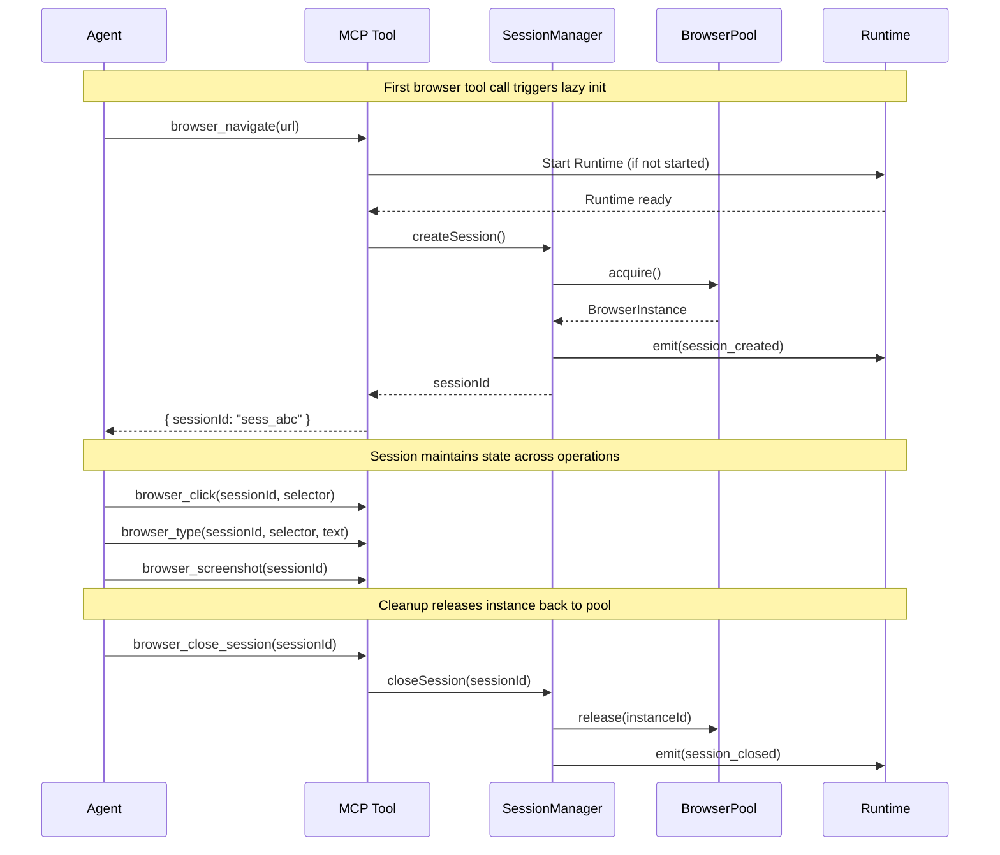

# Workflow Examples

This guide provides complete, tested workflow examples for common browser automation tasks using BrowserX MCP tools.

## Understanding Session Flow

All multi-step workflows follow this pattern with the BrowserPool:



## Workflow 1: Login and Extract Data

**Scenario:** Log into a website and extract data from a protected page.

**Goal:** Authenticate once, maintain session, access protected content.

### Implementation

```typescript
async function loginAndExtractData() {
  let sessionId: string | null = null;

  try {
    // 1. Navigate to login page
    const navResult = await browser_navigate({
      url: "https://example.com/login"
    });
    sessionId = navResult.sessionId;
    console.log("Session created:", sessionId);

    // 2. Wait for login form to load
    await browser_wait({
      sessionId,
      type: "selector",
      selector: "#email"
    });
    console.log("Login form loaded");

    // 3. Fill email field
    await browser_type({
      sessionId,
      selector: "#email",
      text: "user@example.com",
      clear: true  // Clear any existing value
    });

    // 4. Fill password field
    await browser_type({
      sessionId,
      selector: "#password",
      text: "password123",
      clear: true
    });

    // 5. Submit login form
    await browser_click({
      sessionId,
      selector: "button[type=submit]"
    });

    // 6. Wait for dashboard to confirm login success
    await browser_wait({
      sessionId,
      type: "selector",
      selector: ".dashboard",
      timeout: 10000  // Allow extra time for redirect
    });
    console.log("Login successful");

    // 7. Navigate to data page (session maintains login cookies)
    await browser_navigate({
      sessionId,
      url: "https://example.com/data"
    });

    // 8. Wait for data to load
    await browser_wait({
      sessionId,
      type: "selector",
      selector: ".data-row"
    });

    // 9. Extract data
    const result = await browser_query_dom({
      sessionId,
      selector: ".data-row",
      extract: [
        { name: "id", attribute: "data-id" },
        { name: "name", getText: true },
        { name: "value", getText: true }
      ]
    });

    console.log("Extracted data:", result.elements);
    return result.elements;

  } catch (error) {
    console.error("Workflow failed:", error);
    throw error;
  } finally {
    // 10. Always cleanup session
    if (sessionId) {
      await browser_close_session({ sessionId });
      console.log("Session closed");
    }
  }
}
```

### Error Handling

```typescript
// Check for login errors
const errorCheck = await browser_query_dom({
  sessionId,
  selector: ".error-message"
});

if (errorCheck.count > 0) {
  const errorText = errorCheck.elements[0].text;
  throw new Error(`Login failed: ${errorText}`);
}
```

### Key Insights

- **Single session** maintains login state across all pages
- **try/finally** ensures session cleanup even on failure
- **Wait for selectors** instead of fixed timeouts
- **Check for errors** after form submission

---

## Workflow 2: Form Filling with Validation

**Scenario:** Fill out a multi-field form and verify successful submission.

**Goal:** Handle validation errors, retry if needed, capture result.

### Implementation

```typescript
async function fillFormWithValidation() {
  let sessionId: string | null = null;

  try {
    // 1. Navigate to form page
    const navResult = await browser_navigate({
      url: "https://example.com/apply"
    });
    sessionId = navResult.sessionId;

    // 2. Discover form fields (helps with debugging)
    const fields = await browser_query_dom({
      sessionId,
      selector: "form input, form select, form textarea",
      extract: [
        { name: "id", attribute: "id" },
        { name: "name", attribute: "name" },
        { name: "type", attribute: "type" }
      ]
    });
    console.log("Found fields:", fields.elements);

    // 3. Fill form fields
    await browser_type({
      sessionId,
      selector: "#firstName",
      text: "John",
      clear: true
    });

    await browser_type({
      sessionId,
      selector: "#lastName",
      text: "Doe",
      clear: true
    });

    await browser_type({
      sessionId,
      selector: "#email",
      text: "john.doe@example.com",
      clear: true
    });

    await browser_type({
      sessionId,
      selector: "#phone",
      text: "555-123-4567",
      clear: true
    });

    // 4. Check terms checkbox if present
    const termsExists = await browser_query_dom({
      sessionId,
      selector: "#terms-checkbox"
    });

    if (termsExists.count > 0) {
      await browser_click({
        sessionId,
        selector: "#terms-checkbox"
      });
    }

    // 5. Submit form
    await browser_click({
      sessionId,
      selector: "button[type=submit]"
    });

    // 6. Wait for either success or error message
    await browser_wait({
      sessionId,
      type: "function",
      condition: "document.querySelector('.success-message') || document.querySelector('.error-message')",
      timeout: 10000
    });

    // 7. Check result
    const result = await browser_query_dom({
      sessionId,
      selector: ".success-message, .error-message",
      extract: [
        { name: "message", getText: true },
        { name: "type", attribute: "class" }
      ]
    });

    if (result.elements[0]?.type?.includes("success")) {
      console.log("Form submitted successfully");

      // 8. Capture confirmation screenshot
      const screenshot = await browser_screenshot({
        sessionId
      });
      console.log("Screenshot saved:", screenshot.filePath);

      return { success: true, message: result.elements[0].message };

    } else {
      // Handle validation errors
      const errorFields = await browser_query_dom({
        sessionId,
        selector: ".field-error",
        extract: [
          { name: "field", attribute: "data-field" },
          { name: "error", getText: true }
        ]
      });

      console.error("Validation errors:", errorFields.elements);
      return { success: false, errors: errorFields.elements };
    }

  } finally {
    if (sessionId) {
      await browser_close_session({ sessionId });
    }
  }
}
```

### Handling Validation Errors

```typescript
// After detecting validation errors, retry with corrected data
const result = await fillFormWithValidation();

if (!result.success) {
  console.log("Validation failed, retrying with corrections...");

  // Analyze errors and correct fields
  for (const error of result.errors) {
    if (error.field === "email") {
      // Fix email format
      await browser_type({
        sessionId,
        selector: "#email",
        text: "corrected.email@example.com",
        clear: true
      });
    }
  }

  // Re-submit
  await browser_click({
    sessionId,
    selector: "button[type=submit]"
  });
}
```

---

## Workflow 3: Multi-Page Data Collection

**Scenario:** Navigate through pagination to collect data from multiple pages.

**Goal:** Extract data from all pages efficiently.

### Implementation

```typescript
async function collectPaginatedData() {
  let sessionId: string | null = null;
  const allData: any[] = [];

  try {
    // 1. Navigate to first page
    const navResult = await browser_navigate({
      url: "https://example.com/products?page=1"
    });
    sessionId = navResult.sessionId;

    let hasNextPage = true;
    let pageNum = 1;

    while (hasNextPage) {
      console.log(`Processing page ${pageNum}...`);

      // 2. Wait for product list to load
      await browser_wait({
        sessionId,
        type: "selector",
        selector: ".product-list"
      });

      // 3. Extract products from current page
      const products = await browser_query_dom({
        sessionId,
        selector: ".product",
        extract: [
          { name: "name", getText: true },
          { name: "price", getText: true },
          { name: "url", attribute: "href" }
        ]
      });

      console.log(`Found ${products.count} products on page ${pageNum}`);
      allData.push(...products.elements);

      // 4. Check if next page exists
      const nextButton = await browser_query_dom({
        sessionId,
        selector: ".pagination .next:not(.disabled)"
      });

      if (nextButton.count === 0) {
        console.log("No more pages");
        hasNextPage = false;
      } else {
        // 5. Click next page
        await browser_click({
          sessionId,
          selector: ".pagination .next"
        });

        // 6. Wait for new page to load
        await browser_wait({
          sessionId,
          type: "selector",
          selector: ".product-list"
        });

        pageNum++;
      }
    }

    console.log(`Total products collected: ${allData.length}`);
    return allData;

  } finally {
    if (sessionId) {
      await browser_close_session({ sessionId });
    }
  }
}
```

### Using BrowserX Query (Alternative)

For simpler pagination patterns:

```typescript
async function collectWithQuery() {
  const result = await browserx_query({
    query: `
      FOR page IN RANGE(1, 10)
        NAVIGATE TO CONCAT('https://example.com/products?page=', page)
        SELECT name, price FROM '.product'
      END
    `
  });

  return result.data;
}
```

---

## Workflow 4: JavaScript-Heavy SPA Navigation

**Scenario:** Navigate a single-page application with client-side routing.

**Goal:** Wait for client-side navigation and data loading.

### Implementation

```typescript
async function navigateSPA() {
  let sessionId: string | null = null;

  try {
    // 1. Navigate to SPA with networkidle (important for SPAs)
    const navResult = await browser_navigate({
      url: "https://spa.example.com",
      waitUntil: "networkidle"  // Wait for async requests
    });
    sessionId = navResult.sessionId;

    // 2. Wait for app-specific ready state
    await browser_wait({
      sessionId,
      type: "function",
      condition: "window.__appReady === true",
      timeout: 15000
    });
    console.log("App initialized");

    // 3. Click navigation element (triggers client-side route)
    await browser_click({
      sessionId,
      selector: "[data-route='/dashboard']"
    });

    // 4. Wait for route change
    await browser_wait({
      sessionId,
      type: "function",
      condition: "window.location.pathname === '/dashboard'",
      timeout: 5000
    });

    // 5. Wait for dashboard content
    await browser_wait({
      sessionId,
      type: "selector",
      selector: ".dashboard-loaded"
    });
    console.log("Dashboard loaded");

    // 6. Extract dashboard data
    const widgets = await browser_query_dom({
      sessionId,
      selector: ".dashboard-widget",
      extract: [
        { name: "title", getText: true },
        { name: "value", attribute: "data-value" }
      ]
    });

    return widgets.elements;

  } finally {
    if (sessionId) {
      await browser_close_session({ sessionId });
    }
  }
}
```

### SPA-Specific Patterns

```typescript
// Wait for React hydration
await browser_wait({
  sessionId,
  type: "function",
  condition: "document.querySelector('[data-reactroot]') !== null"
});

// Wait for Vue app mount
await browser_wait({
  sessionId,
  type: "function",
  condition: "document.querySelector('[data-v-app]') !== null"
});

// Wait for Angular bootstrap
await browser_wait({
  sessionId,
  type: "function",
  condition: "window.getAllAngularRootElements().length > 0"
});
```

---

## Workflow 5: Screenshot Comparison / Change Detection

**Scenario:** Monitor a page for visual or content changes.

**Goal:** Compare current state to baseline, detect changes.

### Implementation

```typescript
interface Baseline {
  screenshot: string;
  metrics: any[];
  timestamp: string;
}

async function captureBaseline(url: string): Promise<Baseline> {
  let sessionId: string | null = null;

  try {
    const navResult = await browser_navigate({ url });
    sessionId = navResult.sessionId;

    await browser_wait({
      sessionId,
      type: "selector",
      selector: ".content"
    });

    // Capture screenshot
    const screenshot = await browser_screenshot({
      sessionId,
      fullPage: true
    });

    // Capture metrics
    const metrics = await browser_query_dom({
      sessionId,
      selector: ".key-metric",
      extract: [
        { name: "label", getText: true },
        { name: "value", attribute: "data-value" }
      ]
    });

    return {
      screenshot: screenshot.filePath,
      metrics: metrics.elements,
      timestamp: new Date().toISOString()
    };

  } finally {
    if (sessionId) {
      await browser_close_session({ sessionId });
    }
  }
}

async function compareToBaseline(
  url: string,
  baseline: Baseline
): Promise<{ changed: boolean; differences: string[] }> {
  let sessionId: string | null = null;

  try {
    const navResult = await browser_navigate({ url });
    sessionId = navResult.sessionId;

    await browser_wait({
      sessionId,
      type: "selector",
      selector: ".content"
    });

    // Capture current state
    const currentScreenshot = await browser_screenshot({
      sessionId,
      fullPage: true
    });

    const currentMetrics = await browser_query_dom({
      sessionId,
      selector: ".key-metric",
      extract: [
        { name: "label", getText: true },
        { name: "value", attribute: "data-value" }
      ]
    });

    // Compare metrics
    const differences: string[] = [];

    for (const baseMetric of baseline.metrics) {
      const current = currentMetrics.elements.find(
        m => m.label === baseMetric.label
      );

      if (!current) {
        differences.push(`Metric removed: ${baseMetric.label}`);
      } else if (current.value !== baseMetric.value) {
        differences.push(
          `Metric changed: ${baseMetric.label} ` +
          `(${baseMetric.value} → ${current.value})`
        );
      }
    }

    // Check for new metrics
    for (const currentMetric of currentMetrics.elements) {
      const exists = baseline.metrics.find(
        m => m.label === currentMetric.label
      );
      if (!exists) {
        differences.push(`New metric: ${currentMetric.label}`);
      }
    }

    return {
      changed: differences.length > 0,
      differences
    };

  } finally {
    if (sessionId) {
      await browser_close_session({ sessionId });
    }
  }
}

// Usage
const baseline = await captureBaseline("https://example.com/monitor");
console.log("Baseline captured:", baseline.timestamp);

// Later...
const comparison = await compareToBaseline(
  "https://example.com/monitor",
  baseline
);

if (comparison.changed) {
  console.log("Changes detected:");
  comparison.differences.forEach(diff => console.log(`  - ${diff}`));
}
```

---

## Workflow 6: Parallel Session Operations

**Scenario:** Process multiple URLs concurrently.

**Goal:** Maximize throughput while respecting session limits.

### Implementation

```typescript
async function processUrlsConcurrently(urls: string[], maxConcurrent: number = 3) {
  // Check available capacity
  const capacity = await browser_list_sessions();
  const available = capacity.maxSessions - capacity.activeSessions;

  if (available < maxConcurrent) {
    throw new Error(
      `Not enough session capacity. Need ${maxConcurrent}, have ${available}`
    );
  }

  // Process in batches
  const results: any[] = [];

  for (let i = 0; i < urls.length; i += maxConcurrent) {
    const batch = urls.slice(i, i + maxConcurrent);
    console.log(`Processing batch ${i / maxConcurrent + 1}...`);

    const batchResults = await Promise.all(
      batch.map(url => processSingleUrl(url))
    );

    results.push(...batchResults);
  }

  return results;
}

async function processSingleUrl(url: string) {
  let sessionId: string | null = null;

  try {
    const navResult = await browser_navigate({ url });
    sessionId = navResult.sessionId;

    await browser_wait({
      sessionId,
      type: "selector",
      selector: ".content"
    });

    const data = await browser_query_dom({
      sessionId,
      selector: ".data",
      extract: [{ name: "text", getText: true }]
    });

    return { url, data: data.elements };

  } catch (error) {
    return { url, error: error.message };

  } finally {
    if (sessionId) {
      await browser_close_session({ sessionId });
    }
  }
}

// Usage
const urls = [
  "https://example.com/page1",
  "https://example.com/page2",
  "https://example.com/page3",
  "https://example.com/page4",
  "https://example.com/page5"
];

const results = await processUrlsConcurrently(urls, 3);
console.log("Processed", results.length, "URLs");
```

---

## Workflow 7: System Health Monitoring

**Scenario:** Monitor MCP server health and diagnose issues.

**Goal:** Detect degraded components, pool exhaustion, session leaks.

### Implementation

```typescript
interface HealthReport {
  status: "healthy" | "degraded" | "critical";
  issues: string[];
  metrics: any;
}

async function checkSystemHealth(): Promise<HealthReport> {
  const issues: string[] = [];

  // 1. Get system dashboard
  const dashboard = await system_dashboard();

  // 2. Check component health
  for (const [name, component] of Object.entries(dashboard.health)) {
    if (component === "degraded") {
      issues.push(`Component degraded: ${name}`);
    }
  }

  // 3. Check session leaks
  const created = dashboard.metrics.browserx_mcp_sessions_created_total;
  const closed = dashboard.metrics.browserx_mcp_sessions_closed_total;
  const leaked = created - closed - dashboard.metrics.browserx_mcp_active_sessions;

  if (leaked > 5) {
    issues.push(`Possible session leak: ${leaked} unaccounted sessions`);
  }

  // 4. Check pool capacity
  if (dashboard.pool.idle < 2) {
    issues.push(`Low pool capacity: only ${dashboard.pool.idle} idle instances`);
  }

  // 5. List stale sessions
  const sessions = await browser_list_sessions();
  for (const session of sessions.sessions) {
    const idleMinutes = session.lastUsed / 1000 / 60;
    if (idleMinutes > 25) {
      issues.push(
        `Session ${session.id} idle for ${idleMinutes.toFixed(1)} minutes`
      );
    }
  }

  // Determine overall status
  let status: "healthy" | "degraded" | "critical" = "healthy";
  if (issues.length > 0) status = "degraded";
  if (issues.length > 5 || leaked > 10) status = "critical";

  return {
    status,
    issues,
    metrics: dashboard.metrics
  };
}

// Periodic monitoring
setInterval(async () => {
  const health = await checkSystemHealth();

  if (health.status !== "healthy") {
    console.warn(`System ${health.status}:`, health.issues);

    // Auto-remediation
    if (health.issues.some(i => i.includes("idle"))) {
      const sessions = await browser_list_sessions();
      const oldSession = sessions.sessions
        .sort((a, b) => b.lastUsed - a.lastUsed)[0];

      if (oldSession && oldSession.lastUsed > 25 * 60 * 1000) {
        console.log(`Closing idle session: ${oldSession.id}`);
        await browser_close_session({ sessionId: oldSession.id });
      }
    }
  }
}, 60000);  // Check every minute
```

---

## Anti-Patterns to Avoid

### 1. Time Waits Instead of Selector Waits

```typescript
// ❌ BAD: Fixed delay
await browser_wait({ sessionId, type: "time", duration: 5000 });
await browser_click({ sessionId, selector: "#button" });

// ✅ GOOD: Wait for element
await browser_wait({ sessionId, type: "selector", selector: "#button" });
await browser_click({ sessionId, selector: "#button" });
```

### 2. Not Closing Sessions

```typescript
// ❌ BAD: Session leak
for (const url of urls) {
  await browser_navigate({ url });  // Creates new session each time
  // ... process ...
  // No cleanup!
}

// ✅ GOOD: Always cleanup
for (const url of urls) {
  let sessionId: string | null = null;
  try {
    const result = await browser_navigate({ url });
    sessionId = result.sessionId;
    // ... process ...
  } finally {
    if (sessionId) {
      await browser_close_session({ sessionId });
    }
  }
}
```

### 3. Not Verifying Selectors

```typescript
// ❌ BAD: Blind click
await browser_click({ sessionId, selector: "#submit" });
// Fails silently if selector doesn't exist

// ✅ GOOD: Verify first
const button = await browser_query_dom({
  sessionId,
  selector: "#submit"
});

if (button.count === 0) {
  throw new Error("Submit button not found");
}

await browser_click({ sessionId, selector: "#submit" });
```

### 4. Losing Session References

```typescript
// ❌ BAD: No session reference
await browser_click({
  sessionId: (await browser_navigate({ url })).sessionId,
  selector: "#btn"
});
// Can't close session - no reference!

// ✅ GOOD: Store session ID
const { sessionId } = await browser_navigate({ url });
await browser_click({ sessionId, selector: "#btn" });
await browser_close_session({ sessionId });
```

---

## Next Steps

- [Tools Reference](/mcp/tools) - Complete tool documentation
- [Session Management](/mcp/sessions) - Deep dive into sessions
- [Agent Guide](/mcp/agent-guide) - Error recovery and monitoring
- [Integration](/mcp/integration) - Using workflows in your application
