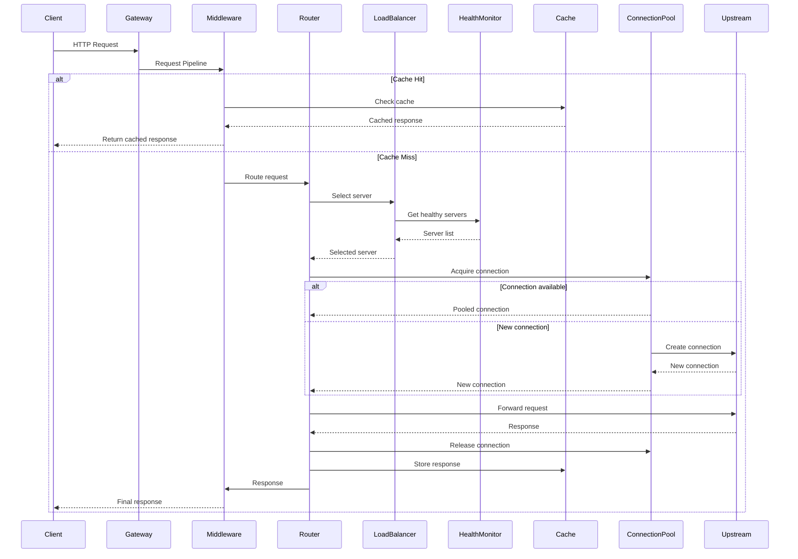

The Proxy Engine follows a layered architecture where each layer has specific responsibilities and well-defined interfaces. This design promotes modularity, testability, and composability.

## Layered Architecture

```text
┌─────────────────────────────────────────────────────────────────┐
│                        Runtime Layer                            │
│  Lifecycle Management, Configuration, Event Coordination        │
└─────────────────────────────────────────────────────────────────┘
                              ↓
┌─────────────────────────────────────────────────────────────────┐
│                       Gateway Layer                             │
│  HTTP Server, Request Routing, Middleware Chain                 │
└─────────────────────────────────────────────────────────────────┘
                              ↓
┌─────────────────────────────────────────────────────────────────┐
│                     Proxy Types Layer                           │
│  Reverse, LoadBalancer, Auth, WebSocket, SSE, TLS              │
└─────────────────────────────────────────────────────────────────┘
                              ↓
┌─────────────────────────────────────────────────────────────────┐
│                    Connection Layer                             │
│  Connection Pool, Health Monitoring, Upstream Management        │
└─────────────────────────────────────────────────────────────────┘
                              ↓
┌─────────────────────────────────────────────────────────────────┐
│                     Transport Layer                             │
│  HTTP/1.1, HTTP/2, TCP, TLS, WebSocket, DNS                    │
└─────────────────────────────────────────────────────────────────┘
                              ↓
┌─────────────────────────────────────────────────────────────────┐
│                   Network Primitives                            │
│  Socket, BufferPool, StreamReader/Writer, Parsers              │
└─────────────────────────────────────────────────────────────────┘
```

### Cross-Cutting Concerns

In addition to the main layers, several infrastructure components provide cross-cutting functionality:

- **Cache System** - HTTP caching with eviction policies
- **Metrics & Observability** - Counters, gauges, histograms, tracing
- **Event System** - Pub/sub event bus for component communication
- **Worker/Thread Management** - Parallel processing and CPU-intensive tasks
- **Process Management** - Multi-process architecture support
- **Memory Management** - Memory tracking and resource limits

## Complete Request Flow

Let's follow a client request through the entire system:



### Step-by-Step Breakdown

1. **Client Connection** (Gateway Layer)
   - Client connects to Gateway Server
   - TLS handshake if HTTPS enabled
   - Socket wrapped in HTTP server

2. **Request Parsing** (Transport Layer)
   - HTTP request line parsed
   - Headers parsed into key-value pairs
   - Body streamed if present

3. **Middleware Pipeline** (Gateway Layer)
   - Request ID generated for tracing
   - Request middleware executed in priority order:
     - Logging middleware logs incoming request
     - CORS middleware checks origin
     - Auth middleware validates credentials
     - Rate limit middleware checks quota
   - Any middleware can short-circuit with response

4. **Cache Lookup** (Infrastructure)
   - Generate cache key from method + URL + Vary headers
   - Check if response cached and fresh
   - If cache hit, skip to response middleware
   - If cache miss or stale, continue

5. **Route Matching** (Gateway Layer)
   - Pattern-based routing matches request path
   - Extract path parameters if pattern includes variables
   - Lookup associated proxy handler

6. **Load Balancing** (Proxy Types Layer)
   - Get list of upstream servers for route
   - Filter to healthy servers (via Health Monitor)
   - Apply load balancing strategy:
     - Round Robin: Select next in rotation
     - Least Connections: Select server with fewest active connections
     - Weighted: Distribute based on weights
     - IP Hash: Consistent hash based on client IP
     - Least Response Time: Select fastest server
     - Random: Random selection
   - Check session affinity if enabled

7. **Connection Pooling** (Connection Layer)
   - Check if pooled connection exists for `host:port`
   - Validate connection is not stale (age < maxLifetime, idle < idleTimeout)
   - Reuse if valid, create new if needed
   - Fail if pool exhausted (all connections in use)

8. **Request Forwarding** (Proxy Types Layer)
   - Add X-Forwarded-For, X-Forwarded-Proto, X-Forwarded-Host headers
   - Preserve or replace Host header based on config
   - Send request to upstream server via pooled connection
   - Apply request timeout
   - Retry on failure if retry policy configured

9. **Response Handling** (Proxy Types Layer)
   - Receive response from upstream
   - Record metrics (response time, status code)
   - Update load balancer stats (success/failure)
   - Return connection to pool for reuse

10. **Cache Storage** (Infrastructure)
    - Check if response is cacheable (Cache-Control headers)
    - Parse max-age, s-maxage directives
    - Encrypt response body if encryption enabled
    - Store in memory cache with TTL
    - Evict old entries if memory limit reached

11. **Response Middleware** (Gateway Layer)
    - Response middleware executed in priority order:
      - Compression middleware gzips large responses
      - Header transform middleware adds/removes headers
      - Logging middleware logs response status
    - Middleware can modify response

12. **Response Transmission** (Gateway Layer)
    - HTTP response line written
    - Headers written
    - Body streamed to client
    - Connection kept alive or closed based on Connection header

## Layer Details

### 1. Runtime Layer

**Location**: `/proxy-engine/core/runtime/`

The Runtime layer provides unified orchestration and lifecycle management for the entire proxy engine.

**Key Components**:

- `Runtime` - Main runtime coordinator
- `ConfigLoader` - Loads and validates configuration from files/objects
- `ConfigBuilder` - Fluent API for building configuration programmatically
- `RuntimeState` - State machine (STOPPED → STARTING → RUNNING → STOPPING)

**Responsibilities**:

- Start/stop coordination across all components
- Configuration validation and defaults
- Event coordination through EventCoordinator
- Graceful shutdown with connection draining

**Example**:

```typescript
import { Runtime, ConfigBuilder } from "@browserx/proxy-engine";

const config = new ConfigBuilder()
  .setHost("0.0.0.0")
  .setPort(8080)
  .addRoute({
    id: "api",
    pattern: "/api/*",
    upstream: {
      servers: [{ id: "backend", host: "localhost", port: 3000 }],
      loadBalancingStrategy: "round-robin",
    },
  })
  .build();

const runtime = new Runtime(config);
await runtime.start();

// Graceful shutdown
await runtime.stop();
```

### 2. Gateway Layer

**Location**: `/proxy-engine/gateway/`

The Gateway layer handles incoming HTTP/HTTPS connections and request routing.

**Key Components**:

- `GatewayServer` - Main HTTP/HTTPS server
- `PatternRouter` - Pattern-based request routing
- `MiddlewareChain` - Request/response middleware pipeline
- `RouteMatcher` - Path pattern matching with parameter extraction

**Responsibilities**:

- Accept incoming connections (HTTP/HTTPS)
- TLS termination
- Pattern-based routing
- Middleware execution
- Connection limits and timeouts
- Keep-alive connection management

**Request Flow**:

```typescript
// GatewayServer pseudo-code
async handleConnection(conn: Deno.Conn) {
  const socket = new Socket(conn);
  const httpServer = new HTTP11Server(socket);

  for await (const request of httpServer.requests()) {
    // Build request context
    const context = {
      clientIP: socket.remoteAddress,
      clientPort: socket.remotePort,
      protocol: "http",
      startTime: Date.now(),
      requestId: generateRequestId(),
      metadata: {},
    };

    // Execute request middleware
    const middlewareResult = await this.middleware.processRequest(request, context);
    if (middlewareResult.type === "respond") {
      await this.sendResponse(middlewareResult.response);
      continue;
    }

    // Match route
    const route = this.router.match(request.uri);
    if (!route) {
      await this.sendResponse(createNotFoundResponse());
      continue;
    }

    // Get proxy handler for route
    const proxy = this.proxies.get(route.id);

    // Handle request via proxy
    const response = await proxy.handleRequest(request, context);

    // Execute response middleware
    const finalResponse = await this.middleware.processResponse(
      request,
      response,
      context
    );

    await this.sendResponse(finalResponse);
  }
}
```

### 3. Proxy Types Layer

**Location**: `/proxy-engine/core/proxy_types/`

The Proxy Types layer provides different proxy patterns for various use cases.

**Proxy Types**:

#### ReverseProxy

Standard reverse proxy that sits in front of backend servers.

- SSL/TLS termination
- Load balancing via LoadBalancer interface
- Header manipulation (X-Forwarded-*)
- Connection pooling
- Retry logic with exponential backoff

```typescript
import { ReverseProxy } from "@browserx/proxy-engine";

const proxy = new ReverseProxy(route, {
  sslTermination: true,
  addForwardedHeaders: true,
  preserveHost: false,
  timeout: 30000,
  maxRetries: 3,
  retryDelay: 100,
});

const response = await proxy.handleRequest(request, context);
```

#### LoadBalancerProxy

Advanced load balancing with session affinity and failover.

- Session affinity (cookie-based, IP-based)
- Automatic failover on backend failure
- Health-based server selection
- Persistent session state

```typescript
import { LoadBalancerProxy } from "@browserx/proxy-engine";

const proxy = new LoadBalancerProxy(route, {
  sessionAffinity: {
    type: "cookie",
    cookieName: "SERVERID",
    cookiePath: "/",
    cookieMaxAge: 3600,
  },
  failover: {
    enabled: true,
    maxRetries: 3,
    retryDelay: 100,
  },
});
```

#### AuthProxy

Centralized authentication and authorization.

- Basic auth, bearer token, custom validators
- User role checking
- Audit logging
- Access control rules

```typescript
import { AuthProxy, InMemoryUserValidator } from "@browserx/proxy-engine";

const proxy = new AuthProxy(route, {
  authMethod: "basic",
  validator: new InMemoryUserValidator({
    "admin": { password: "secret", roles: ["admin"] }
  }),
  accessRules: [
    { path: "/admin/*", roles: ["admin"] },
    { path: "/api/*", roles: ["user", "admin"] },
  ],
  auditLog: true,
});
```

#### TLSProxy

TLS termination and SNI-based routing.

- Multiple certificates via SNI
- TLS 1.2 and 1.3 support
- Certificate reloading
- ALPN negotiation

#### WebSocketProxy

Full-duplex WebSocket connections.

- WebSocket upgrade handling
- Bidirectional message forwarding
- Connection pooling for WebSocket backends
- Ping/pong keep-alive

#### SSEProxy

Server-Sent Events streaming.

- Event stream forwarding
- Event filtering and transformation
- Reconnection handling
- Custom event types

### 4. Connection Layer

**Location**: `/proxy-engine/core/connection/`

The Connection layer manages connections to upstream servers.

**Key Components**:

- `ConnectionPool` - Pool of reusable connections per host:port
- `UpstreamConnectionManager` - Higher-level connection management with stats
- `HealthMonitor` - Periodic health checks with configurable checkers
- `TCPHealthChecker` - TCP connection check
- `HTTPHealthChecker` - HTTP endpoint check

**Connection Pool Lifecycle**:

```typescript
// Acquire connection
const pooledConn = await pool.acquire("api.example.com", 443);

// Use connection
await pooledConn.conn.write(request);
const response = await pooledConn.conn.read(buffer);

// Release back to pool
pool.release(pooledConn);

// Pool automatically:
// - Tracks age and idle time
// - Closes stale connections in background
// - Enforces min/max pool sizes
```

**Health Monitoring**:

```typescript
const healthMonitor = new HealthMonitor({
  type: "http",
  interval: 5000,
  timeout: 2000,
  healthyThreshold: 2,    // 2 successful checks = healthy
  unhealthyThreshold: 3,  // 3 failed checks = unhealthy
  path: "/health",
  expectedStatus: 200,
});

healthMonitor.start(servers);

// Get only healthy servers
const healthyServers = healthMonitor.getHealthyServers(servers);
```

### 5. Transport Layer

**Location**: `/proxy-engine/core/network/transport/`

The Transport layer implements network protocols.

**Protocols**:

- **HTTP/1.1** - Request/response with chunked encoding, keep-alive
- **HTTP/2** - Multiplexing, server push, header compression (HPACK)
- **TCP** - State machine (SYN, ESTABLISHED, FIN_WAIT, etc.)
- **TLS** - Handshake, cipher suites, certificate validation
- **WebSocket** - Upgrade, framing, ping/pong
- **DNS** - Resolution with caching

**HTTP/1.1 Example**:

```typescript
import { HTTP11Client } from "@browserx/proxy-engine";

const client = new HTTP11Client({
  host: "api.example.com",
  port: 80,
  keepAlive: true,
  timeout: 30000,
});

const response = await client.request({
  method: "GET",
  uri: "/users/123",
  headers: {
    "Host": "api.example.com",
    "User-Agent": "BrowserX/1.0",
  },
  body: new Uint8Array(),
});
```

### 6. Network Primitives

**Location**: `/proxy-engine/core/network/primitive/`

The lowest layer providing fundamental networking primitives.

**Components**:

- `Socket` - Raw TCP socket wrapper with state machine
- `BufferPool` - Reusable buffer allocation
- `StreamReader` - Buffered reading with lookahead
- `StreamWriter` - Buffered writing with flush control
- `HeaderParser` - HTTP header parsing
- `RequestLineParser` - Parse "GET /path HTTP/1.1"
- `StatusLineParser` - Parse "HTTP/1.1 200 OK"

## Infrastructure Components

### Cache System

**Location**: `/proxy-engine/core/cache/`

HTTP-compliant caching with eviction and encryption.

**Features**:

- Cache-Control header parsing (max-age, s-maxage, no-store, private)
- ETag and Last-Modified validation
- Conditional requests (If-None-Match, If-Modified-Since)
- LRU eviction when memory limit reached
- Optional AES-GCM encryption for cached data
- Background cleanup of expired entries

```typescript
import { HTTPCacheManager } from "@browserx/proxy-engine";

const cache = new HTTPCacheManager({
  maxMemoryMB: 100,
  defaultTTL: 300, // 5 minutes
  enableDiskCache: false,
  encryption: {
    enabled: true,
    key: await crypto.subtle.generateKey(
      { name: "AES-GCM", length: 256 },
      true,
      ["encrypt", "decrypt"]
    ),
  },
});

// Store response
const cacheKey = cache.generateCacheKey("GET", url, varyHeaders);
if (cache.isCacheable(request, response)) {
  await cache.store(cacheKey, response);
}

// Retrieve response
const cached = await cache.get(cacheKey);
if (cached) {
  // Serve from cache
}
```

### Metrics & Observability

**Location**: `/proxy-engine/core/metrics/`

Comprehensive metrics for monitoring.

**Metric Types**:

- **Counter** - Monotonically increasing (total_requests, total_errors)
- **Gauge** - Can increase or decrease (active_connections, memory_usage)
- **Histogram** - Distribution with buckets (request_duration, response_size)

**Distributed Tracing**:

- Trace context propagation (W3C Trace Context)
- Span recording with parent/child relationships
- Trace export to collectors

```typescript
import { MetricsCollector, Counter, Histogram } from "@browserx/proxy-engine";

const metrics = new MetricsCollector();

const requestsTotal = new Counter("http_requests_total", {
  service: "proxy",
});

const requestDuration = new Histogram(
  "http_request_duration_ms",
  [10, 50, 100, 500, 1000, 5000], // Buckets
  { service: "proxy" }
);

// Record metrics
requestsTotal.inc();
requestDuration.observe(150); // 150ms request

// Export metrics
const allMetrics = metrics.exportMetrics();
```

### Event System

**Location**: `/proxy-engine/core/event/`

Pub/sub event bus for component communication.

```typescript
import { EventBus } from "@browserx/proxy-engine";

const eventBus = new EventBus();

// Subscribe
const unsubscribe = eventBus.on("request:start", (event) => {
  console.log(`Request started: ${event.requestId}`);
});

// Publish
eventBus.emit("request:start", {
  requestId: "req-123",
  method: "GET",
  url: "/api/users",
});

// Unsubscribe
unsubscribe();
```

## Design Principles

### 1. Modularity

Each layer is independently usable:

```typescript
// Use just the cache
import { HTTPCacheManager } from "@browserx/proxy-engine";
const cache = new HTTPCacheManager(config);

// Use just the load balancer
import { RoundRobinLoadBalancer } from "@browserx/proxy-engine";
const lb = new RoundRobinLoadBalancer();

// Use just the connection pool
import { ConnectionPool } from "@browserx/proxy-engine";
const pool = new ConnectionPool(config);
```

### 2. Composability

Components compose together naturally:

```typescript
import {
  Runtime,
  GatewayServer,
  ReverseProxy,
  LoadBalancerProxy,
  MiddlewareChain,
} from "@browserx/proxy-engine";

// Compose a complete proxy with all features
const runtime = new Runtime({
  gateway: gatewayConfig,
  routes: [
    { id: "api", pattern: "/api/*", upstream: apiUpstream },
    { id: "web", pattern: "/*", upstream: webUpstream },
  ],
  middleware: middlewareConfig,
  cache: cacheConfig,
  metrics: metricsConfig,
});
```

### 3. Testability

Each component has well-defined interfaces for mocking:

```typescript
// Mock LoadBalancer for testing
class MockLoadBalancer implements LoadBalancer {
  select(req, servers) {
    return servers[0]; // Always return first server
  }
  recordSuccess(serverId, responseTime) {}
  recordFailure(serverId) {}
  // ...
}

// Inject mock
const proxy = new ReverseProxy(route, { loadBalancer: mockLB });
```

### 4. Performance

- Async I/O throughout
- Connection pooling reduces handshake overhead
- HTTP caching reduces origin server load
- Zero-copy buffer management where possible
- Worker threads for CPU-intensive tasks

### 5. Observability

Every component emits metrics and events:

- Request/response counts
- Error rates
- Latency histograms
- Active connection gauges
- Cache hit rates
- Pool utilization

## Next Steps

- [Proxy Types](/proxy/proxy-types) - Detailed guide to each proxy type
- [Load Balancing](/proxy/load-balancing) - Load balancing strategies
- [Middleware](/proxy/middleware) - Building middleware pipelines
- [Configuration](/proxy/configuration) - Complete configuration reference
