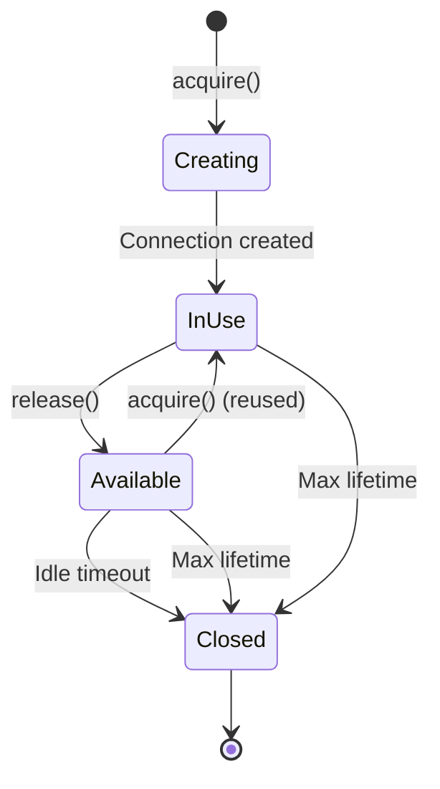

Connection pooling is one of the most effective performance optimizations in the Proxy Engine. By reusing existing connections instead of creating new ones for each request, connection pooling saves 50-100ms per request for TCP handshakes and 100-300ms for TLS handshakes.

## Why Connection Pooling?

### Without Pooling

Every request requires a new connection:

```text
Request 1:
  DNS lookup: 20ms
  TCP handshake: 50ms (SYN, SYN-ACK, ACK)
  TLS handshake: 150ms (ClientHello, ServerHello, Certificate, etc.)
  Request/Response: 30ms
  Total: 250ms

Request 2:
  DNS lookup: 20ms
  TCP handshake: 50ms
  TLS handshake: 150ms
  Request/Response: 30ms
  Total: 250ms

Request 3:
  ... (repeats)
```

**Total time for 3 requests: 750ms**

### With Pooling

First request creates connection, subsequent requests reuse it:

```text
Request 1:
  DNS lookup: 20ms
  TCP handshake: 50ms
  TLS handshake: 150ms
  Request/Response: 30ms
  Total: 250ms
  → Connection returned to pool

Request 2:
  Acquire pooled connection: &lt;1ms
  Request/Response: 30ms
  Total: 31ms
  → Connection returned to pool

Request 3:
  Acquire pooled connection: &lt;1ms
  Request/Response: 30ms
  Total: 31ms
```

**Total time for 3 requests: 312ms (60% faster!)**

## Basic Usage

```typescript
import { ConnectionPool } from "@browserx/proxy-engine";

const pool = new ConnectionPool({
  minConnections: 2,        // Keep 2 connections warm
  maxConnections: 10,       // Max 10 concurrent connections per host
  idleTimeout: 30000,       // Close after 30s idle
  maxLifetime: 300000,      // Close after 5 minutes regardless
});

// Acquire connection
const conn = await pool.acquire("api.example.com", 443);

if (conn) {
  // Use connection
  await conn.conn.write(requestData);
  const response = await conn.conn.read(buffer);

  // Release back to pool
  pool.release(conn);
}

// Clean up on shutdown
pool.destroy();
```

## Configuration

### Pool Size

**minConnections**: Minimum connections to keep warm (not yet implemented)

```typescript
{
  minConnections: 2,  // Future: Keep 2 connections ready
}
```

**maxConnections**: Maximum concurrent connections per host:port

```typescript
{
  maxConnections: 10,  // Max 10 connections to api.example.com:443
}
```

**Choosing pool size**:

- Small pool (2-5): Low traffic, conserve resources
- Medium pool (10-20): Normal API traffic
- Large pool (50-100): High traffic, many concurrent requests

### Connection Lifetime

**idleTimeout**: Close connections idle longer than this

```typescript
{
  idleTimeout: 30000,  // 30 seconds
}
```

After 30 seconds of no activity, connection is closed and removed from pool.

**maxLifetime**: Close connections older than this

```typescript
{
  maxLifetime: 300000,  // 5 minutes
}
```

Even if actively used, connection is closed after 5 minutes to:
- Prevent stale connections
- Allow load balancer updates
- Refresh DNS records
- Rotate security credentials

**Recommendations**:

- **Development**: idleTimeout=10000, maxLifetime=60000
- **Production**: idleTimeout=30000, maxLifetime=300000
- **Long-lived (WebSocket)**: idleTimeout=120000, maxLifetime=3600000

## Connection Lifecycle



### 1. Connection Creation

```typescript
const conn = await pool.acquire("api.example.com", 443);

// First request to this host:port
// → No available connections
// → Create new connection
// → Mark as in-use
// → Return to caller

console.log(conn.id);              // "conn-1"
console.log(conn.inUse);           // true
console.log(conn.createdAt);       // timestamp
console.log(conn.requestCount);    // 1
```

### 2. Connection Release

```typescript
pool.release(conn);

// → Mark as available (inUse = false)
// → Update lastUsedAt timestamp
// → Keep in pool for reuse

console.log(conn.inUse);           // false
console.log(conn.lastUsedAt);      // updated timestamp
```

### 3. Connection Reuse

```typescript
const conn = await pool.acquire("api.example.com", 443);

// Second request to same host:port
// → Find available connection
// → Validate (not too old, not idle too long)
// → Mark as in-use
// → Return to caller

console.log(conn.id);              // "conn-1" (same connection!)
console.log(conn.requestCount);    // 2 (incremented)
console.log("Age:", Date.now() - conn.createdAt);  // e.g., 5000ms
```

### 4. Connection Cleanup

```typescript
// Automatic cleanup every 10 seconds
// → Check all connections
// → Close if age > maxLifetime
// → Close if idle > idleTimeout
// → Remove from pool

// [CLEANUP] Running connection pool cleanup...
// ✗ Closed stale connection conn-5 for api.example.com:443
// api.example.com:443: 5 → 4 connections
```

## Pool Management

### Per-Host Pools

The pool maintains separate connection pools for each `host:port` combination:

```typescript
await pool.acquire("api.example.com", 443);
// → Pool key: "api.example.com:443"

await pool.acquire("api.example.com", 80);
// → Pool key: "api.example.com:80" (different pool)

await pool.acquire("cdn.example.com", 443);
// → Pool key: "cdn.example.com:443" (different pool)
```

Each pool independently tracks:
- Available connections
- In-use connections
- Creation timestamps
- Request counts

### Connection Validation

Before reusing a connection, the pool validates it:

```typescript
private isConnectionValid(conn: PooledConnectionInfo): boolean {
  const now = Date.now();

  // Check age
  const age = now - conn.createdAt;
  if (age > this.config.maxLifetime) {
    return false;  // Too old
  }

  // Check idle time
  const idleTime = now - conn.lastUsedAt;
  if (idleTime > this.config.idleTimeout) {
    return false;  // Idle too long
  }

  return true;
}
```

### Pool Exhaustion

When all connections are in use:

```typescript
const conn = await pool.acquire("api.example.com", 443);

if (!conn) {
  // Pool exhausted
  // All connections in use
  // maxConnections reached

  console.error("Pool exhausted - all connections in use");

  // Options:
  // 1. Wait and retry
  // 2. Increase maxConnections
  // 3. Queue request
  // 4. Return error to client
}
```

## Statistics and Monitoring

### Pool Statistics

```typescript
const stats = pool.getStats();

console.log(`Total pools: ${stats.totalPools}`);
console.log(`Total connections: ${stats.totalConnections}`);
console.log(`In use: ${stats.inUseConnections}`);
console.log(`Available: ${stats.availableConnections}`);
console.log(`Total requests: ${stats.totalRequests}`);
console.log(`Avg requests/connection: ${stats.avgRequestsPerConnection.toFixed(2)}`);
```

### Detailed Statistics

```typescript
pool.displayStats();

// Output:
// ======================================================================
// Connection Pool Statistics
// ======================================================================
//
// Pool: api.example.com:443
//   Total connections: 5
//   In use: 2
//   Available: 3
//     conn-1: IDLE, age: 45.2s, idle: 12.3s, reqs: 15
//     conn-2: IN USE, age: 38.1s, idle: 0.5s, reqs: 12
//     conn-3: IDLE, age: 30.5s, idle: 8.2s, reqs: 10
//     conn-4: IN USE, age: 25.3s, idle: 0.1s, reqs: 8
//     conn-5: IDLE, age: 15.7s, idle: 5.4s, reqs: 5
//
// Pool: cdn.example.com:443
//   Total connections: 2
//   In use: 1
//   Available: 1
//     conn-6: IN USE, age: 20.1s, idle: 0.2s, reqs: 7
//     conn-7: IDLE, age: 18.5s, idle: 6.8s, reqs: 6
//
// Overall:
//   Total connections: 7
//   In use: 3
//   Total requests served: 63
//   Average requests per connection: 9.00
// ======================================================================
```

## Integration Examples

### With ReverseProxy

ReverseProxy automatically uses connection pooling:

```typescript
import { ReverseProxy, ConnectionPool } from "@browserx/proxy-engine";

// Connection pool created internally
const proxy = new ReverseProxy(route, {
  timeout: 30000,
  maxRetries: 3,
});

// Connections automatically pooled per upstream server
// backend-1 (10.0.1.10:3000) → Separate pool
// backend-2 (10.0.1.11:3000) → Separate pool
```

### Custom Pool Configuration

```typescript
import { UpstreamConnectionManager } from "@browserx/proxy-engine";

const connectionManager = new UpstreamConnectionManager({
  maxConnectionsPerHost: 20,
  connectionTimeout: 5000,
  idleTimeout: 30000,
  maxLifetime: 300000,
});

// Use in custom proxy
class CustomProxy {
  constructor(private connectionManager: UpstreamConnectionManager) {}

  async handleRequest(request: HTTPRequest): Promise<HTTPResponse> {
    const conn = await this.connectionManager.acquire("backend.internal", 3000);

    if (!conn) {
      throw new Error("Connection pool exhausted");
    }

    try {
      // Use connection
      const response = await this.makeRequest(conn, request);
      return response;
    } finally {
      // Always release connection
      this.connectionManager.release(conn);
    }
  }
}
```

### Manual Pool Management

```typescript
import { ConnectionPool } from "@browserx/proxy-engine";

const pool = new ConnectionPool({
  minConnections: 2,
  maxConnections: 50,
  idleTimeout: 60000,
  maxLifetime: 600000,
});

async function makeRequest(host: string, port: number, request: Uint8Array): Promise<Uint8Array> {
  // Acquire connection
  const conn = await pool.acquire(host, port);

  if (!conn) {
    throw new Error("Failed to acquire connection");
  }

  try {
    // Write request
    await conn.conn.write(request);

    // Read response
    const buffer = new Uint8Array(65536);
    const bytesRead = await conn.conn.read(buffer);

    if (!bytesRead) {
      throw new Error("Connection closed");
    }

    return buffer.subarray(0, bytesRead);
  } finally {
    // Always release, even on error
    pool.release(conn);
  }
}

// Cleanup on shutdown
process.on("SIGTERM", () => {
  pool.destroy();
});
```

## Performance Impact

### Latency Reduction

```text
Without pooling:
  Request 1: 250ms (50ms TCP + 150ms TLS + 50ms request)
  Request 2: 250ms
  Request 3: 250ms
  Average: 250ms

With pooling:
  Request 1: 250ms (initial connection)
  Request 2: 50ms (reused connection)
  Request 3: 50ms (reused connection)
  Average: 117ms (53% faster)

With 10 requests:
  Without pooling: 2500ms
  With pooling: 700ms (72% faster)
```

### Throughput Increase

```text
Without pooling:
  250ms per request
  → 4 requests/second per connection
  → 10 connections = 40 requests/second

With pooling:
  50ms per request (amortized)
  → 20 requests/second per connection
  → 10 connections = 200 requests/second

→ 5x throughput increase
```

### Resource Savings

```text
1000 requests without pooling:
  1000 TCP handshakes
  1000 TLS handshakes
  ~400 seconds total handshake time
  ~200KB certificate transfers

1000 requests with pooling (pool size 10):
  10 TCP handshakes
  10 TLS handshakes
  ~4 seconds total handshake time
  ~2KB certificate transfers

→ 99% reduction in handshake overhead
```

## Best Practices

1. **Size pools appropriately**:
   ```typescript
   // Low traffic
   { maxConnections: 5, idleTimeout: 30000 }

   // Medium traffic
   { maxConnections: 20, idleTimeout: 60000 }

   // High traffic
   { maxConnections: 100, idleTimeout: 120000 }
   ```

2. **Set realistic timeouts**:
   - idleTimeout: Balance between connection reuse and resource usage
   - maxLifetime: Prevent stale connections, allow config updates

3. **Always release connections**:
   ```typescript
   try {
     const response = await makeRequest(conn, request);
     return response;
   } finally {
     pool.release(conn);  // Critical!
   }
   ```

4. **Monitor pool health**:
   ```typescript
   setInterval(() => {
     const stats = pool.getStats();
     const utilization = stats.inUseConnections / stats.totalConnections * 100;

     if (utilization > 80) {
       console.warn("Pool utilization high:", utilization.toFixed(1), "%");
     }
   }, 10000);
   ```

5. **Handle pool exhaustion**:
   ```typescript
   const conn = await pool.acquire(host, port);

   if (!conn) {
     // Implement retry with backoff
     await new Promise(resolve => setTimeout(resolve, 100));
     const conn = await pool.acquire(host, port);

     if (!conn) {
       throw new Error("Connection pool exhausted");
     }
   }
   ```

6. **Clean up on shutdown**:
   ```typescript
   process.on("SIGTERM", async () => {
     console.log("Shutting down...");

     // Stop accepting new requests
     await server.stop();

     // Destroy connection pools
     pool.destroy();

     process.exit(0);
   });
   ```

7. **Use per-host pools**:
   - Each host:port has separate pool
   - Prevents one slow backend from blocking others
   - Allows per-backend tuning

## Troubleshooting

### High Eviction Rate

**Symptom**: Many connections closed by cleanup

```text
[CLEANUP] Closed 25 stale connection(s)
```

**Causes**:
- idleTimeout too low
- Traffic is bursty
- Pool too small

**Solutions**:
- Increase idleTimeout
- Increase maxConnections
- Monitor request patterns

### Pool Exhaustion

**Symptom**: acquire() returns null frequently

```text
[POOL] Pool exhausted (10/10)
    All connections are in use
```

**Causes**:
- maxConnections too low
- Slow backend responses
- Connection leaks (not released)

**Solutions**:
- Increase maxConnections
- Reduce request timeout
- Ensure connections always released
- Check for hung requests

### Stale Connections

**Symptom**: Connection errors after reuse

```text
Error: Connection reset by peer
```

**Causes**:
- Backend closed connection
- Firewall timeout
- Load balancer timeout

**Solutions**:
- Reduce maxLifetime
- Reduce idleTimeout
- Implement connection health checks
- Handle connection errors gracefully

## Advanced Features

### Connection Health Checks (Future)

```typescript
const pool = new ConnectionPool({
  maxConnections: 10,
  idleTimeout: 30000,
  maxLifetime: 300000,
  healthCheck: {
    enabled: true,
    interval: 5000,        // Check every 5 seconds
    timeout: 1000,         // 1 second timeout
  },
});

// Periodically validates idle connections
// Closes unhealthy connections
```

### Per-Route Pool Configuration (Future)

```typescript
const routes = [
  {
    id: "api",
    pattern: "/api/*",
    upstream: { /* ... */ },
    connectionPool: {
      maxConnections: 50,  // High traffic route
      idleTimeout: 120000,
    },
  },
  {
    id: "admin",
    pattern: "/admin/*",
    upstream: { /* ... */ },
    connectionPool: {
      maxConnections: 5,   // Low traffic route
      idleTimeout: 30000,
    },
  },
];
```

## Next Steps

- [Load Balancing](/proxy/load-balancing) - Distribute traffic across pools
- [Observability](/proxy/observability) - Monitor pool performance
- [Configuration](/proxy/configuration) - Complete configuration reference
