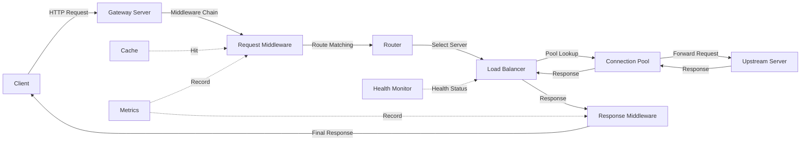

The BrowserX Proxy Engine is a composable, high-performance HTTP/HTTPS proxy system built with TypeScript and Deno. It provides enterprise-grade features including load balancing, health checking, connection pooling, distributed caching, and a flexible middleware pipeline.

## Overview

The Proxy Engine follows a layered architecture where each component can be used independently or composed together:

```text
Runtime → Gateway → Proxy Types → Connection Pool → Transport → Network Primitives
```

### Key Features

- **Multiple Proxy Types**: Reverse proxy, load balancer, auth proxy, WebSocket, SSE, TLS termination
- **Load Balancing**: 6 strategies (round-robin, least-connections, weighted, IP-hash, least-response-time, random)
- **Health Checking**: TCP, HTTP, and ping-based health monitors with automatic failover
- **Connection Pooling**: Reduce TCP/TLS handshake overhead with intelligent connection reuse
- **HTTP Caching**: RFC-compliant caching with LRU eviction, TTL, and optional encryption
- **Middleware Pipeline**: Composable request/response processing (auth, rate limiting, CORS, compression, logging)
- **Observability**: Built-in metrics (counters, gauges, histograms), distributed tracing, and structured logging
- **Session Affinity**: Cookie-based and IP-based sticky sessions
- **Graceful Shutdown**: Clean connection draining and resource cleanup

## Architecture

### Layered Design

The Proxy Engine is organized into distinct layers, each with specific responsibilities:

1. **Runtime Layer** (`/core/runtime/`)
   - Unified orchestration and lifecycle management
   - Configuration loading and validation
   - Event coordination across components

2. **Gateway Layer** (`/gateway/`)
   - HTTP/HTTPS server with TLS support
   - Request routing based on patterns
   - Middleware chain execution

3. **Proxy Types Layer** (`/core/proxy_types/`)
   - ReverseProxy - Standard reverse proxy with load balancing
   - LoadBalancerProxy - Advanced load balancing with session affinity
   - AuthProxy - Authentication and authorization
   - TLSProxy - TLS termination and SNI routing
   - WebSocketProxy - WebSocket protocol support
   - SSEProxy - Server-Sent Events support
   - EventDrivenProxy - Event-based request handling

4. **Connection Layer** (`/core/connection/`)
   - Connection pooling with health tracking
   - Upstream connection management
   - Health monitoring and failover

5. **Transport Layer** (`/core/network/`)
   - HTTP/1.1, HTTP/2 protocol implementations
   - TCP, TLS, socket primitives
   - DNS resolution

6. **Infrastructure** (`/core/`)
   - Cache system with eviction policies
   - Metrics collection and observability
   - Event bus for pub/sub communication
   - Worker and thread management

### Data Flow



## Quick Start

### Basic Reverse Proxy

```typescript
import { GatewayServer } from "@browserx/proxy-engine";

const server = new GatewayServer({
  host: "0.0.0.0",
  port: 8080,
  routes: [
    {
      id: "api-route",
      pattern: "/api/*",
      upstream: {
        servers: [
          { id: "backend-1", host: "localhost", port: 3000, enabled: true }
        ],
        loadBalancingStrategy: "round-robin",
      },
    },
  ],
});

await server.start();
```

### With Load Balancing and Health Checks

```typescript
import { GatewayServer } from "@browserx/proxy-engine";

const server = new GatewayServer({
  host: "0.0.0.0",
  port: 8080,
  routes: [
    {
      id: "api-route",
      pattern: "/api/*",
      upstream: {
        servers: [
          { id: "backend-1", host: "10.0.1.10", port: 3000, enabled: true, weight: 2 },
          { id: "backend-2", host: "10.0.1.11", port: 3000, enabled: true, weight: 1 },
          { id: "backend-3", host: "10.0.1.12", port: 3000, enabled: true, weight: 1 },
        ],
        loadBalancingStrategy: "weighted-round-robin",
        healthCheck: {
          type: "http",
          interval: 5000, // 5 seconds
          timeout: 2000,  // 2 seconds
          healthyThreshold: 2,
          unhealthyThreshold: 3,
          path: "/health",
        },
        timeout: 30000, // 30 second request timeout
        retryPolicy: {
          maxRetries: 3,
          retryDelay: 100, // 100ms between retries
        },
      },
    },
  ],
});

await server.start();
```

### With Middleware Pipeline

```typescript
import {
  GatewayServer,
  AuthMiddleware,
  RateLimitMiddleware,
  CORSMiddleware,
  CompressionMiddleware,
  RequestLoggingMiddleware,
  InMemoryUserValidator,
} from "@browserx/proxy-engine";

// Configure middleware
const authMiddleware = new AuthMiddleware({
  method: "basic",
  validator: new InMemoryUserValidator({
    "admin": { password: "secret", roles: ["admin"] }
  }),
});

const rateLimitMiddleware = new RateLimitMiddleware({
  algorithm: "token-bucket",
  tokensPerInterval: 100,
  interval: 60000, // 100 requests per minute
});

const corsMiddleware = new CORSMiddleware({
  allowOrigin: "*",
  allowMethods: ["GET", "POST", "PUT", "DELETE"],
  allowHeaders: ["Content-Type", "Authorization"],
});

const compressionMiddleware = new CompressionMiddleware({
  enabled: true,
  encoding: "gzip",
  threshold: 1024, // Only compress responses > 1KB
});

const loggingMiddleware = new RequestLoggingMiddleware({
  level: "info",
  format: "combined",
});

const server = new GatewayServer({
  host: "0.0.0.0",
  port: 8080,
  routes: [
    {
      id: "api-route",
      pattern: "/api/*",
      upstream: {
        servers: [{ id: "backend", host: "localhost", port: 3000, enabled: true }],
        loadBalancingStrategy: "round-robin",
      },
    },
  ],
  middleware: {
    request: [
      { middleware: loggingMiddleware, config: { enabled: true, priority: 1 } },
      { middleware: corsMiddleware, config: { enabled: true, priority: 2 } },
      { middleware: authMiddleware, config: { enabled: true, priority: 3 } },
      { middleware: rateLimitMiddleware, config: { enabled: true, priority: 4 } },
    ],
    response: [
      { middleware: compressionMiddleware, config: { enabled: true, priority: 1 } },
    ],
  },
});

await server.start();
```

## Core Concepts

### Proxy Types

The engine supports multiple proxy types for different use cases:

- **Reverse Proxy** - Standard reverse proxy pattern, sits in front of backend servers
- **Load Balancer Proxy** - Distributes traffic across multiple backends with session affinity
- **Auth Proxy** - Centralized authentication and authorization
- **TLS Proxy** - SSL/TLS termination and certificate management
- **WebSocket Proxy** - Full-duplex WebSocket connections
- **SSE Proxy** - Server-Sent Events streaming
- **Event-Driven Proxy** - Reactive event-based request handling

### Load Balancing Strategies

Six built-in strategies for distributing traffic:

1. **Round Robin** - Cycles through servers sequentially
2. **Weighted Round Robin** - Distributes based on server weights
3. **Least Connections** - Routes to server with fewest active connections
4. **Least Response Time** - Routes to fastest responding server
5. **IP Hash** - Consistent hashing based on client IP
6. **Random** - Random server selection

### Connection Pooling

Reuses TCP connections to reduce overhead:

- Configurable min/max pool sizes
- Idle timeout and max lifetime
- Automatic stale connection cleanup
- Per-host connection pools
- Health checking before reuse

### HTTP Caching

RFC 7234 compliant HTTP caching:

- Cache-Control header parsing
- ETag and Last-Modified validation
- Conditional requests (If-None-Match, If-Modified-Since)
- LRU eviction when memory limit reached
- Optional AES-GCM encryption for cached data
- Background cleanup of expired entries

### Middleware Pipeline

Composable request/response processing:

- **Auth Middleware** - Basic, Bearer token, custom validators
- **Rate Limit Middleware** - Token bucket, sliding window algorithms
- **CORS Middleware** - Cross-origin resource sharing
- **Compression Middleware** - Gzip, deflate, brotli
- **Logging Middleware** - Common log format, combined format
- **Header Transform Middleware** - Add, remove, replace headers

## Documentation

<div class="grid grid-cols-1 md:grid-cols-2 gap-4 mt-6">
  <a href="/proxy/architecture" class="card">
    <h3>Architecture</h3>
    <p>Deep dive into the layered architecture and data flow</p>
  </a>

  <a href="/proxy/proxy-types" class="card">
    <h3>Proxy Types</h3>
    <p>Learn about reverse, load balancer, auth, WebSocket, and SSE proxies</p>
  </a>

  <a href="/proxy/load-balancing" class="card">
    <h3>Load Balancing</h3>
    <p>Configure load balancing strategies and health checks</p>
  </a>

  <a href="/proxy/middleware" class="card">
    <h3>Middleware</h3>
    <p>Build request/response pipelines with composable middleware</p>
  </a>

  <a href="/proxy/caching" class="card">
    <h3>Caching</h3>
    <p>HTTP caching with eviction policies and encryption</p>
  </a>

  <a href="/proxy/connection-pooling" class="card">
    <h3>Connection Pooling</h3>
    <p>Optimize performance with connection reuse</p>
  </a>

  <a href="/proxy/observability" class="card">
    <h3>Observability</h3>
    <p>Metrics, tracing, and logging for monitoring</p>
  </a>

  <a href="/proxy/configuration" class="card">
    <h3>Configuration</h3>
    <p>Complete configuration reference</p>
  </a>
</div>

## Performance

The Proxy Engine is designed for high performance:

- **Connection Pooling**: Saves 50-100ms per request (TCP handshake) and 100-300ms for HTTPS (TLS handshake)
- **HTTP Caching**: Reduces origin server load by 70-90%, improves response time from 100ms+ to &lt;5ms
- **Keep-Alive**: Persistent connections reduce overhead
- **Async I/O**: Non-blocking operations throughout
- **Zero-Copy**: Minimal data copying for large payloads
- **Worker Threads**: CPU-intensive tasks offloaded to workers

## Use Cases

Common deployment scenarios:

- **API Gateway** - Centralized entry point for microservices
- **Reverse Proxy** - Protect and load balance backend servers
- **CDN Origin Shield** - Reduce load on origin servers
- **Authentication Gateway** - Centralized auth for multiple services
- **Rate Limiting Gateway** - Protect APIs from abuse
- **WebSocket Gateway** - Scale WebSocket connections
- **Development Proxy** - Local proxy for debugging and testing
