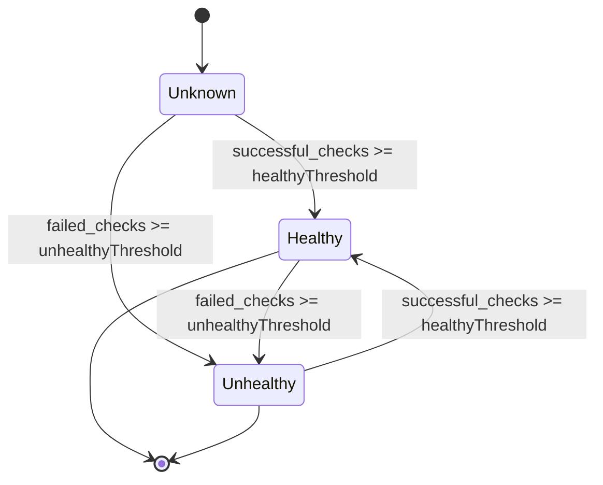
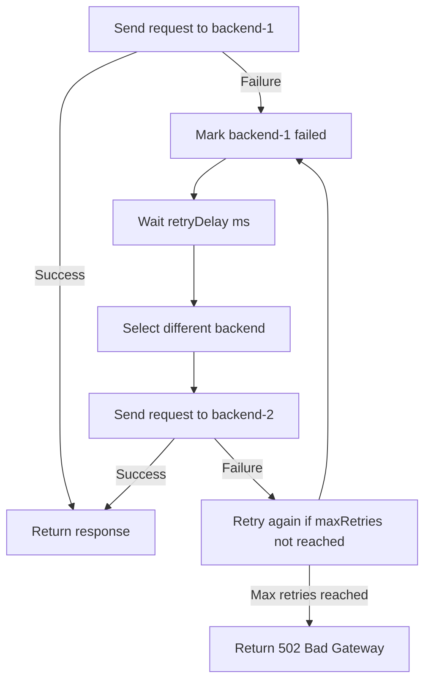

The Proxy Engine includes six built-in load balancing strategies and comprehensive health monitoring to ensure high availability and optimal resource utilization.

## Load Balancing Strategies

### 1. Round Robin

Distributes requests sequentially across all servers in rotation. Simple and effective for homogeneous backends.

**When to use**:
- All backend servers have similar capacity
- Simple, predictable distribution needed
- Stateless applications

**Configuration**:

```typescript
const route = {
  id: "api-route",
  pattern: "/api/*",
  upstream: {
    servers: [
      { id: "backend-1", host: "10.0.1.10", port: 3000, enabled: true },
      { id: "backend-2", host: "10.0.1.11", port: 3000, enabled: true },
      { id: "backend-3", host: "10.0.1.12", port: 3000, enabled: true },
    ],
    loadBalancingStrategy: "round-robin",
  },
};
```

**Behavior**:
```text
Request 1 → backend-1
Request 2 → backend-2
Request 3 → backend-3
Request 4 → backend-1 (cycle repeats)
```

### 2. Weighted Round Robin

Distributes requests based on server weights. Use when backends have different capacities.

**When to use**:
- Backends have different CPU/memory/bandwidth
- Gradual rollout of new servers (low weight initially)
- Heterogeneous infrastructure

**Configuration**:

```typescript
const route = {
  id: "api-route",
  pattern: "/api/*",
  upstream: {
    servers: [
      { id: "powerful", host: "10.0.1.10", port: 3000, enabled: true, weight: 3 },
      { id: "medium", host: "10.0.1.11", port: 3000, enabled: true, weight: 2 },
      { id: "small", host: "10.0.1.12", port: 3000, enabled: true, weight: 1 },
    ],
    loadBalancingStrategy: "weighted-round-robin",
  },
};
```

**Behavior** (weights 3:2:1):
```text
Request 1 → powerful
Request 2 → powerful
Request 3 → powerful
Request 4 → medium
Request 5 → medium
Request 6 → small
Request 7 → powerful (cycle repeats)
```

### 3. Least Connections

Routes to the server with the fewest active connections. Best for long-running requests.

**When to use**:
- Long-running requests (WebSocket, SSE, file uploads)
- Variable request duration
- Real-time connection balancing needed

**Configuration**:

```typescript
const route = {
  id: "websocket-route",
  pattern: "/ws/*",
  upstream: {
    servers: [
      { id: "backend-1", host: "10.0.1.10", port: 3000, enabled: true },
      { id: "backend-2", host: "10.0.1.11", port: 3000, enabled: true },
      { id: "backend-3", host: "10.0.1.12", port: 3000, enabled: true },
    ],
    loadBalancingStrategy: "least-connections",
  },
};
```

**Behavior**:
```text
Initial state:
  backend-1: 5 connections
  backend-2: 3 connections ← selected (least connections)
  backend-3: 7 connections

After selection:
  backend-1: 5 connections ← selected next (now least)
  backend-2: 4 connections
  backend-3: 7 connections
```

### 4. Least Response Time

Routes to the server with the lowest average response time. Best for performance-sensitive applications.

**When to use**:
- Performance is critical
- Backends have varying performance characteristics
- Auto-discovery of fastest backends
- Geographic distribution (closest server responds fastest)

**Configuration**:

```typescript
const route = {
  id: "api-route",
  pattern: "/api/*",
  upstream: {
    servers: [
      { id: "backend-1", host: "10.0.1.10", port: 3000, enabled: true },
      { id: "backend-2", host: "10.0.1.11", port: 3000, enabled: true },
      { id: "backend-3", host: "10.0.1.12", port: 3000, enabled: true },
    ],
    loadBalancingStrategy: "least-response-time",
  },
};
```

**Behavior**:
```text
Average response times:
  backend-1: 150ms
  backend-2: 75ms  ← selected (fastest)
  backend-3: 200ms

After several requests, metrics updated:
  backend-1: 145ms
  backend-2: 80ms
  backend-3: 190ms ← may be selected if backend-2 slows down
```

### 5. IP Hash

Consistent hashing based on client IP address. Routes same client to same server.

**When to use**:
- Session affinity needed without cookies
- Client IP is stable
- Simple sticky sessions
- Cache locality at backend servers

**Configuration**:

```typescript
const route = {
  id: "api-route",
  pattern: "/api/*",
  upstream: {
    servers: [
      { id: "backend-1", host: "10.0.1.10", port: 3000, enabled: true },
      { id: "backend-2", host: "10.0.1.11", port: 3000, enabled: true },
      { id: "backend-3", host: "10.0.1.12", port: 3000, enabled: true },
    ],
    loadBalancingStrategy: "ip-hash",
  },
};
```

**Behavior**:
```text
Client 192.168.1.10 → hash(192.168.1.10) % 3 = 1 → backend-2 (always)
Client 192.168.1.11 → hash(192.168.1.11) % 3 = 0 → backend-1 (always)
Client 192.168.1.12 → hash(192.168.1.12) % 3 = 2 → backend-3 (always)

Same client always routed to same server (unless server goes down)
```

### 6. Random

Randomly selects a server. Simple and works well for stateless applications.

**When to use**:
- Stateless applications
- Simplicity is priority
- Similar to round-robin but without state tracking

**Configuration**:

```typescript
const route = {
  id: "api-route",
  pattern: "/api/*",
  upstream: {
    servers: [
      { id: "backend-1", host: "10.0.1.10", port: 3000, enabled: true },
      { id: "backend-2", host: "10.0.1.11", port: 3000, enabled: true },
      { id: "backend-3", host: "10.0.1.12", port: 3000, enabled: true },
    ],
    loadBalancingStrategy: "random",
  },
};
```

## Health Checks

Health monitoring automatically detects and removes unhealthy backends from rotation.

### Health Check Types

#### TCP Health Check

Attempts a TCP connection to verify the server is reachable.

```typescript
const route = {
  id: "api-route",
  pattern: "/api/*",
  upstream: {
    servers: [
      { id: "backend-1", host: "10.0.1.10", port: 3000, enabled: true },
      { id: "backend-2", host: "10.0.1.11", port: 3000, enabled: true },
    ],
    loadBalancingStrategy: "round-robin",
    healthCheck: {
      type: "tcp",
      interval: 5000,           // Check every 5 seconds
      timeout: 2000,            // 2 second timeout
      healthyThreshold: 2,      // 2 successful checks = healthy
      unhealthyThreshold: 3,    // 3 failed checks = unhealthy
    },
  },
};
```

**Process**:
1. Establish TCP connection to `host:port`
2. If successful, increment healthy count
3. If fails, increment unhealthy count
4. Mark healthy when healthy count reaches threshold
5. Mark unhealthy when unhealthy count reaches threshold

#### HTTP Health Check

Makes an HTTP request to a health endpoint.

```typescript
const route = {
  id: "api-route",
  pattern: "/api/*",
  upstream: {
    servers: [
      { id: "backend-1", host: "10.0.1.10", port: 3000, enabled: true },
      { id: "backend-2", host: "10.0.1.11", port: 3000, enabled: true },
    ],
    loadBalancingStrategy: "round-robin",
    healthCheck: {
      type: "http",
      interval: 5000,
      timeout: 2000,
      healthyThreshold: 2,
      unhealthyThreshold: 3,
      path: "/health",          // Health endpoint path
      expectedStatus: 200,      // Expected HTTP status code
      expectedBody: "OK",       // Optional: expected response body
    },
  },
};
```

**Process**:
1. Send `GET /health HTTP/1.1` to server
2. Check response status code (must match expectedStatus)
3. Optionally check response body
4. Update healthy/unhealthy counts
5. Mark server based on thresholds

### Health Check Configuration

**interval**: Milliseconds between health checks. Typical: 5000-30000ms (5-30 seconds)

**timeout**: Maximum time to wait for health check response. Typical: 1000-5000ms (1-5 seconds)

**healthyThreshold**: Consecutive successful checks needed to mark server healthy. Typical: 2-3

**unhealthyThreshold**: Consecutive failed checks needed to mark server unhealthy. Typical: 2-5

**Recommendations**:

- Production: interval=10000, timeout=3000, healthyThreshold=2, unhealthyThreshold=3
- Development: interval=5000, timeout=2000, healthyThreshold=2, unhealthyThreshold=2
- Critical services: interval=3000, timeout=1000, healthyThreshold=3, unhealthyThreshold=2

### Health States



**Unknown**: Initial state before any health checks
**Healthy**: Server is passing health checks and receiving traffic
**Unhealthy**: Server is failing health checks and removed from rotation

## Session Affinity (Sticky Sessions)

Session affinity ensures that requests from the same client always go to the same backend server.

### Cookie-Based Affinity

Uses a cookie to track which server should handle requests from a client.

```typescript
import { LoadBalancerProxy } from "@browserx/proxy-engine";

const proxy = new LoadBalancerProxy(route, {
  sessionAffinity: {
    type: "cookie",
    cookieName: "SERVERID",
    cookiePath: "/",
    cookieMaxAge: 3600,       // 1 hour
    cookieSecure: true,       // HTTPS only
    cookieHttpOnly: true,     // Not accessible via JavaScript
  },
});
```

**Flow**:

1. First request from client → Select server via load balancing strategy
2. Set cookie: `Set-Cookie: SERVERID=backend-1; Path=/; Max-Age=3600; Secure; HttpOnly`
3. Subsequent requests include cookie: `Cookie: SERVERID=backend-1`
4. Proxy reads cookie and routes to backend-1
5. If backend-1 is unhealthy, select new server and update cookie

### IP-Based Affinity

Uses client IP address to maintain affinity (similar to IP Hash strategy but with failover).

```typescript
import { LoadBalancerProxy } from "@browserx/proxy-engine";

const proxy = new LoadBalancerProxy(route, {
  sessionAffinity: {
    type: "ip",
    timeoutMs: 3600000,      // 1 hour session timeout
  },
});
```

**Flow**:

1. Client 192.168.1.10 connects → Select server, store mapping
2. Subsequent requests from 192.168.1.10 → Use stored mapping
3. Session expires after timeoutMs or server becomes unhealthy
4. New server selected and mapping updated

## Failover

Automatic failover handles backend server failures gracefully.

### Configuration

```typescript
import { LoadBalancerProxy } from "@browserx/proxy-engine";

const proxy = new LoadBalancerProxy(route, {
  failover: {
    enabled: true,
    maxRetries: 3,           // Retry up to 3 times
    retryDelay: 100,         // 100ms between retries
    backoffMultiplier: 2,    // Exponential backoff: 100ms, 200ms, 400ms
  },
});
```

### Failover Behavior



**Example Timeline**:

```text
t=0ms:    Request to backend-1 → Timeout
t=100ms:  Request to backend-2 → Connection refused
t=300ms:  Request to backend-3 → Success! (total latency: 300ms)
```

### Retry Policies

**Fixed Delay**:
```typescript
{
  enabled: true,
  maxRetries: 3,
  retryDelay: 100,         // Always 100ms
  backoffMultiplier: 1,    // No exponential backoff
}
```

**Exponential Backoff**:
```typescript
{
  enabled: true,
  maxRetries: 5,
  retryDelay: 100,         // Initial delay
  backoffMultiplier: 2,    // 100ms, 200ms, 400ms, 800ms, 1600ms
}
```

**Aggressive Retry**:
```typescript
{
  enabled: true,
  maxRetries: 10,
  retryDelay: 10,          // Fast retries
  backoffMultiplier: 1,
}
```

## Advanced Examples

### Complete Production Configuration

```typescript
import { GatewayServer } from "@browserx/proxy-engine";

const server = new GatewayServer({
  host: "0.0.0.0",
  port: 443,
  tls: {
    certFile: "/etc/ssl/cert.pem",
    keyFile: "/etc/ssl/key.pem",
    alpnProtocols: ["h2", "http/1.1"],
  },
  routes: [
    {
      id: "api-route",
      pattern: "/api/*",
      upstream: {
        servers: [
          {
            id: "api-1",
            host: "10.0.1.10",
            port: 3000,
            enabled: true,
            weight: 3,        // More powerful server
            protocol: "http",
          },
          {
            id: "api-2",
            host: "10.0.1.11",
            port: 3000,
            enabled: true,
            weight: 2,
            protocol: "http",
          },
          {
            id: "api-3",
            host: "10.0.1.12",
            port: 3000,
            enabled: true,
            weight: 1,
            protocol: "http",
          },
        ],
        loadBalancingStrategy: "weighted-round-robin",
        healthCheck: {
          type: "http",
          interval: 10000,        // 10 seconds
          timeout: 3000,          // 3 second timeout
          healthyThreshold: 2,
          unhealthyThreshold: 3,
          path: "/health",
          expectedStatus: 200,
        },
        timeout: 30000,           // 30 second request timeout
        retryPolicy: {
          maxRetries: 3,
          retryDelay: 100,
        },
        sessionAffinity: {
          type: "cookie",
          cookieName: "API_SERVER",
          cookiePath: "/api",
          cookieMaxAge: 3600,
          cookieSecure: true,
          cookieHttpOnly: true,
        },
        failover: {
          enabled: true,
          maxRetries: 3,
          retryDelay: 100,
          backoffMultiplier: 2,
        },
      },
    },
  ],
});

await server.start();
```

### Geographic Load Balancing

Use least-response-time strategy to automatically route to the closest datacenter:

```typescript
const route = {
  id: "global-api",
  pattern: "/api/*",
  upstream: {
    servers: [
      { id: "us-east", host: "us-east.api.example.com", port: 443, enabled: true },
      { id: "us-west", host: "us-west.api.example.com", port: 443, enabled: true },
      { id: "eu-west", host: "eu-west.api.example.com", port: 443, enabled: true },
      { id: "ap-southeast", host: "ap-southeast.api.example.com", port: 443, enabled: true },
    ],
    loadBalancingStrategy: "least-response-time",
    healthCheck: {
      type: "http",
      interval: 5000,
      timeout: 2000,
      healthyThreshold: 2,
      unhealthyThreshold: 3,
      path: "/health",
    },
  },
};

// Automatically routes to datacenter with lowest latency
// Client in New York → us-east (20ms)
// Client in London → eu-west (15ms)
// Client in Singapore → ap-southeast (30ms)
```

### Canary Deployment

Gradually roll out new version using weighted load balancing:

```typescript
// Start: 90% traffic to v1, 10% to v2
const servers = [
  { id: "v1-1", host: "10.0.1.10", port: 3000, enabled: true, weight: 45 },
  { id: "v1-2", host: "10.0.1.11", port: 3000, enabled: true, weight: 45 },
  { id: "v2-1", host: "10.0.2.10", port: 3000, enabled: true, weight: 10 },
];

// Later: 50% traffic to v1, 50% to v2
const servers = [
  { id: "v1-1", host: "10.0.1.10", port: 3000, enabled: true, weight: 25 },
  { id: "v1-2", host: "10.0.1.11", port: 3000, enabled: true, weight: 25 },
  { id: "v2-1", host: "10.0.2.10", port: 3000, enabled: true, weight: 25 },
  { id: "v2-2", host: "10.0.2.11", port: 3000, enabled: true, weight: 25 },
];

// Finally: 100% traffic to v2
const servers = [
  { id: "v2-1", host: "10.0.2.10", port: 3000, enabled: true, weight: 50 },
  { id: "v2-2", host: "10.0.2.11", port: 3000, enabled: true, weight: 50 },
];
```

## Monitoring

### Load Balancer Statistics

```typescript
import { createLoadBalancer } from "@browserx/proxy-engine";

const lb = createLoadBalancer("weighted-round-robin");

// After handling requests
const stats = lb.getAllStats();

for (const [serverId, serverStats] of stats.entries()) {
  console.log(`Server: ${serverId}`);
  console.log(`  Total requests: ${serverStats.totalRequests}`);
  console.log(`  Successful: ${serverStats.successfulRequests}`);
  console.log(`  Failed: ${serverStats.failedRequests}`);
  console.log(`  Avg response time: ${serverStats.averageResponseTime.toFixed(2)}ms`);
  console.log(`  Active connections: ${serverStats.activeConnections}`);
}
```

### Health Monitor Status

```typescript
import { HealthMonitor } from "@browserx/proxy-engine";

const healthMonitor = new HealthMonitor(healthCheckConfig);
healthMonitor.start(servers);

// Get health status
const healthyServers = healthMonitor.getHealthyServers(servers);
console.log(`Healthy: ${healthyServers.length}/${servers.length}`);

// Get detailed status per server
for (const server of servers) {
  const state = healthMonitor.getServerState(server.id);
  console.log(`${server.id}: ${state.status} (${state.consecutiveSuccesses} successes, ${state.consecutiveFailures} failures)`);
}
```

## Best Practices

1. **Choose the right strategy**:
   - Stateless APIs → Round Robin or Random
   - Long connections → Least Connections
   - Performance-critical → Least Response Time
   - Session state → IP Hash or Cookie-based affinity
   - Heterogeneous backends → Weighted Round Robin

2. **Configure health checks**:
   - Always enable health checks in production
   - Use HTTP health checks with dedicated endpoints
   - Set interval based on server count (more servers = longer interval)
   - Set timeout < interval to avoid overlapping checks

3. **Use session affinity carefully**:
   - Only when backend state is not shared
   - Cookie-based preferred over IP-based (NAT issues)
   - Set appropriate timeouts to allow rebalancing
   - Implement session persistence in backends if possible

4. **Configure retry and failover**:
   - Enable failover for critical services
   - Use exponential backoff to avoid thundering herd
   - Set maxRetries based on latency requirements
   - Monitor retry rates to detect systemic issues

5. **Monitor continuously**:
   - Track server health states
   - Monitor request distribution across backends
   - Alert on unhealthy server count
   - Track average response times per server

## Next Steps

- [Proxy Types](/proxy/proxy-types) - Learn about different proxy implementations
- [Connection Pooling](/proxy/connection-pooling) - Optimize with connection reuse
- [Observability](/proxy/observability) - Set up metrics and monitoring
