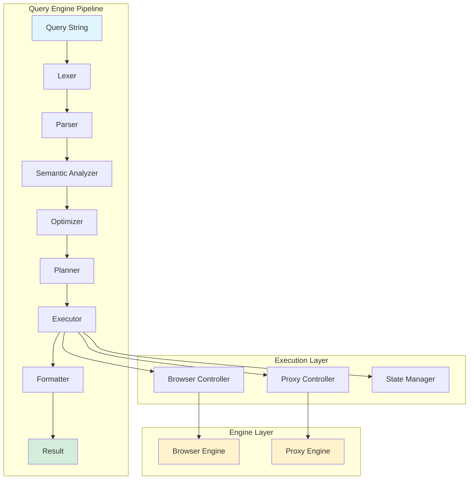
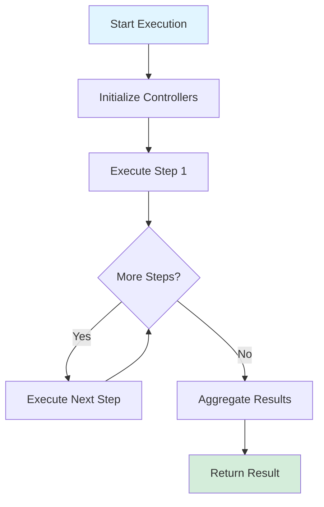

The Query Engine processes queries through a multi-stage pipeline, transforming declarative SQL-like queries into optimized execution plans that coordinate browser and proxy operations.

## Architecture Overview



## Pipeline Stages

### 1. Lexer (Tokenization)

The lexer converts raw query text into a stream of tokens.

**Input:**
```sql
SELECT title FROM "https://example.com"
```

**Output:**
```typescript
[
  Token { type: 'KEYWORD', value: 'SELECT', line: 1, column: 1 },
  Token { type: 'IDENTIFIER', value: 'title', line: 1, column: 8 },
  Token { type: 'KEYWORD', value: 'FROM', line: 1, column: 14 },
  Token { type: 'STRING', value: 'https://example.com', line: 1, column: 19 },
  Token { type: 'EOF', value: '', line: 1, column: 40 }
]
```

**Token Types:**
- `KEYWORD` - Reserved words (SELECT, FROM, WHERE, etc.)
- `IDENTIFIER` - Variable/field names
- `STRING` - String literals
- `NUMBER` - Numeric literals
- `OPERATOR` - Operators (=, &gt;, &lt;, etc.)
- `PUNCTUATION` - Delimiters (, . ; etc.)
- `EOF` - End of file

**Implementation:**
```typescript
// query-engine/lexer/tokenizer.ts
export class Lexer {
  private input: string;
  private position: number;
  private line: number;
  private column: number;

  nextToken(): Token {
    this.skipWhitespace();

    if (this.isAtEnd()) {
      return this.makeToken(TokenType.EOF, '');
    }

    const char = this.peek();

    // String literals
    if (char === '"' || char === "'") {
      return this.scanString();
    }

    // Numbers
    if (this.isDigit(char)) {
      return this.scanNumber();
    }

    // Identifiers and keywords
    if (this.isAlpha(char)) {
      return this.scanIdentifier();
    }

    // Operators and punctuation
    return this.scanOperator();
  }
}
```

### 2. Parser (AST Construction)

The parser builds an Abstract Syntax Tree (AST) from the token stream using recursive descent parsing.

**Input:**
```typescript
[Token { type: 'KEYWORD', value: 'SELECT' }, ...]
```

**Output:**
```typescript
{
  type: "SELECT",
  fields: [
    { name: "title", alias: null }
  ],
  source: {
    type: "URL",
    value: "https://example.com"
  },
  where: null,
  orderBy: null,
  limit: null
}
```

**AST Node Types:**
```typescript
export type Statement =
  | SelectStatement
  | NavigateStatement
  | SetStatement
  | ShowStatement
  | ForStatement
  | IfStatement
  | InsertStatement
  | UpdateStatement
  | DeleteStatement
  | ClickStatement
  | WaitStatement
  | ScreenshotStatement
  | PdfStatement;
```

**Implementation:**
```typescript
// query-engine/parser/parser.ts
export class Parser {
  private tokens: Token[];
  private current: number;

  parse(): ASTNode {
    return this.parseStatement();
  }

  private parseStatement(): ASTNode {
    const token = this.peek();

    switch (token.value.toUpperCase()) {
      case 'SELECT':
        return this.parseSelect();
      case 'NAVIGATE':
        return this.parseNavigate();
      case 'SET':
        return this.parseSet();
      // ... other statements
    }
  }

  private parseSelect(): SelectStatement {
    this.consume('SELECT');

    const fields = this.parseFieldList();
    this.consume('FROM');
    const source = this.parseSource();

    const where = this.match('WHERE') ? this.parseCondition() : undefined;
    const orderBy = this.match('ORDER') ? this.parseOrderBy() : undefined;
    const limit = this.match('LIMIT') ? this.parseLimit() : undefined;

    return { type: 'SELECT', fields, source, where, orderBy, limit };
  }
}
```

### 3. Semantic Analyzer

Validates types, resolves names, and checks permissions.

**Responsibilities:**
1. **Symbol Table Construction** - Track all variables and their types
2. **Type Checking** - Ensure type compatibility
3. **Name Resolution** - Resolve variable references
4. **Permission Validation** - Check security permissions
5. **Field Validation** - Verify fields exist in sources

**Example Type Checking:**
```typescript
// Invalid: comparing number to string
WHERE price > "abc"
→ TypeError: Cannot compare Number and String

// Valid: comparing number to number
WHERE price > 100
→ ✓ Type check passed
```

**Implementation:**
```typescript
// query-engine/analyzer/semantic.ts
export class SemanticAnalyzer {
  private symbolTable: Map<string, Symbol>;
  private typeChecker: TypeChecker;
  private securityValidator: SecurityValidator;

  analyze(ast: ASTNode): AnnotatedAST {
    // Build symbol table
    this.buildSymbolTable(ast);

    // Type check
    this.typeChecker.check(ast, this.symbolTable);

    // Security validation
    this.securityValidator.validate(ast);

    // Return annotated AST with type information
    return this.annotate(ast);
  }
}
```

### 4. Optimizer

Transforms AST to optimize execution.

**Optimization Strategies:**

#### Constant Folding
Evaluate constant expressions at compile time:

```sql
-- Before
WHERE 1 + 1 = 2 AND status = "active"

-- After
WHERE true AND status = "active"
→ WHERE status = "active"
```

#### Predicate Pushdown
Move filters closer to data source:

```sql
-- Before: Extract all, then filter
SELECT name, price FROM "https://store.com/products"
WHERE price < 100

-- After: Filter in browser using CSS selector
SELECT name, price FROM "https://store.com/products"
WHERE SELECTOR ".product[data-price<100]"
```

#### Cache Utilization
Use cached data when possible:

```sql
-- Check cache before navigating
IF CACHED("https://example.com") THEN
  SELECT title FROM CACHE("https://example.com")
ELSE
  SELECT title FROM "https://example.com"
  CACHE RESULT
```

#### Parallel Execution Detection
Identify independent operations:

```sql
-- Sequential (detected automatically)
PARALLEL {
  SELECT title FROM url1,
  SELECT title FROM url2,
  SELECT title FROM url3
}
```

**Implementation:**
```typescript
// query-engine/optimizer/optimizer.ts
export class QueryOptimizer {
  optimize(ast: ASTNode): ASTNode {
    let optimized = ast;

    // Apply optimization passes
    optimized = this.constantFolding(optimized);
    optimized = this.deadCodeElimination(optimized);
    optimized = this.predicatePushdown(optimized);
    optimized = this.cacheOptimization(optimized);
    optimized = this.parallelDetection(optimized);

    return optimized;
  }
}
```

### 5. Execution Planner

Generates a physical execution plan with estimated costs.

**Plan Structure:**
```typescript
interface ExecutionPlan {
  steps: ExecutionStep[];
  estimatedCost: number;  // Milliseconds
  resources: ResourceRequirements;
}

type ExecutionStep =
  | BrowserStep
  | ProxyStep
  | ComputeStep;
```

**Example Plan:**
```typescript
// Query: SELECT title FROM "https://example.com"

{
  steps: [
    {
      type: 'PROXY',
      action: 'CONFIGURE',
      params: { cache: true },
      estimatedDuration: 5
    },
    {
      type: 'BROWSER',
      action: 'NAVIGATE',
      params: { url: 'https://example.com' },
      estimatedDuration: 500
    },
    {
      type: 'BROWSER',
      action: 'WAIT',
      params: { condition: 'dom-ready' },
      estimatedDuration: 100
    },
    {
      type: 'BROWSER',
      action: 'EXTRACT',
      params: { field: 'title', selector: 'title' },
      estimatedDuration: 10
    }
  ],
  estimatedCost: 615,
  resources: {
    browsers: 1,
    pages: 1,
    connections: 1
  }
}
```

**Cost Estimation:**
```typescript
// query-engine/planner/cost-estimator.ts
export class CostEstimator {
  estimateStepCost(step: ExecutionStep): number {
    const baseCosts = {
      // Browser operations
      NAVIGATE: 500,      // Network latency + page load
      EXTRACT: 10,        // DOM traversal + extraction
      CLICK: 50,          // Interaction + potential navigation
      TYPE: 30,           // Typing simulation
      WAIT: 100,          // Wait overhead
      SCREENSHOT: 200,    // Rendering + capture

      // Proxy operations
      CONFIGURE: 5,       // Configuration overhead
      INTERCEPT: 2,       // Interception overhead per request
      CACHE_LOOKUP: 1,    // Cache lookup

      // Compute operations
      FILTER: 5,          // Filtering overhead
      AGGREGATE: 10,      // Aggregation overhead
      SORT: 15            // Sorting overhead
    };

    return baseCosts[step.action] || 10;
  }
}
```

### 6. Executor

Executes the physical plan step by step.

**Execution Flow:**


**Controllers:**

#### Browser Controller
```typescript
// query-engine/controllers/browser/browser-controller.ts
export class BrowserController {
  async navigate(url: string, options?: NavigateOptions): Promise<NavigateResult> {
    const page = await this.getOrCreatePage();
    await page.setViewport(options?.viewport || defaultViewport);
    const response = await page.goto(url, {
      waitUntil: options?.waitUntil || 'domcontentloaded',
      timeout: options?.timeout || 30000
    });
    return { url: response.url, status: response.status };
  }

  async extract(field: string, selector: string): Promise<unknown> {
    const page = this.currentPage;
    return await page.evaluate((sel, fld) => {
      const element = document.querySelector(sel);
      if (fld === 'text') return element?.textContent;
      if (fld === 'html') return element?.innerHTML;
      return element?.getAttribute(fld);
    }, selector, field);
  }
}
```

#### Proxy Controller
```typescript
// query-engine/controllers/proxy/proxy-controller.ts
export class ProxyController {
  async configure(config: ProxyConfig): Promise<void> {
    if (config.headers) {
      this.proxy.setDefaultHeaders(config.headers);
    }
    if (config.cache !== undefined) {
      this.proxy.setCachingEnabled(config.cache);
    }
    if (config.intercept) {
      this.setupInterception(config.intercept);
    }
  }

  async intercept(config: InterceptConfig): Promise<void> {
    this.proxy.on('request', (request) => {
      if (this.shouldIntercept(request, config)) {
        this.interceptedRequests.push(request);
      }
      return request;
    });
  }
}
```

**Implementation:**
```typescript
// query-engine/executor/executor.ts
export class QueryExecutor {
  async execute(plan: ExecutionPlan): Promise<QueryResult> {
    const results: unknown[] = [];
    const timing: Record<string, number> = {};
    const startTime = performance.now();

    for (const step of plan.steps) {
      const stepStart = performance.now();
      const result = await this.executeStep(step);
      results.push(result);
      timing[`step_${step.type}_${step.action}`] = performance.now() - stepStart;
    }

    return {
      data: this.aggregateResults(results),
      timing: { ...timing, total: performance.now() - startTime },
      metadata: { plan, steps: plan.steps.length }
    };
  }

  private async executeStep(step: ExecutionStep): Promise<unknown> {
    switch (step.type) {
      case 'BROWSER':
        return this.executeBrowserStep(step as BrowserStep);
      case 'PROXY':
        return this.executeProxyStep(step as ProxyStep);
      case 'COMPUTE':
        return this.executeComputeStep(step as ComputeStep);
    }
  }
}
```

### 7. Result Formatter

Formats execution results into requested output format.

**Supported Formats:**
- `JSON` - JSON object
- `TABLE` - ASCII table
- `CSV` - Comma-separated values
- `STREAM` - Streaming results

**Example:**
```typescript
// JSON format
{
  "title": "Example Domain",
  "description": "Example Domain..."
}

// TABLE format
┌─────────────────┬──────────────────────┐
│ Title           │ Description          │
├─────────────────┼──────────────────────┤
│ Example Domain  │ Example Domain...    │
└─────────────────┴──────────────────────┘

// CSV format
title,description
Example Domain,Example Domain...
```

## State Management

The Query Engine maintains state across query executions:

### Browser State
```typescript
// query-engine/state/browser-state.ts
export class BrowserStateManager {
  private cookies: Map<string, Cookie>;
  private localStorage: Map<string, string>;
  private sessionStorage: Map<string, string>;
  private navigationHistory: URL[];

  async saveCookies(page: Page): Promise<void> {
    const cookies = await page.context().cookies();
    for (const cookie of cookies) {
      this.cookies.set(cookie.name, cookie);
    }
  }

  async restoreCookies(page: Page): Promise<void> {
    const cookies = Array.from(this.cookies.values());
    await page.context().addCookies(cookies);
  }
}
```

### Execution Context
```typescript
// query-engine/state/execution-context.ts
export class ExecutionContext {
  private variables: Map<string, unknown>;
  private browserState: BrowserStateManager;
  private proxyState: ProxyStateManager;

  setVariable(name: string, value: unknown): void {
    this.variables.set(name, value);
  }

  getVariable(name: string): unknown {
    return this.variables.get(name);
  }
}
```

## Resource Management

Efficient resource pooling and lifecycle management:

### Browser Pool
```typescript
interface BrowserPoolConfig {
  min: number;         // Minimum pool size
  max: number;         // Maximum pool size
  idleTimeout: number; // Idle timeout (ms)
  maxLifetime: number; // Max lifetime (ms)
}

class BrowserPool {
  async acquire(): Promise<Browser> {
    // Get from pool or create new
  }

  async release(browser: Browser): Promise<void> {
    // Return to pool or destroy
  }
}
```

### Connection Pool
```typescript
class ConnectionPool {
  async acquire(): Promise<Connection> {
    // Get available connection
  }

  async release(connection: Connection): Promise<void> {
    // Return to pool
  }

  async healthCheck(): Promise<void> {
    // Remove unhealthy connections
  }
}
```

## Security

Multi-layer security enforcement:

### Permission System
```typescript
enum Permission {
  NAVIGATE_PUBLIC,
  NAVIGATE_PRIVATE,
  READ_COOKIES,
  WRITE_COOKIES,
  EXECUTE_JS,
  INTERCEPT_TRAFFIC,
  SCREENSHOT,
  FILE_DOWNLOAD
}

class PermissionManager {
  checkPermission(permission: Permission): void {
    if (!this.granted.has(permission)) {
      throw new PermissionError(`Permission denied: ${Permission[permission]}`);
    }
  }
}
```

### Sandboxed Execution
```typescript
class QuerySandbox {
  async execute(query: string): Promise<unknown> {
    const isolate = new Isolate({ memoryLimit: 128 * 1024 * 1024 });
    const context = isolate.createContext();

    // Inject safe APIs only
    context.global.set('SELECT', new Reference(this.selectFunction));

    // Block dangerous APIs
    context.global.delete('require');
    context.global.delete('eval');

    const script = await isolate.compileScript(query);
    return await script.run(context, { timeout: 30000 });
  }
}
```

## Next Steps

- Study [Query Optimization](/query/optimization) techniques
- Explore [Real-World Examples](/query/examples)
- Read about [Performance Tuning](/query/performance)
