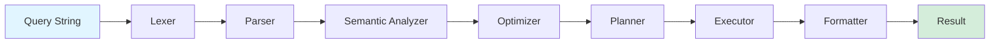

import { Card, CardGrid } from '@astrojs/starlight/components';

The **Query Engine** is BrowserX's unified interface layer that provides declarative, SQL-like control over both the Browser Engine and Proxy Engine. Instead of writing imperative code calling individual APIs, you express your intent through queries that the engine translates into coordinated actions.

## Why Use the Query Engine?

Traditional web automation requires imperative code with manual coordination:

```typescript
// Traditional imperative approach
await browser.navigate("https://example.com");
await browser.waitForSelector(".product");
const html = await browser.getHTML(".product");
const price = parsePrice(html);
```

The Query Engine simplifies this to a declarative query:

```sql
SELECT price FROM "https://example.com" WHERE selector = ".product"
```

## Key Features

<CardGrid>
  <Card title="Declarative Syntax" icon="pencil">
    Express complex browser and proxy operations as simple SQL-like queries
  </Card>
  <Card title="Unified Control" icon="merge">
    Control both browser and proxy engines in a single query
  </Card>
  <Card title="AI/ML Friendly" icon="rocket">
    Natural syntax for humans, programmatic generation for AI agents
  </Card>
  <Card title="Optimized Execution" icon="speedometer">
    Automatic query optimization and parallel execution
  </Card>
  <Card title="Type Safe" icon="shield">
    Strong typing with compile-time validation
  </Card>
  <Card title="Secure by Default" icon="security">
    Multi-layer security with sandboxing and permissions
  </Card>
</CardGrid>

## Architecture Pipeline

The Query Engine processes queries through a multi-stage pipeline:



### Pipeline Stages

1. **Lexer** - Tokenizes query string into tokens
2. **Parser** - Builds Abstract Syntax Tree (AST)
3. **Semantic Analyzer** - Type checking and validation
4. **Optimizer** - Query transformation and optimization
5. **Planner** - Physical execution plan generation
6. **Executor** - Step-by-step query execution
7. **Formatter** - Result formatting (JSON, table, CSV)

## Quick Start

```typescript
import { QueryEngine } from "@browserx/query-engine";

// Create and initialize engine
const engine = new QueryEngine({
  browser: {
    headless: true,
    defaultTimeout: 30000,
  },
  proxy: {
    enabled: true,
    defaultCache: true,
  },
});

await engine.initialize();

// Execute a query
const result = await engine.execute(
  `SELECT title, description FROM "https://example.com"`
);

console.log(result.data);
// { title: "Example Domain", description: "..." }
```

## Core Capabilities

### Data Extraction

Extract structured data from websites:

```sql
SELECT product.name, product.price
FROM "https://store.com/products"
WHERE product.price < 100
ORDER BY product.price ASC
LIMIT 10
```

### Browser Automation

Automate browser interactions:

```sql
NAVIGATE TO "https://app.example.com/login"

IF EXISTS("#login-form") THEN
  INSERT "user@example.com" INTO "#email"
  INSERT "password123" INTO "#password"
  CLICK "#submit"
  WAIT 2s
```

### Proxy Control

Configure and monitor network traffic:

```sql
NAVIGATE TO "https://api.example.com"
  WITH {
    proxy: {
      headers: {"Authorization": "Bearer token"},
      cache: true,
      intercept: { urls: ["*/api/*"] }
    }
  }
  CAPTURE response.body, proxy.requests
```

### Complex Workflows

Combine queries into sophisticated automation:

```sql
WITH search_results AS (
  SELECT product.name, product.url
  FROM "https://store.com/search?q=laptop"
  LIMIT 50
)
FOR EACH product IN search_results
  NAVIGATE TO product.url
  CAPTURE {
    name: TEXT(".product-name"),
    price: TEXT(".product-price"),
    rating: ATTR(".rating", "data-rating")
  }
```

## Use Cases

- **Web Scraping** - Extract data from websites with pagination support
- **Testing & QA** - Automated UI testing and visual regression
- **Security Research** - Traffic analysis and vulnerability scanning
- **AI/ML Training** - Generate training datasets from web content
- **Monitoring** - Track website changes and performance metrics
- **API Testing** - Test APIs through proxy interception

## Documentation Sections

<CardGrid>
  <Card title="Getting Started" icon="rocket">
    [Installation and basic usage](/query/getting-started)
  </Card>
  <Card title="Query Language" icon="document">
    [Complete syntax reference](/query/syntax)
  </Card>
  <Card title="Architecture" icon="puzzle">
    [Deep dive into the pipeline](/query/architecture)
  </Card>
  <Card title="DOM Functions" icon="code">
    [Built-in DOM manipulation](/query/dom-functions)
  </Card>
  <Card title="Expressions" icon="calculator">
    [Operators and expressions](/query/expressions)
  </Card>
  <Card title="Examples" icon="open-book">
    [Real-world query examples](/query/examples)
  </Card>
  <Card title="API Reference" icon="list-format">
    [Programmatic API](/query/api-reference)
  </Card>
  <Card title="Optimization" icon="speedometer">
    [Performance optimization](/query/optimization)
  </Card>
</CardGrid>

## Next Steps

- Read the [Getting Started Guide](/query/getting-started) to install and run your first query
- Explore the [Query Language Syntax](/query/syntax) to learn all statements and operators
- Check out [Real-World Examples](/query/examples) for common automation patterns
