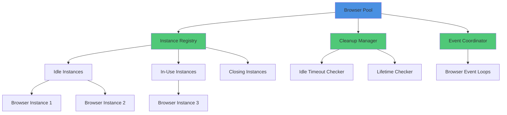
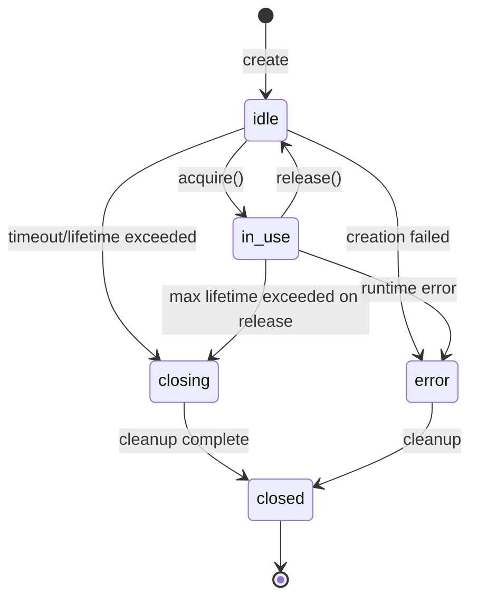

import { Tabs, TabItem } from '@astrojs/starlight/components';

The **Browser Pool** manages a pool of browser instances with automatic lifecycle management, resource cleanup, and configurable pooling strategies. It provides the `acquire()` / `release()` pattern for efficient browser instance reuse.

## Overview

The Browser Pool solves several challenges when managing browser instances:

- **Resource Efficiency**: Reuse browser instances instead of creating/destroying on every request
- **Concurrency Control**: Limit maximum concurrent browsers to prevent resource exhaustion
- **Automatic Cleanup**: Close idle instances and rotate long-lived instances
- **Pre-warming**: Keep warm instances ready for immediate use
- **Event Loop Integration**: Each instance has its own event loop for JavaScript execution

## Architecture



## Instance States

Each browser instance progresses through a state machine:



- **idle**: Available for acquisition, waiting in the pool
- **in_use**: Acquired by a session, actively processing requests
- **closing**: Cleanup in progress (event loop stop, resource release)
- **closed**: Cleanup complete, removed from pool
- **error**: Instance encountered an error during lifecycle

## Basic Usage

### Acquire and Release

<Tabs>
<TabItem label="Basic Pattern">

```typescript
import { createRuntime } from "@browserx/runtime";

const runtime = await createRuntime();
const pool = runtime.browserPool;

// Acquire a browser instance
const instance = await pool.acquire();

try {
  // Use the browser instance
  console.log(`Using instance: ${instance.id}`);
  console.log(`Created at: ${new Date(instance.createdAt)}`);
  console.log(`Use count: ${instance.useCount}`);

  // Access browser engine
  if (instance.browserEngine) {
    const engine = instance.browserEngine as BrowserEngine;
    await engine.navigate("https://example.com");
    const screenshot = await engine.screenshot();
  }
} finally {
  // Always release back to the pool
  pool.release(instance.id);
}
```

</TabItem>

<TabItem label="With Timeout">

```typescript
// Acquire with custom timeout
const instance = await pool.acquire({
  timeout: 10000, // 10 seconds
});

try {
  // Use instance
} finally {
  pool.release(instance.id);
}
```

</TabItem>

<TabItem label="With URL">

```typescript
// Acquire and set initial URL
const instance = await pool.acquire({
  url: "https://example.com",
});

console.log(`Current URL: ${instance.currentUrl}`);

// Instance is already navigated to the URL
try {
  // Use instance
} finally {
  pool.release(instance.id);
}
```

</TabItem>
</Tabs>

## Pool Statistics

Monitor pool health and usage:

```typescript
const stats = pool.getStats();

console.log(`Total instances: ${stats.totalInstances}`);
console.log(`Idle: ${stats.idleInstances}`);
console.log(`In use: ${stats.inUseInstances}`);
console.log(`Max capacity: ${stats.maxInstances}`);

console.log(`Total created: ${stats.totalCreated}`);
console.log(`Total closed: ${stats.totalClosed}`);
console.log(`Total errors: ${stats.totalErrors}`);

console.log(`Average lifetime: ${stats.averageLifetime}ms`);
console.log(`Average uses per instance: ${stats.averageUseCount}`);
```

### Statistics Interface

```typescript
interface BrowserPoolStats {
  totalInstances: number;      // Current instance count
  idleInstances: number;       // Available for acquisition
  inUseInstances: number;      // Currently acquired
  maxInstances: number;        // Pool capacity
  minInstances: number;        // Minimum warm instances

  totalCreated: number;        // Lifetime instances created
  totalClosed: number;         // Lifetime instances closed
  totalErrors: number;         // Lifetime errors

  averageLifetime: number;     // Average instance lifetime (ms)
  averageUseCount: number;     // Average uses per instance
}
```

## Automatic Cleanup

The pool performs automatic cleanup on two intervals:

### Idle Timeout Cleanup

Runs every **60 seconds**, closes instances idle for longer than `idleTimeout`:

```typescript
{
  browser: {
    idleTimeout: 10 * 60 * 1000,  // 10 minutes
    minInstances: 2,              // Never close below 2
  }
}
```

**Behavior**:
- Instances idle for > 10 minutes are closed
- Pool maintains at least 2 warm instances
- If all instances are idle, only excess instances are closed

### Lifetime Checker

Runs every **5 minutes**, closes instances older than `maxLifetime`:

```typescript
{
  browser: {
    maxLifetime: 60 * 60 * 1000,  // 1 hour
  }
}
```

**Behavior**:
- Instances older than 1 hour are marked for closure
- Instances still in use continue until released
- On release, instances exceeding lifetime are closed instead of returned to pool

### Manual Cleanup

Manually trigger cleanup operations:

```typescript
// Close all idle instances (respects minInstances)
await pool.drain();

// Close a specific instance
await pool.closeInstance(instance.id, "manual_cleanup");

// Stop the entire pool (closes all instances)
await pool.stop();
```

## Pre-warming

Configure minimum warm instances for fast startup:

```typescript
{
  browser: {
    minInstances: 5,  // Keep 5 warm instances ready
  }
}
```

When the pool starts, it immediately creates `minInstances` browser instances. This ensures:

- **Zero cold-start latency**: Instances are ready for immediate acquisition
- **Predictable performance**: First requests don't wait for instance creation
- **Resource reservation**: Memory and resources are allocated upfront

**Tradeoff**: Higher memory footprint even when idle.

## Pool Exhaustion

When all instances are in use and `maxInstances` is reached:

```typescript
const instance = await pool.acquire({
  timeout: 30000,  // Wait up to 30 seconds
});
```

**Behavior**:
1. Check for idle instances (return immediately if available)
2. If no idle instances, check if can create new instance (< `maxInstances`)
3. If at capacity, poll every 100ms until an instance is released
4. If timeout is exceeded, throw error:

```
Error: Failed to acquire browser instance: pool exhausted and timeout reached
```

### Handling Exhaustion

<Tabs>
<TabItem label="Increase Capacity">

```typescript
{
  browser: {
    maxInstances: 20,  // Increase capacity
  }
}
```

</TabItem>

<TabItem label="Increase Timeout">

```typescript
const instance = await pool.acquire({
  timeout: 60000,  // Wait longer (1 minute)
});
```

</TabItem>

<TabItem label="Queue Requests">

```typescript
class RequestQueue {
  private queue: Array<() => void> = [];

  async acquireWithQueue(pool: BrowserPool) {
    return new Promise<BrowserInstance>((resolve, reject) => {
      this.queue.push(async () => {
        try {
          const instance = await pool.acquire();
          resolve(instance);
        } catch (error) {
          reject(error);
        }
      });

      this.processQueue();
    });
  }

  private async processQueue() {
    if (this.queue.length > 0) {
      const next = this.queue.shift();
      await next?.();
    }
  }
}
```

</TabItem>
</Tabs>

## Instance Lifecycle Details

### Instance Creation

When a new instance is created:

1. Generate unique ID: `browser_${timestamp}_${random}`
2. Create browser event loop via `EventCoordinator`
3. Create `BrowserEngine` instance
4. Set state to `idle`
5. Record creation timestamp
6. Add to instance registry

```typescript
interface BrowserInstance {
  readonly id: string;
  state: BrowserInstanceState;
  readonly createdAt: number;
  lastUsedAt: number;
  useCount: number;
  currentUrl?: string;
  error?: Error;
  eventLoopHandle?: BrowserEventLoopHandle;
  browserEngine?: unknown;
}
```

### Instance Acquisition

When `acquire()` is called:

1. Search for idle instance in registry
2. If found:
   - Set state to `in_use`
   - Increment `useCount`
   - Update `lastUsedAt`
   - Optionally set `currentUrl`
   - Return instance
3. If not found and below capacity:
   - Create new instance
   - Immediately mark as `in_use`
   - Return instance
4. If at capacity:
   - Poll for idle instance (100ms intervals)
   - Timeout after `timeout` ms

### Instance Release

When `release(instanceId)` is called:

1. Validate instance exists and is `in_use`
2. Check instance lifetime: `Date.now() - instance.createdAt`
3. If lifetime > `maxLifetime`:
   - Close instance immediately
4. Otherwise:
   - Set state to `idle`
   - Update `lastUsedAt`
   - Clear `currentUrl`
   - Return to pool

### Instance Closure

When an instance is closed:

1. Set state to `closing`
2. Stop event loop via `eventLoopHandle.stop()`
3. Record lifetime and use count statistics
4. Set state to `closed`
5. Remove from instance registry
6. Increment `totalClosed` counter

## Integration with MCP Server

The Browser Pool integrates with the MCP Server through the SessionManager:

```typescript
// mcp-server/session/session-manager.ts
class SessionManager {
  constructor(
    private browserPool?: BrowserPool,
    private eventEmitter?: (event: RuntimeEvent) => void,
  ) {}

  async createSession(options: SessionOptions): Promise<BrowserSession> {
    let poolInstanceId: string | undefined;

    // Try to acquire from pool first
    if (this.browserPool) {
      try {
        const instance = await this.browserPool.acquire({
          timeout: 30000,
        });
        poolInstanceId = instance.id;

        // Use the pooled browser engine
        const session = new BrowserSession(
          sessionId,
          instance.browserEngine,
          poolInstanceId,
        );

        // Emit session_created event
        this.eventEmitter?.({
          type: "session_created",
          sessionId,
          instanceId: poolInstanceId,
        });

        return session;
      } catch (error) {
        console.warn("Pool exhausted, creating standalone instance");
      }
    }

    // Fallback: create standalone browser engine
    const browser = new BrowserEngine(options.browser);
    return new BrowserSession(sessionId, browser, undefined);
  }

  async closeSession(sessionId: string): Promise<void> {
    const session = this.sessions.get(sessionId);

    if (session?.poolInstanceId && this.browserPool) {
      // Release back to pool
      this.browserPool.release(session.poolInstanceId);

      this.eventEmitter?.({
        type: "session_closed",
        sessionId,
        instanceId: session.poolInstanceId,
        reason: "manual",
      });
    } else {
      // Close standalone instance
      await session?.browser.close();
    }

    this.sessions.delete(sessionId);
  }
}
```

### Benefits

- **Unified instance management**: MCP sessions use runtime-managed instances
- **Automatic cleanup**: Sessions automatically return instances to pool
- **Resource limits**: Pool `maxInstances` applies to MCP sessions
- **Metrics integration**: Session usage appears in pool statistics

## Best Practices

### 1. Always Release Instances

Use try-finally blocks to ensure instances are released:

```typescript
const instance = await pool.acquire();

try {
  // Use instance
} finally {
  pool.release(instance.id); // Always executes
}
```

### 2. Set Appropriate Timeouts

Configure timeouts based on expected usage:

- **Low traffic**: Short timeouts (5-10 minutes)
- **High traffic**: Longer timeouts (30-60 minutes)
- **Batch processing**: Disable cleanup during jobs

```typescript
{
  browser: {
    idleTimeout: process.env.NODE_ENV === "production"
      ? 30 * 60 * 1000
      : 5 * 60 * 1000,
  }
}
```

### 3. Monitor Pool Statistics

Periodically log pool statistics to detect issues:

```typescript
setInterval(() => {
  const stats = pool.getStats();

  if (stats.inUseInstances === stats.maxInstances) {
    console.warn("Pool at capacity!");
  }

  if (stats.totalErrors > 10) {
    console.error("High error rate in browser pool");
  }

  console.log(`Pool: ${stats.inUseInstances}/${stats.maxInstances} in use`);
}, 60000); // Every minute
```

### 4. Handle Pool Exhaustion

Implement backpressure when pool is exhausted:

```typescript
async function acquireWithBackoff(
  pool: BrowserPool,
  maxRetries = 3,
): Promise<BrowserInstance> {
  let retries = 0;

  while (retries < maxRetries) {
    try {
      return await pool.acquire({ timeout: 10000 });
    } catch (error) {
      retries++;
      if (retries >= maxRetries) throw error;

      // Exponential backoff
      await new Promise(resolve => setTimeout(resolve, 1000 * Math.pow(2, retries)));
    }
  }

  throw new Error("Failed to acquire instance after retries");
}
```

### 5. Pre-warm for Predictable Load

If you know your baseline load, pre-warm the pool:

```typescript
{
  browser: {
    minInstances: 10,  // Expected baseline concurrency
    maxInstances: 50,  // Peak capacity
  }
}
```

## Troubleshooting

### Pool Exhaustion

**Symptom**: `acquire()` times out frequently

**Solutions**:
1. Increase `maxInstances`
2. Reduce `idleTimeout` (instances recycled faster)
3. Check for leaks (instances not being released)
4. Implement request queuing

### High Memory Usage

**Symptom**: Memory grows over time

**Solutions**:
1. Reduce `maxLifetime` (rotate instances more frequently)
2. Reduce `maxInstances`
3. Lower `minInstances` (fewer warm instances)
4. Check for browser engine memory leaks

### Slow Startup

**Symptom**: First requests are slow

**Solutions**:
1. Increase `minInstances` (pre-warm more instances)
2. Reduce `idleTimeout` (keep instances warm longer)
3. Use faster browser initialization (disable JavaScript if not needed)

### Too Many Instances Created

**Symptom**: High `totalCreated` relative to usage

**Solutions**:
1. Increase `idleTimeout` (instances stay alive longer)
2. Increase `maxLifetime` (instances used for more requests)
3. Check for rapid acquire/release cycles

## API Reference

### BrowserPool

```typescript
class BrowserPool {
  // Lifecycle
  start(): Promise<void>;
  stop(): Promise<void>;

  // Instance management
  acquire(options?: AcquisitionOptions): Promise<BrowserInstance>;
  release(instanceId: string): void;
  closeInstance(instanceId: string, reason?: string): Promise<void>;

  // Query methods
  getInstance(instanceId: string): BrowserInstance | undefined;
  hasInstance(instanceId: string): boolean;
  getStats(): BrowserPoolStats;
  getResourceStats(): Partial<ResourceStats>;

  // Cleanup
  drain(): Promise<void>;

  // Events
  addEventListener(listener: RuntimeEventListener): void;
  removeEventListener(listener: RuntimeEventListener): void;
}
```

### AcquisitionOptions

```typescript
interface AcquisitionOptions {
  timeout?: number;  // Acquisition timeout ms (default: 30000)
  url?: string;      // Initial URL to navigate to
}
```

## Next Steps

- [Lifecycle](./lifecycle) - Initialization and shutdown sequences
- [Events](./events) - Event types and event coordination
- [Configuration](./configuration) - Pool configuration options
- [Integration Patterns](./integration) - Using the pool in applications
