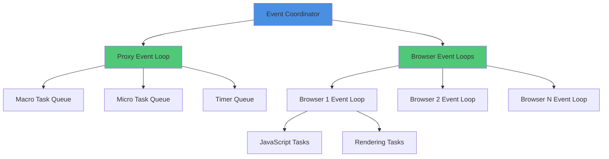

The **Event Coordinator** manages event loops across all BrowserX engines and provides a unified event bus for cross-component communication.

## Event Loop Architecture



## Proxy Event Loop

Global event loop for proxy engine async operations:

```typescript
// Queue a task on the proxy event loop
const taskId = runtime.eventCoordinator.queueProxyTask(async () => {
  // Task runs on proxy event loop
  await processRequest();
}, "high"); // Priority: "high" | "normal" | "low"

// Queue a microtask
const microtaskId = runtime.eventCoordinator.queueProxyMicrotask(async () => {
  // Microtask runs before next macro task
  await quickCleanup();
});
```

## Browser Event Loops

Each browser instance has its own event loop for JavaScript execution:

```typescript
// Create browser event loop (automatically done by Browser Pool)
const eventLoopHandle = await coordinator.createBrowserEventLoop(browserId);

// Get event loop statistics
const stats = eventLoopHandle.getStats();
console.log(`Running: ${eventLoopHandle.isRunning()}`);
console.log(`Stats:`, stats);

// Stop event loop (done automatically when instance is closed)
eventLoopHandle.stop();
```

### Event Loop Configuration

```typescript
{
  eventLoop: {
    enabled: true,                 // Enable event coordination
    targetFrameRate: 60,           // Browser loop frame rate
    maxMicrotasksPerCycle: 1000,   // Max microtasks per tick
    enableIdleTasks: true,         // Enable idle task processing
  }
}
```

## Runtime Events

The Runtime emits events for all lifecycle changes and component activity:

### Event Types

```typescript
type RuntimeEvent =
  // State changes
  | { type: "state_change"; from: RuntimeState; to: RuntimeState }

  // Component lifecycle
  | { type: "component_starting"; componentId: ComponentId }
  | { type: "component_started"; componentId: ComponentId }
  | { type: "component_stopping"; componentId: ComponentId }
  | { type: "component_stopped"; componentId: ComponentId }
  | { type: "component_error"; componentId: ComponentId; error: Error }

  // Signals
  | { type: "signal_received"; signal: string }
  | { type: "shutdown_initiated"; reason: string }
  | { type: "shutdown_timeout"; elapsed: number }
  | { type: "shutdown_complete"; duration: number }

  // Health checks
  | { type: "health_check"; status: HealthStatus; details: HealthCheckResult }

  // Event loops
  | { type: "event_loop_started"; loopType: "proxy" | "browser"; id?: string }
  | { type: "event_loop_stopped"; loopType: "proxy" | "browser"; id?: string }

  // Plugins
  | { type: "plugin_activating"; pluginId: string }
  | { type: "plugin_activated"; pluginId: string }
  | { type: "plugin_deactivating"; pluginId: string }
  | { type: "plugin_deactivated"; pluginId: string }
  | { type: "plugin_error"; pluginId: string; error: Error }

  // Sessions (MCP integration)
  | { type: "session_created"; sessionId: string; instanceId: string }
  | { type: "session_closed"; sessionId: string; instanceId: string; reason: string }
  | { type: "session_expired"; sessionId: string; instanceId: string };
```

### Event Listeners

```typescript
runtime.addEventListener((event) => {
  switch (event.type) {
    case "state_change":
      console.log(`State: ${event.from} → ${event.to}`);
      break;

    case "component_error":
      console.error(`${event.componentId} error:`, event.error);
      break;

    case "health_check":
      if (event.status === "unhealthy") {
        console.warn("System unhealthy:", event.details);
      }
      break;

    case "plugin_activated":
      console.log(`Plugin activated: ${event.pluginId}`);
      break;

    case "session_created":
      console.log(`Session ${event.sessionId} using instance ${event.instanceId}`);
      break;
  }
});
```

### Remove Listeners

```typescript
const listener = (event: RuntimeEvent) => {
  console.log(event);
};

runtime.addEventListener(listener);

// Later: remove listener
runtime.removeEventListener(listener);
```

## Event Loop Statistics

Monitor event loop performance:

```typescript
const stats = runtime.eventCoordinator.getEventLoopStats();

console.log(`Proxy loop running: ${stats.proxyLoopRunning}`);
console.log(`Browser loops active: ${stats.browserLoopsActive}`);
console.log(`Proxy tasks queued: ${stats.proxyTasksQueued}`);
console.log(`Proxy timers active: ${stats.proxyTimersActive}`);
```

### Detailed Statistics

```typescript
const detailedStats = runtime.eventCoordinator.getStats();

console.log(`Proxy loop: ${detailedStats.proxyLoopRunning}`);
console.log(`Active browser loops: ${detailedStats.browserLoopsActive}`);

for (const loop of detailedStats.browserLoops) {
  console.log(`Browser ${loop.browserId}:`);
  console.log(`  Loop ${loop.id}: running=${loop.running}`);
  console.log(`  Stats:`, loop.stats);
}
```

## External Event Emission

External components (e.g., MCP SessionManager) can emit events through the Runtime:

```typescript
// From MCP SessionManager
class SessionManager {
  constructor(
    private eventEmitter?: (event: RuntimeEvent) => void
  ) {}

  async createSession(...): Promise<BrowserSession> {
    const session = // ... create session

    // Emit event through runtime
    this.eventEmitter?.({
      type: "session_created",
      sessionId: session.id,
      instanceId: session.poolInstanceId,
    });

    return session;
  }

  async closeSession(sessionId: string): Promise<void> {
    const session = this.sessions.get(sessionId);

    // ... close session

    this.eventEmitter?.({
      type: "session_closed",
      sessionId,
      instanceId: session.poolInstanceId,
      reason: "manual",
    });
  }
}

// Wire into runtime
this.sessionManager = new SessionManager(
  runtime.browserPool,
  runtime.emitExternalEvent.bind(runtime),  // Pass event emitter
);
```

## Best Practices

### 1. Use Event Listeners for Monitoring

```typescript
// Central monitoring
runtime.addEventListener((event) => {
  // Send all events to monitoring system
  sendToDatadog({
    timestamp: Date.now(),
    event: event.type,
    ...event,
  });
});
```

### 2. Handle Errors in Listeners

```typescript
runtime.addEventListener((event) => {
  try {
    // Process event
    processEvent(event);
  } catch (error) {
    // Don't throw - would be silently caught
    console.error("Event handler error:", error);
  }
});
```

### 3. Clean Up Listeners

```typescript
class MyService {
  private listener: RuntimeEventListener;

  async start(runtime: BrowserXRuntime) {
    this.listener = (event) => {
      // Handle event
    };

    runtime.addEventListener(this.listener);
  }

  async stop(runtime: BrowserXRuntime) {
    // Always remove listener on cleanup
    runtime.removeEventListener(this.listener);
  }
}
```

## API Reference

### EventCoordinator

```typescript
class EventCoordinator {
  // Lifecycle
  start(): Promise<void>;
  stop(): Promise<void>;
  isRunning(): boolean;

  // Proxy event loop
  isProxyLoopRunning(): boolean;
  queueProxyTask(task: () => Promise<void>, priority?: "high" | "normal" | "low"): number | null;
  queueProxyMicrotask(task: () => Promise<void>): number | null;

  // Browser event loops
  createBrowserEventLoop(browserId: string): Promise<BrowserEventLoopHandle>;
  getBrowserEventLoop(loopId: string): BrowserEventLoopHandle | undefined;
  getBrowserEventLoopsForBrowser(browserId: string): BrowserEventLoopHandle[];
  stopBrowserEventLoops(browserId: string): void;
  getActiveBrowserLoopCount(): number;

  // Statistics
  getStats(): EventCoordinatorStats;
  getEventLoopStats(): EventLoopStats;

  // Events
  addEventListener(listener: RuntimeEventListener): void;
  removeEventListener(listener: RuntimeEventListener): void;
}
```

### BrowserEventLoopHandle

```typescript
interface BrowserEventLoopHandle {
  readonly id: string;
  readonly browserId: string;
  readonly createdAt: number;
  isRunning(): boolean;
  stop(): void;
  getStats(): Record<string, unknown>;
}
```

## Next Steps

- [Lifecycle](./lifecycle) - Runtime lifecycle management
- [Metrics & Health](./metrics-health) - Component health monitoring
- [Configuration](./configuration) - Event loop configuration
- [Integration Patterns](./integration) - Using events in applications
