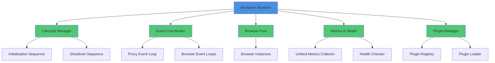
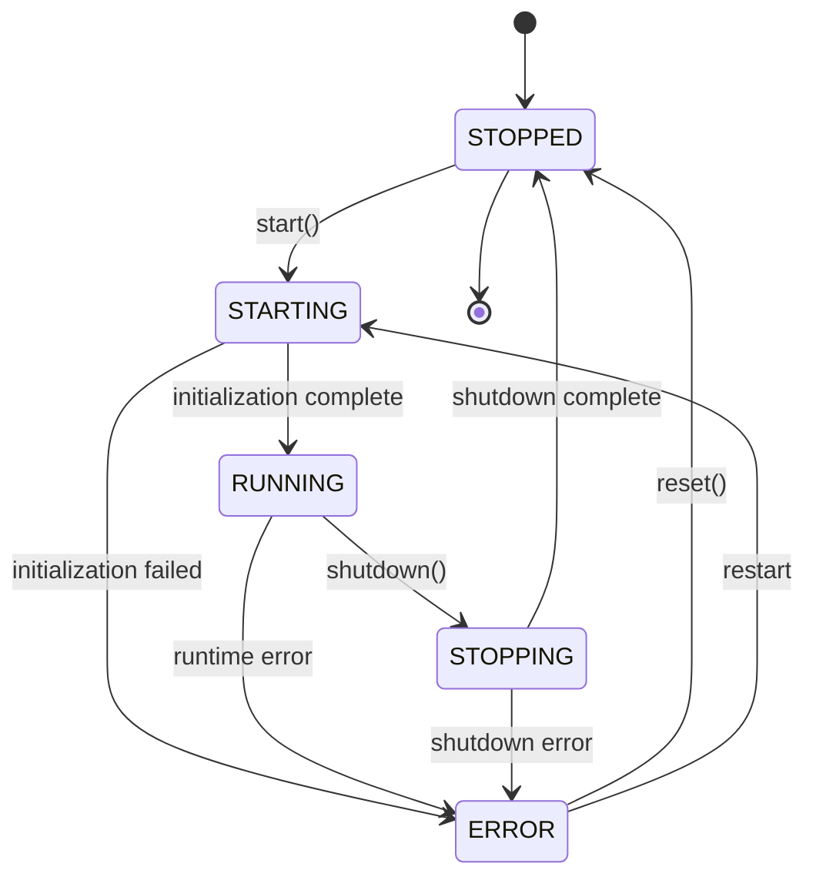
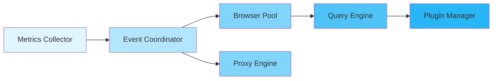

import { Tabs, TabItem } from '@astrojs/starlight/components';

The **BrowserX Runtime** is the unified orchestration layer that integrates the browser engine, proxy engine, and query engine into a composable, production-ready system. It provides lifecycle management, event coordination, resource pooling, metrics collection, and a plugin system for extending functionality.

## Architecture

The Runtime follows a layered architecture with clear separation of concerns:



## Key Components

### Lifecycle Management

The Runtime uses a state machine to manage the system lifecycle:

- **States**: `STOPPED` → `STARTING` → `RUNNING` → `STOPPING` → `STOPPED` (with `ERROR` state for failures)
- **Initialization Sequence**: Ordered startup of all components with dependency tracking
- **Shutdown Sequence**: Graceful shutdown with configurable timeouts and forced cleanup

### Event Coordination

Manages event loops across all engines:

- **Proxy Event Loop**: Global event loop for proxy engine async operations
- **Browser Event Loops**: Per-instance event loops for browser JavaScript execution
- **Cross-Component Events**: Unified event bus for system-wide notifications

### Browser Pool

Resource pool for browser instances with lifecycle management:

- **Acquire/Release Pattern**: Request browser instances from the pool, return when done
- **Idle Timeout**: Automatically close idle instances after configurable timeout
- **Max Lifetime**: Rotate instances after maximum lifetime to prevent memory leaks
- **Pre-warming**: Maintain minimum warm instances for fast startup

### Metrics & Health

Comprehensive observability:

- **Unified Metrics Collector**: Aggregate metrics from all components
- **Health Checker**: Periodic health checks with component-level granularity
- **Export Formats**: Prometheus and JSON metrics endpoints
- **Component Registration**: Subsystems register custom health checks and metrics

### Plugin System

Extensibility through plugins:

- **Dependency Management**: Topological sort for activation order
- **Contribution Points**: Middleware, query functions, MCP tools, DevTools domains, health checks
- **Disposable Pattern**: Automatic cleanup when plugins deactivate
- **Lifecycle Events**: Track plugin activation, deactivation, and errors

## Quick Start

<Tabs>
<TabItem label="Basic Usage">

```typescript
import { createRuntime } from "@browserx/runtime";

// Create and start runtime with defaults
const runtime = await createRuntime();

// Runtime is now running with all subsystems initialized
console.log(runtime.getState()); // "running"

// Get runtime statistics
const stats = runtime.getStats();
console.log(`Uptime: ${stats.uptime}ms`);
console.log(`Browser instances: ${stats.resources.browserInstances}`);

// Graceful shutdown
await runtime.shutdown();
```

</TabItem>

<TabItem label="Custom Configuration">

```typescript
import { BrowserXRuntime } from "@browserx/runtime";

const runtime = new BrowserXRuntime({
  config: {
    environment: "production",
    logLevel: "info",

    browser: {
      minInstances: 2,
      maxInstances: 10,
      idleTimeout: 30 * 60 * 1000, // 30 minutes
    },

    eventLoop: {
      enabled: true,
      targetFrameRate: 60,
    },

    metrics: {
      enabled: true,
      port: 9090,
      exportFormat: "prometheus",
    },

    plugins: {
      enabled: true,
      pluginDirs: ["./plugins"],
      activationTimeout: 10000,
    },
  },
});

await runtime.start();
```

</TabItem>

<TabItem label="With Subsystems">

```typescript
import { createRuntime } from "@browserx/runtime";
import { QueryEngine } from "@browserx/query-engine";

const runtime = await createRuntime({
  config: {
    browser: {
      maxInstances: 5,
      enableJavaScript: true,
    },
    proxy: {
      enabled: true,
      gateways: [{
        host: "localhost",
        port: 8080,
      }],
    },
  },
});

// Access query engine
const queryEngine = runtime.getQueryEngine();

// Execute a query
const result = await queryEngine.execute(
  'SELECT title, description FROM "https://example.com"'
);

console.log(result);

await runtime.shutdown();
```

</TabItem>
</Tabs>

## State Machine

The Runtime follows a strict state machine with validated transitions:



Valid transitions are enforced by the `LifecycleManager`. Attempting an invalid transition throws an error with helpful diagnostics.

## Component Dependencies

The initialization sequence respects component dependencies:



Components are initialized in dependency order and shut down in reverse order.

## Runtime Events

The Runtime emits events for all lifecycle transitions and component changes:

```typescript
runtime.addEventListener((event) => {
  switch (event.type) {
    case "state_change":
      console.log(`State: ${event.from} → ${event.to}`);
      break;

    case "component_started":
      console.log(`Component started: ${event.componentId}`);
      break;

    case "health_check":
      console.log(`Health: ${event.status}`);
      break;

    case "plugin_activated":
      console.log(`Plugin activated: ${event.pluginId}`);
      break;
  }
});
```

See [Events](./events) for the complete event catalog.

## Configuration Presets

The Runtime provides configuration presets for common environments:

```typescript
import {
  createDefaultConfig,
  createDevelopmentConfig,
  createTestConfig,
  mergeConfig,
} from "@browserx/runtime";

// Production defaults (high limits, long timeouts)
const prodConfig = createDefaultConfig();

// Development (lower limits, debug logging, faster timeouts)
const devConfig = createDevelopmentConfig();

// Testing (minimal resources, fast timeouts, warnings only)
const testConfig = createTestConfig();

// Custom merge with defaults
const customConfig = mergeConfig({
  browser: { maxInstances: 20 },
  logLevel: "debug",
});
```

See [Configuration](./configuration) for all available options.

## Subsystem Access

Access runtime subsystems for advanced use cases:

```typescript
const runtime = await createRuntime();

// Browser pool
const pool = runtime.browserPool;
const instance = await pool.acquire();
// ... use instance
pool.release(instance.id);

// Event coordinator
const coordinator = runtime.eventCoordinator;
coordinator.queueProxyTask(async () => {
  // Task runs on proxy event loop
});

// Metrics collector
const metrics = runtime.metricsCollector;
metrics.incrementCounter("custom_metric");
metrics.setGauge("active_users", 42);

// Health checker
const health = runtime.healthChecker;
health.registerHandler("my-service", async () => ({
  status: "healthy",
  message: "All systems operational",
}));

// Plugin manager
const plugins = runtime.pluginManager;
const activePlugins = plugins.getActivePlugins();
```

## Integration with MCP Server

The Runtime integrates seamlessly with the MCP Server:

```typescript
// mcp-server/server/service-initializer.ts
export class ServiceInitializer {
  private runtime?: BrowserXRuntime;

  async initialize() {
    // Lazy initialization on first tool call
    if (!this.runtime) {
      this.runtime = await createRuntime(config);

      // Wire runtime into session manager
      this.sessionManager.setBrowserPool(this.runtime.browserPool);
      this.sessionManager.setEventEmitter(this.runtime.emitExternalEvent);

      // Register session manager health check
      this.runtime.healthChecker.registerHandler(
        "session-manager",
        async () => this.sessionManager.checkHealth()
      );
    }
  }

  async shutdown() {
    // Session manager releases pool instances first
    await this.sessionManager.stop();

    // Then runtime shuts down the pool
    await this.runtime?.shutdown();
  }
}
```

This integration enables:

- **Shared Browser Pool**: MCP sessions use runtime-managed browser instances
- **Unified Metrics**: Session metrics appear in runtime metrics endpoint
- **Health Monitoring**: Session capacity tracked in health checks
- **Event Coordination**: Session lifecycle events flow through runtime event bus

## Next Steps

- [Configuration](./configuration) - Complete configuration reference
- [Browser Pool](./browser-pool) - Browser instance lifecycle management
- [Lifecycle](./lifecycle) - Initialization and shutdown sequences
- [Events](./events) - Event types and event coordination
- [Metrics & Health](./metrics-health) - Observability and monitoring
- [Plugin System](./plugins) - Extending the runtime with plugins
- [Integration Patterns](./integration) - Using the runtime in your applications
