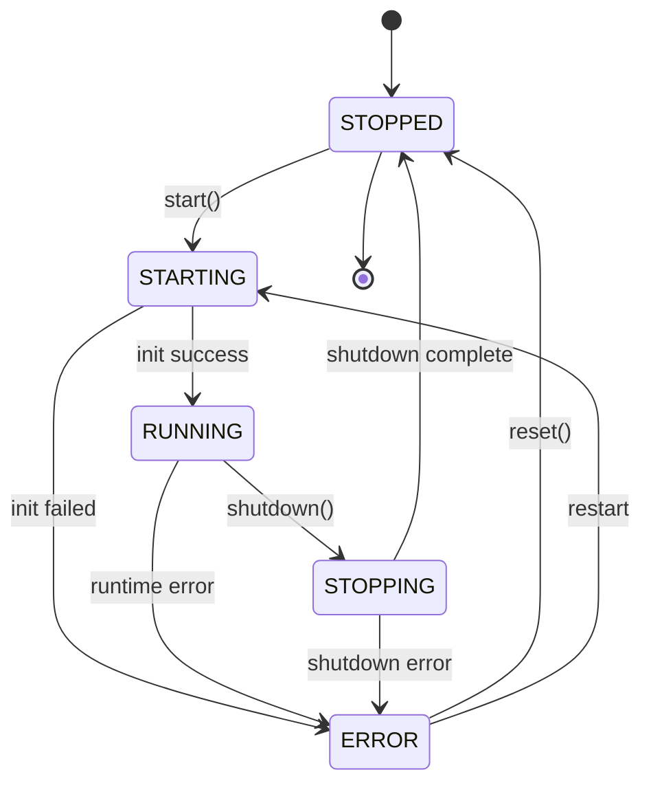
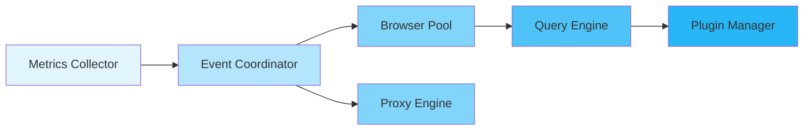
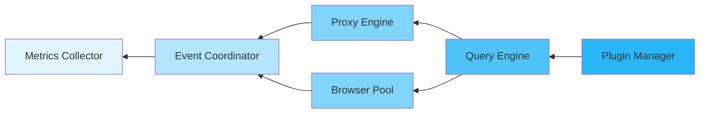

The **Lifecycle Manager** orchestrates the startup and shutdown of all Runtime components using a state machine with dependency tracking and ordered execution.

## State Machine

The Runtime follows a strict state machine:



### States

- **STOPPED**: Runtime is not running (initial state)
- **STARTING**: Initialization sequence in progress
- **RUNNING**: All components initialized and operational
- **STOPPING**: Shutdown sequence in progress
- **ERROR**: Fatal error occurred, recovery required

### Valid Transitions

The `LifecycleManager` validates all state transitions:

```typescript
// Valid transitions
STOPPED → STARTING
STARTING → RUNNING
STARTING → ERROR
RUNNING → STOPPING
RUNNING → ERROR
STOPPING → STOPPED
STOPPING → ERROR
ERROR → STOPPED
ERROR → STARTING
```

Attempting an invalid transition throws an error with diagnostic information.

## Initialization Sequence

The Runtime initializes components in dependency order:



### Step Execution

Each initialization step includes:

```typescript
interface InitializationStep {
  name: string;                    // Human-readable step name
  component: ComponentId;          // Component identifier
  execute: () => Promise<void>;    // Async initialization function
  dependencies: ComponentId[];     // Must complete before this step
  optional?: boolean;              // Can fail without blocking startup
  timeout?: number;                // Step timeout in milliseconds
}
```

### Example Sequence

```typescript
// Step 1: Metrics Collector (no dependencies)
await metricsCollector.start();  // Timeout: 5s

// Step 2: Event Coordinator (depends on metrics)
await eventCoordinator.start();  // Timeout: 10s

// Step 3: Browser Pool (depends on event coordinator)
await browserPool.start();       // Timeout: 30s

// Step 4: Proxy Engine (optional, depends on event coordinator)
await proxyEngine.start();       // Timeout: 30s, can fail

// Step 5: Query Engine (depends on browser pool)
await queryEngine.start();       // Timeout: 10s

// Step 6: Plugin Manager (depends on query engine)
await pluginManager.start();     // Timeout: 15s
```

### Initialization Progress

Monitor initialization progress:

```typescript
await runtime.initialize((progress) => {
  console.log(`Step: ${progress.currentStep}`);
  console.log(`Progress: ${progress.percentage}%`);
  console.log(`Completed: ${progress.completedSteps}/${progress.totalSteps}`);
});
```

### Initialization Failure

If a non-optional step fails:

1. Runtime transitions to `ERROR` state
2. Already-initialized components remain running
3. Error is returned to caller
4. Manual recovery required (fix issue, restart)

```typescript
try {
  await runtime.start();
} catch (error) {
  console.error("Initialization failed:", error);

  // Check which component failed
  const erroredComponents = runtime.lifecycleManager.getErroredComponents();

  for (const component of erroredComponents) {
    console.error(`Component ${component.id} error:`, component.error);
  }

  // Attempt recovery
  await runtime.shutdown();
  await runtime.start();  // Retry
}
```

## Shutdown Sequence

The Runtime shuts down components in **reverse activation order**:



### Graceful Shutdown

When `shutdown()` is called:

```typescript
interface ShutdownStep {
  name: string;                    // Human-readable step name
  component: ComponentId;          // Component identifier
  execute: () => Promise<void>;    // Async shutdown function
  timeout: number;                 // Step timeout in milliseconds
  graceful?: boolean;              // Attempt graceful shutdown first
}
```

### Example Sequence

```typescript
// Step 0: Plugin Manager (deactivate plugins first)
await pluginManager.stop();          // Timeout: 15s

// Step 1: Query Engine (abort running queries)
await queryEngine.shutdown();        // Timeout: 5s

// Step 2: Proxy Engine (drain connections)
await proxyEngine.shutdown();        // Timeout: 30s

// Step 3: Browser Pool (close all instances)
await browserPool.stop();            // Timeout: 10s

// Step 4: Event Coordinator (stop all event loops)
await eventCoordinator.stop();       // Timeout: 5s

// Step 5: Metrics Collector (export final metrics)
await metricsCollector.stop();       // Timeout: 5s
```

### Shutdown Configuration

```typescript
{
  shutdown: {
    graceful: true,               // Enable graceful shutdown
    timeout: 30000,               // Total shutdown timeout (30s)
    drainTimeout: 5000,           // Connection drain timeout (5s)
    forceExitOnTimeout: true,     // Force exit if timeout exceeded
  }
}
```

### Shutdown Timeout

If shutdown exceeds `timeout`:

- Log warning with elapsed time
- If `forceExitOnTimeout: true`, call `Deno.exit(1)`
- If `forceExitOnTimeout: false`, continue waiting

```typescript
await runtime.shutdown("Manual shutdown");
// Logs: [Runtime] Shutting down: Manual shutdown
// Logs: [Runtime] Shutting down: Plugin Manager (0%)
// Logs: [Runtime] Shutting down: Query Engine (16%)
// ...
// Logs: [Runtime] Runtime stopped
```

## Component Lifecycle Tracking

Track individual component states:

```typescript
interface ComponentState {
  readonly id: ComponentId;
  state: RuntimeState;
  startedAt?: number;
  stoppedAt?: number;
  error?: Error;
  stats?: Record<string, unknown>;
}
```

### Query Component States

```typescript
// Get state of a specific component
const browserPoolState = runtime.lifecycleManager.getComponentState("browser-pool");

console.log(`State: ${browserPoolState?.state}`);
console.log(`Started: ${new Date(browserPoolState?.startedAt)}`);
console.log(`Uptime: ${Date.now() - (browserPoolState?.startedAt ?? 0)}ms`);

// Get all component states
const allStates = runtime.lifecycleManager.getComponentStates();

for (const state of allStates) {
  console.log(`${state.id}: ${state.state}`);
}

// Get components in a specific state
const runningComponents = runtime.lifecycleManager.getComponentsInState(RuntimeState.RUNNING);

console.log(`Running: ${runningComponents.length} components`);

// Check if all components are running
const allRunning = runtime.lifecycleManager.allComponentsInState(RuntimeState.RUNNING);

if (allRunning) {
  console.log("All components operational");
}
```

## Lifecycle Events

The Runtime emits events for all lifecycle transitions:

```typescript
runtime.addEventListener((event) => {
  if (event.type === "state_change") {
    console.log(`Runtime: ${event.from} → ${event.to}`);
  }

  if (event.type === "component_starting") {
    console.log(`Starting: ${event.componentId}`);
  }

  if (event.type === "component_started") {
    console.log(`Started: ${event.componentId}`);
  }

  if (event.type === "component_stopping") {
    console.log(`Stopping: ${event.componentId}`);
  }

  if (event.type === "component_stopped") {
    console.log(`Stopped: ${event.componentId}`);
  }

  if (event.type === "component_error") {
    console.error(`Error in ${event.componentId}:`, event.error);
  }
});
```

## Signal Handling

The Runtime handles OS signals for graceful shutdown:

```typescript
{
  signals: {
    handleSIGINT: true,    // Ctrl+C
    handleSIGTERM: true,   // systemd stop
    handleSIGHUP: false,   // Config reload (not implemented)
  }
}
```

When a signal is received:

```typescript
// Signal received
console.log("[Runtime] Received SIGINT, initiating shutdown...");

// Graceful shutdown sequence
await runtime.shutdown("Signal: SIGINT");

// Exit process
Deno.exit(0);
```

## Custom Lifecycle Steps

Plugins can register custom initialization and shutdown steps:

```typescript
class MyPlugin implements Plugin {
  async activate(context: PluginContext) {
    // Register custom init step
    context.registerInitStep({
      name: "Initialize custom database",
      component: "plugin:my-plugin:db",
      execute: async () => {
        await this.db.connect();
      },
      dependencies: ["query-engine"],
      timeout: 10000,
    });

    // Register custom shutdown step
    context.registerShutdownStep({
      name: "Close custom database",
      component: "plugin:my-plugin:db",
      execute: async () => {
        await this.db.close();
      },
      timeout: 5000,
      graceful: true,
    });
  }
}
```

## Best Practices

### 1. Handle Initialization Errors

Always handle initialization failures:

```typescript
try {
  await runtime.start();
} catch (error) {
  console.error("Failed to start runtime:", error);

  // Attempt recovery
  await runtime.shutdown();

  // Retry with different config or exit
  process.exit(1);
}
```

### 2. Use Graceful Shutdown

Enable graceful shutdown in production:

```typescript
{
  shutdown: {
    graceful: true,
    timeout: 60000,            // 1 minute for graceful shutdown
    drainTimeout: 10000,       // 10s to drain active requests
    forceExitOnTimeout: true,  // Exit if timeout exceeded
  }
}
```

### 3. Monitor Component Health

Track component states to detect issues:

```typescript
setInterval(() => {
  const erroredComponents = runtime.lifecycleManager.getErroredComponents();

  if (erroredComponents.length > 0) {
    console.error("Components in error state:", erroredComponents);
  }
}, 30000);  // Every 30 seconds
```

### 4. Use Lifecycle Events

Listen to lifecycle events for monitoring:

```typescript
runtime.addEventListener((event) => {
  // Log all lifecycle events to external monitoring
  if (event.type.startsWith("component_") || event.type === "state_change") {
    sendToMonitoring(event);
  }
});
```

## API Reference

### LifecycleManager

```typescript
class LifecycleManager {
  // State management
  getState(): RuntimeState;
  transition(targetState: RuntimeState): void;
  canTransitionTo(targetState: RuntimeState): boolean;
  getValidTransitions(): RuntimeState[];
  getStateHistory(): Array<{ state: RuntimeState; timestamp: number }>;

  // Component tracking
  registerComponent(id: ComponentId): void;
  hasComponent(id: ComponentId): boolean;
  getComponentState(id: ComponentId): ComponentState | undefined;
  updateComponentState(id: ComponentId, state: RuntimeState, error?, stats?): void;
  getComponentStates(): ComponentState[];
  getComponentsInState(state: RuntimeState): ComponentState[];
  getErroredComponents(): ComponentState[];

  // State queries
  allComponentsInState(state: RuntimeState): boolean;
  anyComponentInState(state: RuntimeState): boolean;
  isTerminal(): boolean;
  isActive(): boolean;

  // Lifecycle
  reset(): void;
  getSummary(): {
    state: RuntimeState;
    componentCount: number;
    runningComponents: number;
    stoppedComponents: number;
    erroredComponents: number;
  };
}
```

## Next Steps

- [Events](./events) - Event types and event coordination
- [Configuration](./configuration) - Lifecycle configuration options
- [Plugin System](./plugins) - Custom lifecycle steps
- [Metrics & Health](./metrics-health) - Component health monitoring
