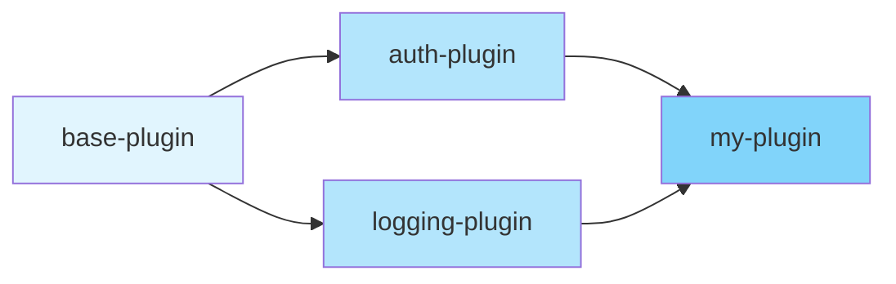
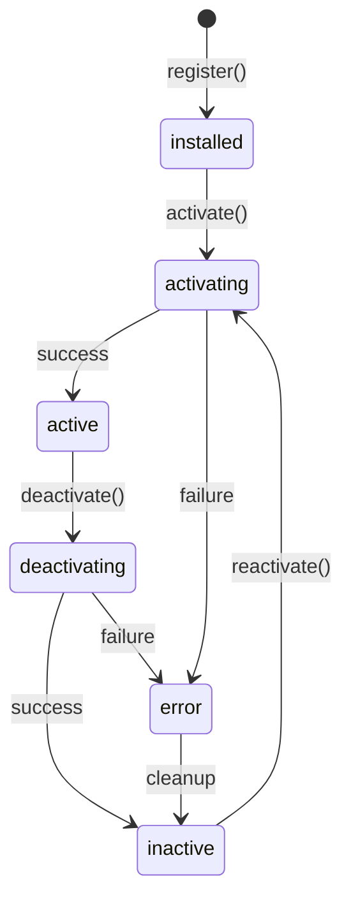

import { Tabs, TabItem } from '@astrojs/starlight/components';

The **Plugin System** provides a structured way to extend the BrowserX Runtime with custom functionality through contribution points.

## Overview

Plugins can contribute:

- **Proxy Middleware**: Request/response interceptors
- **Query Functions**: Custom SQL-like functions
- **MCP Tools**: LLM-accessible tools
- **DevTools Domains**: Chrome DevTools Protocol domains
- **Health Checks**: Custom component health monitoring
- **Lifecycle Steps**: Custom initialization/shutdown steps

## Plugin Interface

All plugins must implement the `Plugin` interface:

```typescript
interface Plugin {
  readonly id: string;           // Unique identifier
  readonly name: string;         // Human-readable name
  readonly version: string;      // Semantic version
  readonly dependencies?: string[]; // Plugin dependencies
  readonly description?: string;

  // Called when plugin loads
  activate(context: PluginContext): Promise<void>;

  // Called when plugin unloads
  deactivate(): Promise<void>;
}
```

## Creating a Plugin

<Tabs>
<TabItem label="Basic Plugin">

```typescript
// my-plugin.ts
import type { Plugin, PluginContext } from "@browserx/runtime";

export default class MyPlugin implements Plugin {
  readonly id = "my-plugin";
  readonly name = "My Plugin";
  readonly version = "1.0.0";
  readonly description = "Example plugin";

  async activate(context: PluginContext): Promise<void> {
    context.log.info("Plugin activated!");

    // Register contributions here
  }

  async deactivate(): Promise<void> {
    // Cleanup (automatic via Disposable pattern)
  }
}
```

</TabItem>

<TabItem label="With Middleware">

```typescript
export default class LoggingPlugin implements Plugin {
  readonly id = "logging-plugin";
  readonly name = "Request Logger";
  readonly version = "1.0.0";

  async activate(context: PluginContext): Promise<void> {
    // Add request middleware
    context.addRequestMiddleware({
      name: "request-logger",
      async processRequest(request, ctx) {
        context.log.info(`Request: ${request.method} ${request.url}`);
        return { type: "continue" };
      },
    });

    // Add response middleware
    context.addResponseMiddleware({
      name: "response-logger",
      async processResponse(response, ctx) {
        context.log.info(`Response: ${response.status}`);
        return { type: "continue" };
      },
    });
  }

  async deactivate(): Promise<void> {}
}
```

</TabItem>

<TabItem label="With MCP Tools">

```typescript
export default class AnalyticsPlugin implements Plugin {
  readonly id = "analytics-plugin";
  readonly name = "Analytics Tools";
  readonly version = "1.0.0";

  async activate(context: PluginContext): Promise<void> {
    // Register MCP tool
    context.registerMCPTool({
      name: "track_event",
      description: "Track an analytics event",
      inputSchema: {
        type: "object",
        properties: {
          event: { type: "string" },
          properties: { type: "object" },
        },
        required: ["event"],
      },
      async execute(params) {
        context.log.info(`Tracking event: ${params.event}`);
        // Send to analytics service
        return { success: true };
      },
    });
  }

  async deactivate(): Promise<void> {}
}
```

</TabItem>
</Tabs>

## Plugin Configuration

### Enable Plugins

```typescript
{
  plugins: {
    enabled: true,
    pluginDirs: ["./plugins"],      // Scan these directories
    plugins: [
      {
        path: "./my-plugin.ts",
        enabled: true,
        config: {
          apiKey: "YOUR_API_KEY",
        },
      },
    ],
    activationTimeout: 10000,       // 10 seconds
  }
}
```

### Plugin-Specific Config

Plugins receive their config via `PluginContext`:

```typescript
async activate(context: PluginContext): Promise<void> {
  const apiKey = context.pluginConfig.apiKey as string;
  const endpoint = context.pluginConfig.endpoint as string;

  // Use configuration
}
```

## Contribution Points

### 1. Proxy Middleware

Intercept and modify proxy requests/responses:

```typescript
// Request middleware
context.addRequestMiddleware({
  name: "auth-middleware",
  async processRequest(request, ctx) {
    // Add authentication header
    return {
      type: "modify",
      request: {
        ...request,
        headers: {
          ...request.headers,
          "Authorization": `Bearer ${token}`,
        },
      },
    };
  },
}, 10); // Priority (higher = earlier)

// Response middleware
context.addResponseMiddleware({
  name: "cache-middleware",
  async processResponse(response, ctx) {
    // Cache response
    await cache.set(ctx.requestId, response);
    return { type: "continue" };
  },
});
```

### 2. Query Functions

Add custom SQL-like functions:

```typescript
context.registerQueryFunction({
  signature: {
    name: "GEOCODE",
    category: "custom",
    minArgs: 1,
    maxArgs: 1,
    argTypes: ["string"],
    returnType: "object",
  },
  execute: async (address: string) => {
    const result = await geocodeService.lookup(address);
    return { lat: result.lat, lng: result.lng };
  },
});

// Use in queries:
// SELECT GEOCODE('1600 Amphitheatre Parkway') AS coords
```

### 3. MCP Tools

Expose tools to LLMs via the MCP server:

```typescript
context.registerMCPTool({
  name: "send_email",
  description: "Send an email via SendGrid",
  inputSchema: {
    type: "object",
    properties: {
      to: { type: "string" },
      subject: { type: "string" },
      body: { type: "string" },
    },
    required: ["to", "subject", "body"],
  },
  async execute(params) {
    await sendGrid.send({
      to: params.to,
      subject: params.subject,
      html: params.body,
    });
    return { sent: true };
  },
});
```

### 4. DevTools Domains

Add Chrome DevTools Protocol domains:

```typescript
context.registerDevToolsDomain({
  name: "CustomDomain",
  version: "1.0",
  description: "Custom DevTools domain",
  methods: {
    "CustomDomain.getData": {
      description: "Get custom data",
      handler: async (params) => {
        return { data: "Custom data" };
      },
    },
  },
  events: ["CustomDomain.dataChanged"],
});
```

### 5. Health Checks

Monitor custom components:

```typescript
context.registerHealthCheck("my-service", async () => {
  try {
    await myService.ping();
    return {
      status: "healthy",
      message: "Service responding",
    };
  } catch (error) {
    return {
      status: "unhealthy",
      message: `Service error: ${error.message}`,
    };
  }
});
```

### 6. Lifecycle Steps

Add custom initialization/shutdown steps:

```typescript
// Custom init step
context.registerInitStep({
  name: "Load plugin database",
  component: "plugin:my-plugin:db",
  execute: async () => {
    await db.connect();
  },
  dependencies: ["query-engine"],
  timeout: 10000,
});

// Custom shutdown step
context.registerShutdownStep({
  name: "Close plugin database",
  component: "plugin:my-plugin:db",
  execute: async () => {
    await db.close();
  },
  timeout: 5000,
  graceful: true,
});
```

## Disposable Pattern

All contribution registration methods return a `Disposable`:

```typescript
const disposable = context.addRequestMiddleware(...);

// Later: manually remove
disposable.dispose();

// Or: let plugin manager auto-cleanup on deactivate
```

The Plugin Manager automatically calls `dispose()` on all contributions when a plugin deactivates.

## Plugin Dependencies

Plugins can depend on other plugins:

```typescript
export default class MyPlugin implements Plugin {
  readonly id = "my-plugin";
  readonly name = "My Plugin";
  readonly version = "1.0.0";
  readonly dependencies = ["base-plugin", "auth-plugin"];

  async activate(context: PluginContext): Promise<void> {
    // base-plugin and auth-plugin are guaranteed to be active
  }
}
```

### Activation Order

Plugins are activated in **topological sort order** based on dependencies:



Activation: `base-plugin` → `auth-plugin` → `logging-plugin` → `my-plugin`

Deactivation: `my-plugin` → `logging-plugin` → `auth-plugin` → `base-plugin`

### Circular Dependencies

The Plugin Manager detects and rejects circular dependencies:

```
Error: Circular dependency detected: plugin-a → plugin-b → plugin-c → plugin-a
```

## Plugin Lifecycle



### States

- **installed**: Plugin registered, not yet activated
- **activating**: `activate()` in progress
- **active**: Plugin running, contributions registered
- **deactivating**: `deactivate()` in progress
- **inactive**: Plugin stopped, contributions removed
- **error**: Activation or deactivation failed

## Plugin Context API

```typescript
interface PluginContext {
  readonly pluginId: string;
  readonly config: Readonly<BrowserXRuntimeConfig>;
  readonly pluginConfig: Record<string, unknown>;

  // Contributions
  addRequestMiddleware(middleware: RequestMiddleware, priority?: number): Disposable;
  addResponseMiddleware(middleware: ResponseMiddleware, priority?: number): Disposable;
  registerQueryFunction(func: FunctionImplementation): Disposable;
  registerMCPTool(tool: MCPToolDefinition): Disposable;
  registerDevToolsDomain(domain: DevToolsDomainDefinition): Disposable;
  registerHealthCheck(id: string, handler: HealthCheckHandler): Disposable;
  registerInitStep(step: InitializationStep): void;
  registerShutdownStep(step: ShutdownStep): void;

  // Runtime access
  addEventListener(listener: RuntimeEventListener): Disposable;
  getBrowserPool(): BrowserPool;
  getQueryEngine(): unknown;
  getProxyRuntime(): unknown;

  // Logging
  log: PluginLogger;
}
```

## Plugin Events

Monitor plugin lifecycle:

```typescript
runtime.addEventListener((event) => {
  if (event.type === "plugin_activated") {
    console.log(`Plugin activated: ${event.pluginId}`);
  }

  if (event.type === "plugin_error") {
    console.error(`Plugin error in ${event.pluginId}:`, event.error);
  }

  if (event.type === "plugin_deactivated") {
    console.log(`Plugin deactivated: ${event.pluginId}`);
  }
});
```

## Best Practices

### 1. Use Disposables

Always return disposables from your plugin:

```typescript
async activate(context: PluginContext): Promise<void> {
  const subscription = externalService.subscribe((data) => {
    // Handle data
  });

  // Return disposable for cleanup
  return {
    async deactivate() {
      subscription.unsubscribe();
    },
  };
}
```

### 2. Handle Errors Gracefully

```typescript
async activate(context: PluginContext): Promise<void> {
  try {
    await this.initialize();
  } catch (error) {
    context.log.error("Initialization failed:", error);
    // Clean up partial state
    await this.cleanup();
    throw error; // Re-throw to mark plugin as errored
  }
}
```

### 3. Use Plugin Config

```typescript
async activate(context: PluginContext): Promise<void> {
  const config = context.pluginConfig as {
    apiKey?: string;
    endpoint?: string;
  };

  if (!config.apiKey) {
    throw new Error("API key is required in plugin config");
  }

  this.client = new Client(config.apiKey, config.endpoint);
}
```

### 4. Log with Plugin Logger

```typescript
async activate(context: PluginContext): Promise<void> {
  context.log.debug("Initializing...");
  context.log.info("Plugin started");
  context.log.warn("Deprecated feature used");
  context.log.error("Failed to connect", error);
}
```

## API Reference

### PluginManager

```typescript
class PluginManager {
  // Lifecycle
  start(): Promise<void>;
  stop(): Promise<void>;
  isRunning(): boolean;

  // Plugin management
  registerPlugin(plugin: Plugin): void;
  activatePlugin(pluginId: string): Promise<void>;
  deactivatePlugin(pluginId: string): Promise<void>;

  // Dependencies
  validateDependencies(): string[];
  getActivationOrder(): string[];

  // Query
  getPlugin(pluginId: string): PluginInfo | undefined;
  getAllPlugins(): PluginInfo[];
  getActivePlugins(): PluginInfo[];
  getPluginContext(pluginId: string): PluginContext | undefined;
  getSummary(): Record<PluginState, number>;

  // MCP integration
  getAllMCPTools(): MCPToolDefinition[];

  // Events
  addEventListener(listener: RuntimeEventListener): void;
  removeEventListener(listener: RuntimeEventListener): void;
}
```

## Next Steps

- [Configuration](./configuration) - Plugin configuration
- [Events](./events) - Plugin lifecycle events
- [Integration Patterns](./integration) - Using plugins in applications
